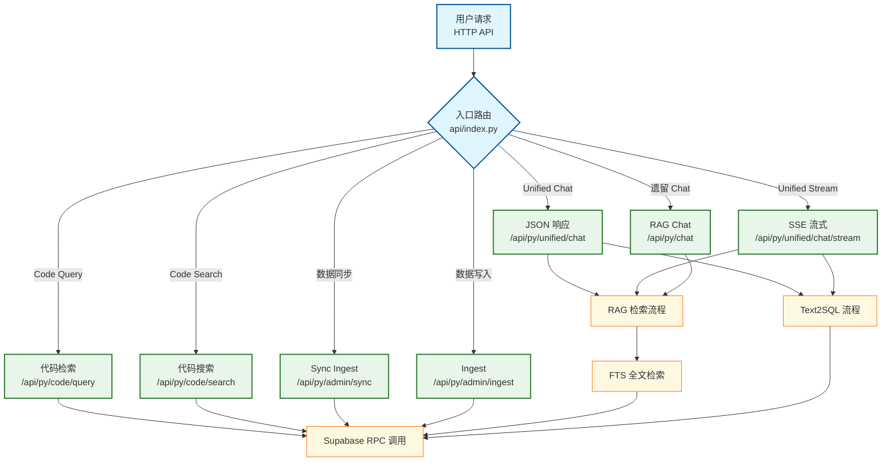

- `Struct`：[`01_struct.md`](01_struct.md)
- `Version`：[`02_version.md`](02_version.md)
- `RAG Flow`：[`10_flow_rag.md`](10_flow_rag.md)（[AI 协议版](10_flow_rag.ai.md)）
- `Text2SQL Flow`：[`11_flow_text2sql.md`](11_flow_text2sql.md)（[AI 协议版](11_flow_text2sql.ai.md)）
- `FTS Flow`：[`12_flow_fts.md`](12_flow_fts.md)（[AI 协议版](12_flow_fts.ai.md)）
- `Supabase RPC`：[`13_flow_supabase_rpc.md`](13_flow_supabase_rpc.md)（[AI 协议版](13_flow_supabase_rpc.ai.md)）
- `Spec`：[`99_spec.md`](99_spec.md)
- `Mermaid Protocol`：[`99_mermaid_protocol.md`](99_mermaid_protocol.md) — 拓扑图绘制规范（Python/FastAPI 适配版）
