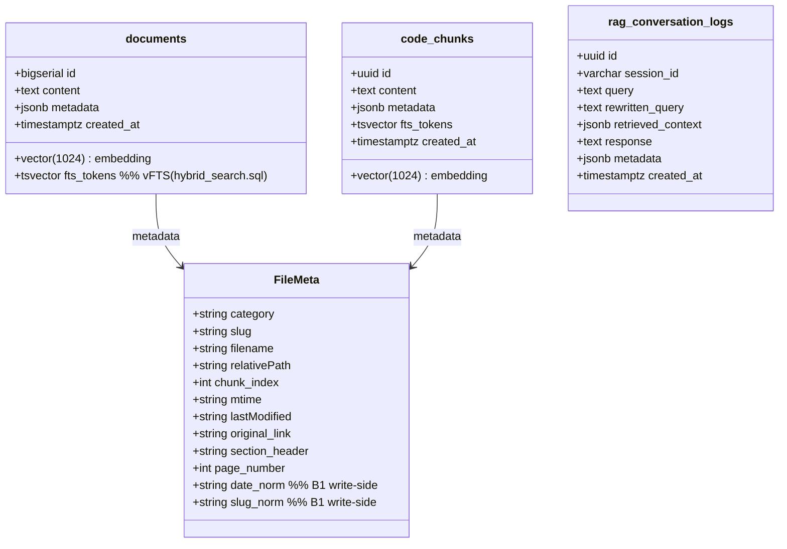

```mermaid
classDiagram
  %% DB Struct (from supabase/sql/*.sql + code usage)

  class documents {
    +bigserial id
    +text content
    +jsonb metadata
    +vector(1024) embedding
    +tsvector fts_tokens  %% vFTS (hybrid_search.sql)
    +timestamptz created_at
  }

  class code_chunks {
    +uuid id
    +text content
    +jsonb metadata
    +vector(1024) embedding
    +tsvector fts_tokens
    +timestamptz created_at
  }

  class rag_conversation_logs {
    +uuid id
    +varchar session_id
    +text query
    +text rewritten_query
    +jsonb retrieved_context
    +text response
    +jsonb metadata
    +timestamptz created_at
  }

  class FileMeta {
    +string category
    +string slug
    +string filename
    +string relativePath
    +int chunk_index
    +string mtime
    +string lastModified
    +string original_link
    +string section_header
    +int page_number
    +string date_norm %% B1 write-side
    +string slug_norm %% B1 write-side
  }

  documents --> FileMeta : metadata
  code_chunks --> FileMeta : metadata
```

