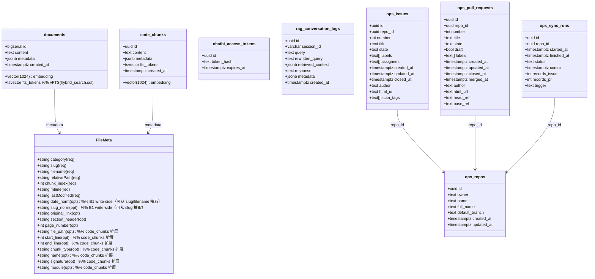

```mermaid
classDiagram
  %% DB Struct (from supabase/sql/*.sql + code usage)

  class documents {
    +bigserial id
    +text content
    +jsonb metadata
    +vector(1024) embedding
    +tsvector fts_tokens  %% vFTS (hybrid_search.sql)
    +timestamptz created_at
  }

  class code_chunks {
    +uuid id
    +text content
    +jsonb metadata
    +vector(1024) embedding
    +tsvector fts_tokens
    +timestamptz created_at
  }

  class chatbi_access_tokens {
    +uuid id
    +text token_hash
    +timestamptz expires_at
  }

  class rag_conversation_logs {
    +uuid id
    +varchar session_id
    +text query
    +text rewritten_query
    +jsonb retrieved_context
    +text response
    +jsonb metadata
    +timestamptz created_at
  }

  class ops_repos {
    +uuid id
    +text owner
    +text name
    +text full_name
    +text default_branch
    +timestamptz created_at
    +timestamptz updated_at
  }

  class ops_issues {
    +uuid id
    +uuid repo_id
    +int number
    +text title
    +text state
    +text[] labels
    +text[] assignees
    +timestamptz created_at
    +timestamptz updated_at
    +timestamptz closed_at
    +text author
    +text html_url
    +text[] scan_tags
  }

  class ops_pull_requests {
    +uuid id
    +uuid repo_id
    +int number
    +text title
    +text state
    +bool draft
    +text[] labels
    +timestamptz created_at
    +timestamptz updated_at
    +timestamptz closed_at
    +timestamptz merged_at
    +text author
    +text html_url
    +text head_ref
    +text base_ref
  }

  class ops_sync_runs {
    +uuid id
    +uuid repo_id
    +timestamptz started_at
    +timestamptz finished_at
    +text status
    +timestamptz cursor
    +int records_issue
    +int records_pr
    +text trigger
  }

  ops_issues --> ops_repos : repo_id
  ops_pull_requests --> ops_repos : repo_id
  ops_sync_runs --> ops_repos : repo_id

  class FileMeta {
    +string category (req)
    +string slug (req)
    +string filename (req)
    +string relativePath (req)
    +int chunk_index (req)
    +string mtime (req)
    +string lastModified (req)
    +string date_norm (opt) %% B1 write-side（可从 slug/filename 抽取）
    +string slug_norm (opt) %% B1 write-side（可从 slug 抽取）
    +string original_link (opt)
    +string section_header (opt)
    +int page_number (opt)
    +string file_path (opt) %% code_chunks 扩展
    +int start_line (opt) %% code_chunks 扩展
    +int end_line (opt) %% code_chunks 扩展
    +string chunk_type (opt) %% code_chunks 扩展
    +string name (opt) %% code_chunks 扩展
    +string signature (opt) %% code_chunks 扩展
    +string module (opt) %% code_chunks 扩展
  }

  documents --> FileMeta : metadata
  code_chunks --> FileMeta : metadata
```

