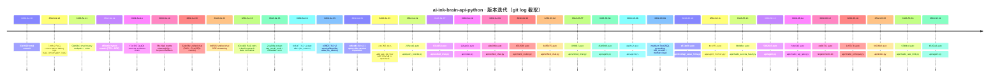

```mermaid
timeline
  title ai-ink-brain-api-python · 版本迭代（git log 截取）

  2026-04-10 : 63e9199 Initial commit
  2026-04-10 : 7cf6fc0 RAG conversation debug logs (rag_conversation_logs)
  2026-04-11 : 01b68e3 chat history endpoint + rules
  2026-04-14 : df54e6b Hybrid search (FTS + RRF)
  2026-04-14 : f7ecf00 Task04 sources evidence chain
  2026-04-18 : 56c19a0 rewrite observability + keyword fallback
  2026-04-22 : 32de56e unified chat (RAG + Text2SQL events)
  2026-04-22 : fe9505f unified chat SSE streaming
  2026-04-23 : b7ecd20 RAG retry + dual keyword + date normalize
  2026-04-23 : 24a3f8a extract rag_recall_tools + metadata norm
  2026-04-23 : 8464f77 B2 v1 date alias (fts_tokens)
  2026-04-23 : e3f9037 B2 v2 version/identifier alias (fts_tokens)
  2026-04-23 : cd6ed43 B2 v2.1 query-side version expansion
  2026-04-23 : 19b7f96 docs: add rag-chat flow and text2sql v1 spec/task
  2026-04-24 : 205ece6 auto: api/query_rewrite.py
  2026-04-27 : 8314154 auto: api/unified_chat.py
  2026-04-28 : 116ab0c auto: api/index.py
  2026-04-29 : abb266b auto: api/unified_chat.py
  2026-04-30 : 4563586 auto: api/intent_router.py
  2026-05-06 : b456d75 auto: api/unified_chat.py
  2026-05-07 : 09fdf13 auto: api/unified_chat.py
  2026-05-08 : 45d99d8 auto: api/agent.py
  2026-05-09 : da0fe2f auto: api/agent.py
  2026-05-09 : multiturn Text2SQL grounding tool_results + memory load
  2026-05-10 : e67ab5b auto: api/text2sql_value_hints.py
  2026-05-11 : 4fc0555 auto: api/agent_memory.py
  2026-05-12 : 8b8d6cc auto: api/chatbi_access_hash.py
  2026-05-13 : 54826c3 auto: api/agent.py
  2026-05-14 : fcbc040 auto: api/chatbi_sql_gate.py
  2026-05-15 : ee6b731 auto: requirements.txt
  2026-05-18 : 1e55c7b auto: api/chatbi_principal.py
  2026-05-25 : fe536b8 auto: api/index.py
  2026-05-29 : 034fdcd auto: api/chatbi_rate_limit.py
  2026-05-31 : b540fa3 auto: api/agent.py
```

