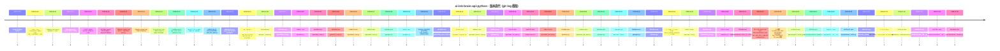

```mermaid
timeline
  title ai-ink-brain-api-python · 版本迭代（git log 截取）

  2026-04-10 : 63e9199 Initial commit
  2026-04-10 : 7cf6fc0 RAG conversation debug logs (rag_conversation_logs)
  2026-04-11 : 01b68e3 chat history endpoint + rules
  2026-04-14 : df54e6b Hybrid search (FTS + RRF)
  2026-04-14 : f7ecf00 Task04 sources evidence chain
  2026-04-18 : 56c19a0 rewrite observability + keyword fallback
  2026-04-22 : 32de56e unified chat (RAG + Text2SQL events)
  2026-04-22 : fe9505f unified chat SSE streaming
  2026-04-23 : b7ecd20 RAG retry + dual keyword + date normalize
  2026-04-23 : 24a3f8a extract rag_recall_tools + metadata norm
  2026-04-23 : 8464f77 B2 v1 date alias (fts_tokens)
  2026-04-23 : e3f9037 B2 v2 version/identifier alias (fts_tokens)
  2026-04-23 : cd6ed43 B2 v2.1 query-side version expansion
  2026-04-23 : 19b7f96 docs: add rag-chat flow and text2sql v1 spec/task
  2026-04-24 : 205ece6 auto: api/query_rewrite.py
  2026-04-27 : 8314154 auto: api/unified_chat.py
  2026-04-28 : 116ab0c auto: api/index.py
  2026-04-29 : abb266b auto: api/unified_chat.py
  2026-04-30 : 4563586 auto: api/intent_router.py
  2026-05-06 : b456d75 auto: api/unified_chat.py
  2026-05-07 : 09fdf13 auto: api/unified_chat.py
  2026-05-08 : 45d99d8 auto: api/agent.py
  2026-05-09 : da0fe2f auto: api/agent.py
  2026-05-09 : multiturn Text2SQL grounding tool_results + memory load
  2026-05-10 : e67ab5b auto: api/text2sql_value_hints.py
  2026-05-11 : 4fc0555 auto: api/agent_memory.py
  2026-05-12 : 8b8d6cc auto: api/chatbi_access_hash.py
  2026-05-13 : 54826c3 auto: api/agent.py
  2026-05-14 : fcbc040 auto: api/chatbi_sql_gate.py
  2026-05-15 : ee6b731 auto: requirements.txt
  2026-05-18 : 1e55c7b auto: api/chatbi_principal.py
  2026-05-25 : fe536b8 auto: api/index.py
  2026-05-29 : 034fdcd auto: api/chatbi_rate_limit.py
  2026-05-31 : b540fa3 auto: api/agent.py
  2026-06-03 : cd5cbd8 auto: api/chain_chat.py
  2026-06-04 : bbd6ded auto: api/agent.py
  2026-06-04 : 6bc051a auto: api/index.py
  2026-06-04 : P0 Graph Q-8 stub routes `/api/py/unified/chat/graph` + `/stream`
  2026-06-05 : 0d0507d auto: api/chain_chat.py
  2026-06-08 : f86a32a auto: api/text2sql_core.py
  2026-06-09 : 7f2a27c auto: api/agent.py
  2026-06-21 : 7006668 auto: supabase/sql/ops_desk_p0_schema.sql
  2026-06-22 : P0-2 Ops Desk GHA sync MoonshotAI/kimi-code · ops_sync_kimi_code.yml + api/ops/sync/
  2026-06-22 : P1 规划 16_flow_ops_chat · Orchestrator fast/deep · ops_runs/events · 00_main 挂链
  2026-06-23 : e3163693 auto: api/ops/demo_cache.py
  2026-06-24 : 52ff03f8 auto: api/ops/agents/issue_analyst.py
  2026-06-25 : f2ee0c57 auto: api/ops/llm/__init__.py
  2026-06-26 : ab701e07 auto: api/ops/demo_cache.py
  2026-07-02 : e9877f22 auto: api/harness_runtime/__init__.py
  2026-07-03 : 71c26129 auto: api/harness_runtime/gate_sync/human_gate.py
  2026-07-06 : c9728e14 auto: api/harness_runtime/promote.py
  2026-07-07 : dd89b870 auto: api/agently_lab/__init__.py
  2026-07-08 : 4bf5782c auto: api/ops/orchestrator/__init__.py
  2026-07-09 : db09fd40 auto: api/ops/events_schema.py
```

