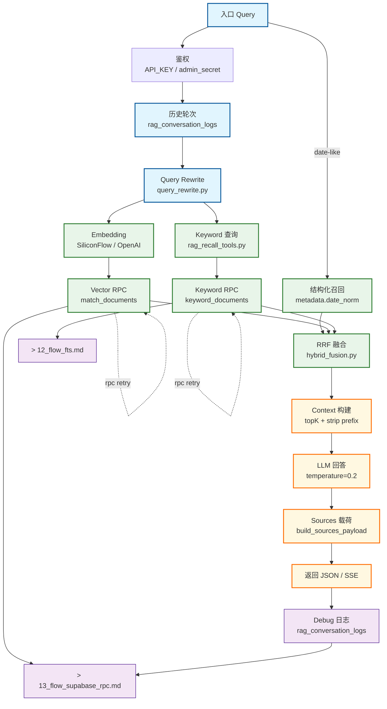

```mermaid
flowchart TD
    %% Entry: /api/py/chat | /api/py/unified/chat(.stream)

    %% Query 阶段
    IN[入口 Query] --> AUTH[鉴权<br/>API_KEY / admin_secret]
    AUTH --> HIS[历史轮次<br/>rag_conversation_logs]
    HIS --> RW[Query Rewrite<br/>query_rewrite.py]

    %% 召回分支
    RW --> KQ[Keyword 查询<br/>rag_recall_tools.py]
    RW --> EMB[Embedding<br/>SiliconFlow / OpenAI]

    IN -->|date-like| B1[结构化召回<br/>metadata.date_norm]

    KQ --> FTS[Keyword RPC<br/>keyword_documents]
    EMB --> VEC[Vector RPC<br/>match_documents]

    %% 可靠性
    VEC -. rpc retry .-> VEC
    FTS -. rpc retry .-> FTS

    %% Fusion
    B1 --> FUSE[RRF 融合<br/>hybrid_fusion.py]
    VEC --> FUSE
    FTS --> FUSE

    %% Answer
    FUSE --> CTX[Context 构建<br/>topK + strip prefix]
    CTX --> LLM[LLM 回答<br/>temperature=0.2]
    LLM --> SRC[Sources 载荷<br/>build_sources_payload]
    SRC --> OUT[返回 JSON / SSE]

    %% 日志
    OUT --> LOG[Debug 日志<br/>rag_conversation_logs]

    %% 子流程链接
    FTS --> FTS_DOC[> 12_flow_fts.md]
    VEC --> RPC_DOC[> 13_flow_supabase_rpc.md]
    LOG --> RPC_DOC

    %% 样式
    classDef query fill:#e1f5fe,stroke:#01579b,stroke-width:2px
    classDef recall fill:#e8f5e9,stroke:#2e7d32,stroke-width:2px
    classDef answer fill:#fff8e1,stroke:#ff6f00,stroke-width:2px
    classDef infra fill:#f3e5f5,stroke:#4a148c,stroke-width:1px

    class IN,Auth,HIS,RW query
    class KQ,EMB,B1,FTS,VEC,FUSE recall
    class CTX,LLM,SRC,OUT answer
    class LOG,FTS_DOC,RPC_DOC infra
```
