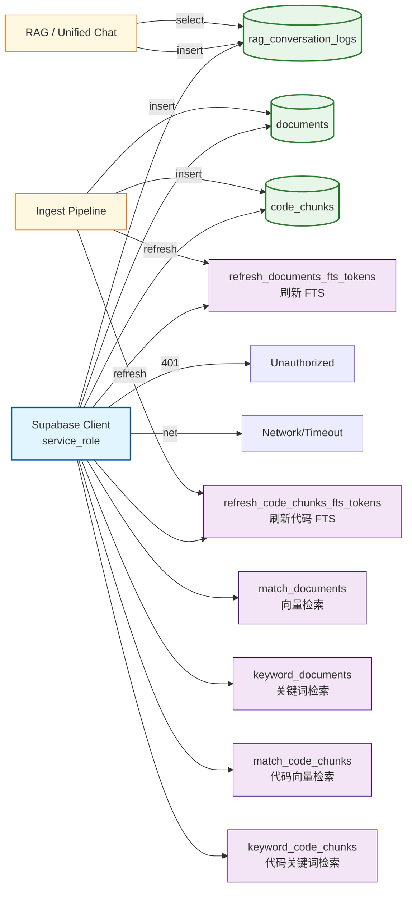

```mermaid
flowchart LR
    %% Supabase RPC + Tables (service_role)

    %% 连接层
    SB[Supabase Client<br/>service_role] --> D[(documents)]
    SB --> C[(code_chunks)]
    SB --> L[(rag_conversation_logs)]
    SB -->|401| E1[Unauthorized]
    SB -->|net| E2[Network/Timeout]

    %% Documents RPC
    SB --> MD[match_documents<br/>向量检索]
    SB --> KD[keyword_documents<br/>关键词检索]
    SB --> RD[refresh_documents_fts_tokens<br/>刷新 FTS]

    %% CodeChunks RPC
    SB --> MC[match_code_chunks<br/>代码向量检索]
    SB --> KC[keyword_code_chunks<br/>代码关键词检索]
    SB --> RC[refresh_code_chunks_fts_tokens<br/>刷新代码 FTS]

    %% 写入流
    ING[Ingest Pipeline] -->|insert| D
    ING -->|insert| C
    ING -->|refresh| RD
    ING -->|refresh| RC

    %% 日志流
    CHAT[RAG / Unified Chat] -->|insert| L
    CHAT -->|select| L

    %% 样式
    classDef client fill:#e1f5fe,stroke:#01579b,stroke-width:2px
    classDef table fill:#e8f5e9,stroke:#2e7d32,stroke-width:2px
    classDef rpc fill:#f3e5f5,stroke:#4a148c,stroke-width:1px
    classDef pipeline fill:#fff8e1,stroke:#ff6f00,stroke-width:1px

    class SB client
    class D,C,L table
    class MD,KD,RD,MC,KC,RC rpc
    class ING,CHAT pipeline
```
