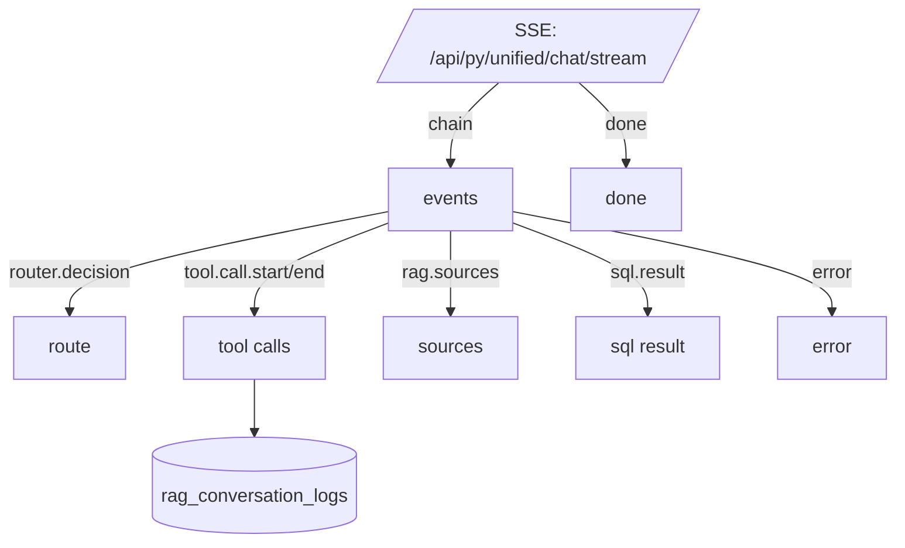

```mermaid
flowchart TD
  %% Runtime / Observability（人类友好版，最小同步）

  SSE[/SSE: /api/py/unified/chat/stream/] -->|chain| EV[events]
  SSE -->|done| DONE[done]

  EV -->|router.decision| R[route]
  EV -->|tool.call.start/end| T[tool calls]
  EV -->|rag.sources| S[sources]
  EV -->|sql.result| Q[sql result]
  EV -->|error| E[error]

  T --> LOG[(rag_conversation_logs)]
```

