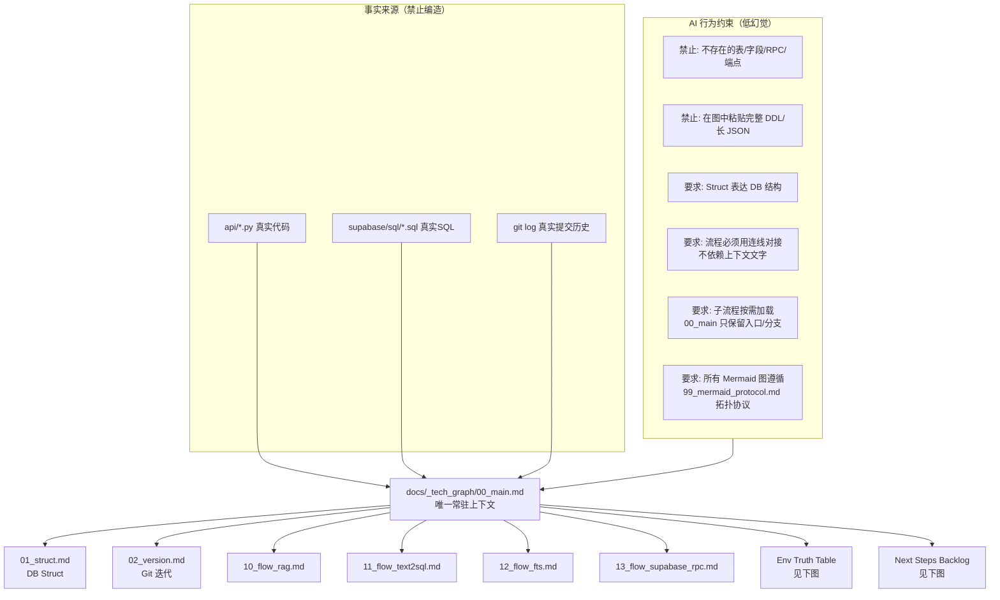

- CI 门禁约束（P4）：任何 **端点 / Supabase RPC / 表 / 关键 env / anchors** 的新增、改名、删除，都必须同步更新 `docs/_tech_graph/_manifest.json`，否则 CI 将因 `python tools/tech_graph_manifest_check.py` 失败而阻止合并。

- 最小漂移校验（P0_3）：运行 `python tools/tech_graph_drift_check.py`，检查端点/RPC/env/表名是否在 `docs/_tech_graph/*.md` 被覆盖（用于避免文档静默过期）。

```mermaid
flowchart TD
  %% Env Truth Table（变量 -> 影响节点）

  subgraph Supabase["Supabase"]
    SURL[NEXT_PUBLIC_SUPABASE_URL / SUPABASE_URL] --> SB[supabase_client()<br/>api/rag_env.py]
    SKEY[SUPABASE_SERVICE_ROLE_KEY / SUPABASE_SERVICE_KEY] --> SB
  end

  subgraph Auth["Auth"]
    AK[API_KEY] --> AUTHU[unified/text2sql/chat auth]
    AS[NEXT_PUBLIC_ADMIN_SECRET / CHAT_API_SECRET] --> AUTHU
  end

  subgraph RAG["RAG"]
    EMBM[SILICONFLOW_EMBEDDING_MODEL] --> EMB[Embedding]
    EMBD[SILICONFLOW_EMBEDDING_DIMENSIONS] --> EMB
    TH[RAG_MATCH_THRESHOLD (0~1 或 none)] --> VEC[match_documents threshold]
    DBG[DEBUG_RAG / RAG_DEBUG / NODE_ENV] --> LOG[rag debug print]
    RRPC[RAG_RPC_RETRIES] --> RPC_RETRY[rpc_execute_with_retry retry 次数]
    RMC[RAG_MATCH_COUNT] --> TOPK[match_count/top_k 默认值]
  end

  subgraph Ingest["Ingest"]
    DI[DEBUG_INGEST] --> ING_LOG[ingest debug print]
    DCI[DEBUG_CODE_INGEST] --> CING_LOG[code-ingest debug print]
  end

  subgraph LLM["LLM"]
    CK[SILICONFLOW_API_KEY] --> OAI[openai_siliconflow_client / OpenAI]
    CM[SILICONFLOW_CHAT_MODEL] --> OAI
    BASE[SILICONFLOW_BASE_URL] --> OAI
  end

  subgraph Text2SQL["Text2SQL"]
    TDB[TEXT2SQL_DATABASE_URL] --> EX[execute_select_sql]
    TTOPK[TEXT2SQL_RETRIEVE_TOPK] --> RET[text2sql_store.search]
    TROW[TEXT2SQL_MAX_ROWS] --> EX
    TDBG[TEXT2SQL_DEBUG] --> TLOG[text2sql debug print]
    TDIM[TEXT2SQL_FAISS_DIM] --> TSTORE[text2sql_store dim]
    TTO[TEXT2SQL_DB_CONNECT_TIMEOUT_S] --> EX
  end
```

```mermaid
flowchart TD
  %% Next Steps Backlog（优先级 + 验收点 + 影响文件）

  START[接手下一步] --> P0[P0: 图谱可接手性补强（内容层）]
  P0 --> P0_1[1) 锚点升级到<br/>文件 + handler/关键函数]
  P0 --> P0_2[2) Struct 标注 required/optional<br/>尤其 metadata.*]
  P0 --> P0_3[3) 最小漂移校验：变更即报警<br/>端点/RPC/env/表名]
  P0 --> A0[验收: 新 Agent 只读 00_main+99_spec<br/>即可定位入口/配置/下一步工作]
  P0 --> F0[影响: docs/_tech_graph/00_main.md<br/>docs/_tech_graph/01_struct.md<br/>docs/_tech_graph/99_spec.md]

  A0 --> P1[P1: 方案A 最小落地（机制层）]
  P1 --> P1_1[1) 引入 manifest（机器可读真值）<br/>端点/RPC/env/表/锚点]
  P1 --> P1_2[2) 自动校验（CI/脚本均可）<br/>manifest vs 源码/SQL 不一致则失败]
  P1 --> P1_3[3) 可选：由 manifest 渲染 md<br/>（先校验，后生成）]
  P1 --> A1[验收: 任何新增/改名端点/RPC/env/表<br/>若未同步到 manifest 会被拦截]
  P1 --> F1[影响: api/index.py<br/>api/*.py（rpc 调用点）<br/>supabase/sql/*.sql]

  A1 --> HOLD[Deferred: 等 P1 完成后重评]
  HOLD --> P2[P2: 分层视角（B）<br/>概念/实现/运行 + 失败路径/排障]
  HOLD --> P3[P3: 端到端边界图（C）<br/>前端SSE/内容仓/后端/DB]

  %% Parking Lot: 被挤下去但未完成的任务（挂起区）
  START --> PARK[Parking Lot / 挂起区<br/>P1 完成后统一重评优先级]
  PARK --> K1[Intent Router: 表名/字段名 flexible match<br/>（raw query 参与路由）<br/>api/intent_router.py]
  PARK --> K2[RAG: raw+rewrite 双路向量召回<br/>api/unified_chat.py]
  PARK --> K3[no_data: 明确承认不知道，禁止编造<br/>（提示词/输出策略）]
  PARK --> K4[Unified Chat: tool extension reservation<br/>（Code RAG / Ticket Bot 接入预留）]
```

