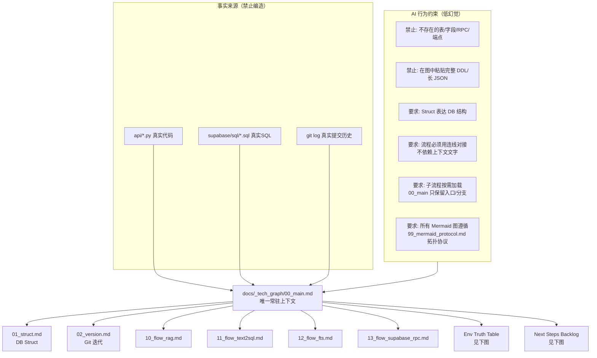
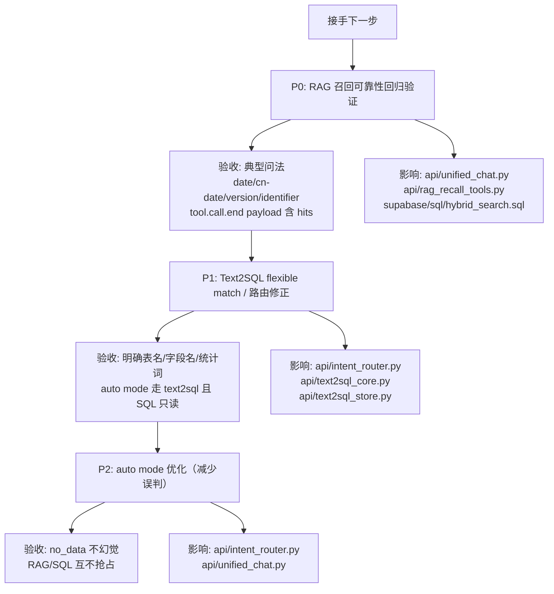

```mermaid
flowchart TD
  %% Env Truth Table（变量 -> 影响节点）

  subgraph Supabase["Supabase"]
    SURL[NEXT_PUBLIC_SUPABASE_URL / SUPABASE_URL] --> SB[supabase_client()<br/>api/rag_env.py]
    SKEY[SUPABASE_SERVICE_ROLE_KEY / SUPABASE_SERVICE_KEY] --> SB
  end

  subgraph Auth["Auth"]
    AK[API_KEY] --> AUTHU[unified/text2sql/chat auth]
    AS[NEXT_PUBLIC_ADMIN_SECRET / CHAT_API_SECRET] --> AUTHU
  end

  subgraph RAG["RAG"]
    EMBM[SILICONFLOW_EMBEDDING_MODEL] --> EMB[Embedding]
    EMBD[SILICONFLOW_EMBEDDING_DIMENSIONS] --> EMB
    TH[RAG_MATCH_THRESHOLD (0~1 或 none)] --> VEC[match_documents threshold]
    DBG[DEBUG_RAG / RAG_DEBUG / NODE_ENV] --> LOG[rag debug print]
  end

  subgraph LLM["LLM"]
    CK[SILICONFLOW_API_KEY] --> OAI[openai_siliconflow_client / OpenAI]
    CM[SILICONFLOW_CHAT_MODEL] --> OAI
    BASE[SILICONFLOW_BASE_URL] --> OAI
  end

  subgraph Text2SQL["Text2SQL"]
    TDB[TEXT2SQL_DATABASE_URL] --> EX[execute_select_sql]
    TTOPK[TEXT2SQL_RETRIEVE_TOPK] --> RET[text2sql_store.search]
    TROW[TEXT2SQL_MAX_ROWS] --> EX
  end
```



