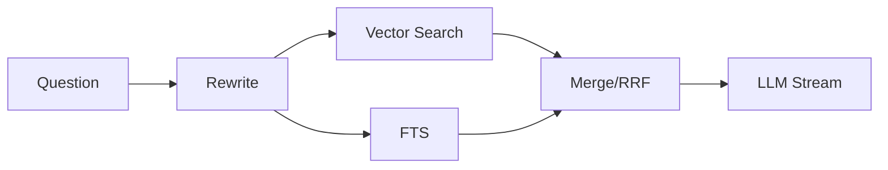

# 后端（ai-ink-brain-api-python）日记总结规范（docs/diary）

> 用途：沉淀**后端侧知识总结**（RAG、检索、日志、入库、性能与稳定性），为后续按日期归总到前端仓 `content/diary/` 提供可引用素材。

## 1. 产出位置与命名（强制）

- **目录**：`docs/diary/`
- **文件名**：`YYYY-MM-DD.md`（强制）
- **定位**：这是“总结素材”，不是最终对外日记；最终归总由总设按日期聚合。

## 2. 标题与结构（强制 + 推荐）

- H2 标题建议：
  - `## YYYY-MM-DD: 后端总结 - {{ 主题 }}`

推荐结构：

- `### 今日结论（TL;DR）`
- `### 关键决策（Why + What）`
- `### 实现要点（How）`
- `### 指标与观测（latency / logs / thresholds）`
- `### 坑位与排障（Symptoms / Root Cause / Fix）`
- `### 明日建议（可选）`

## 3. 截图占位（强制规则）

需要截图时必须用占位块，并写清要求：

```text
【截图占位：后端 {{ 场景/接口/日志面板 }}】
- 需要展示：{{ 关键日志字段/耗时/错误栈（脱敏后） }}
- 期望视角：{{ 全屏/局部/高亮区域 }}
- 备注：{{ 打码/隐藏密钥/隐藏 service_role 等 }}
```

## 4. 引用与隐私（强制规则）

- 不出现本地绝对路径（例如 `/Users/...`）。
- 引用只保留核心片段；超过 300 字必须拆分（公众号单段最大支持 300 字）。
- 不要粘贴任何密钥、token、service_role 等敏感信息。

## 5. Mermaid（可选）

可画检索流水线与模块边界：


