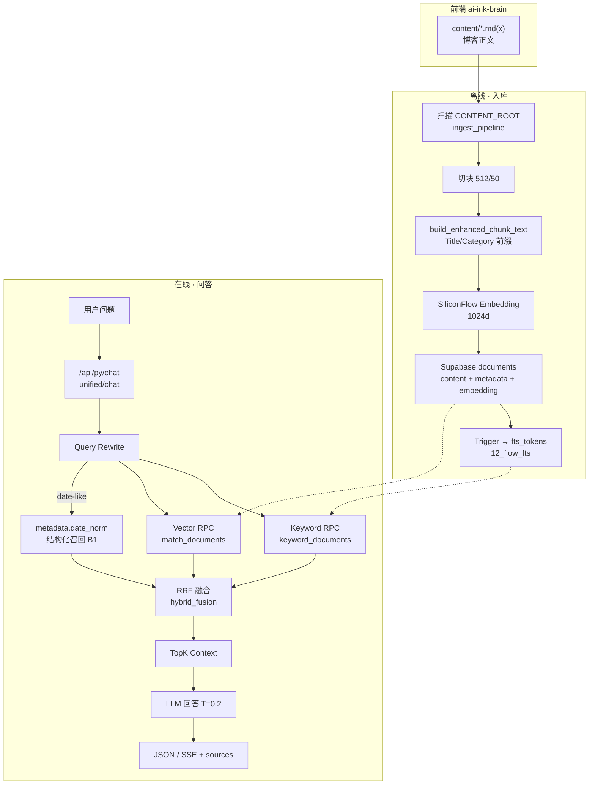
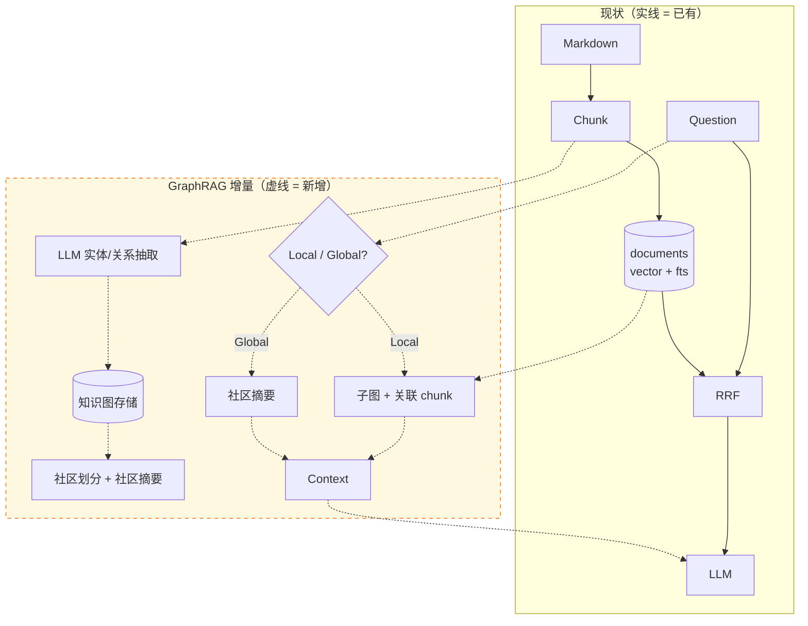

# Ink 博客 RAG vs GraphRAG：现状定位与演进对照

| 项 | 内容 |
| --- | --- |
| **版本** | v0.1 |
| **日期** | 2026-05-18 |
| **范围** | **博客内容 RAG**（`documents` + Supabase）；不含 `code_chunks`、不含 `docs/_tech_graph/` 治理层 |
| **真值来源** | [`docs/_tech_graph/10_flow_rag.md`](../../_tech_graph/10_flow_rag.md)、[`01_struct.md`](../../_tech_graph/01_struct.md)、`api/ingest_pipeline.py` |

---

## 1. 结论（先读）

| 问题 | 答案 |
| --- | --- |
| Ink 现在属于哪一格？ | **经典 Hybrid RAG**：字符切块 + 向量（1024d）+ FTS 关键词 + **RRF 融合**，不是 GraphRAG |
| 和 GraphRAG 最大差别？ | **没有**「从正文 LLM 建实体关系图 + 社区摘要」；检索单位是 **chunk**，不是 **子图/社区** |
| 和 `tech_graph` 关系？ | **平行系统**：图谱管仓库架构真值；博客 RAG 管 `content/` 可读知识，二者默认 **不互通** |
| 若上 GraphRAG 动哪？ | 主要在 **离线索引** 增阶段；在线 **召回/融合** 要加 local/global 分支；ingest 成本显著上升 |

---

## 2. Ink 现状：落在「经典 RAG」哪一格

```text
                    ┌─────────────────────────────────────────┐
                    │  行业谱系（博客 / 文档 QA）              │
                    └─────────────────────────────────────────┘
   纯关键词检索 ◄──────────────────────────────────────► 完整 GraphRAG
        │                        │                              │
        │                   【Ink 当前】                         │
        │              Hybrid RAG（向量+FTS+RRF）                │
        │                        │                              │
        └─ 仅 BM25 ──────────────┴─ 向量 Top-K ────────────────┘
                                      ▲
                                 你们在这里
```

**已实现能力（对照通用 RAG）：**

| 能力 | Ink 实现 | 模块/表 |
| --- | --- | --- |
| 切块 | 512 字符 + overlap 50 | `ingest_pipeline.chunk_text_by_chars` |
| 嵌入 | SiliconFlow，dim=1024 | `rag_env` → `documents.embedding` |
| 元数据 | category、slug、`date_norm`、relativePath、chunk_index | `to_db_metadata` |
| 向量召回 | `match_documents` RPC | `10_flow_rag` → Vector 分支 |
| 关键词召回 | `keyword_documents` + `fts_tokens` GIN | `12_flow_fts` |
| 融合 | RRF | `hybrid_fusion.py`（图谱引用） |
| 查询增强 | Query Rewrite；date-like → 结构化召回 B1 | `query_rewrite.py` |
| 降级 | Embedding 失败 → keyword-only | `10_flow_rag` FBO 分支 |
| 入口 | `/api/py/chat`、`/api/py/unified/chat(.stream)` | `api/index.py` |

**明确没有（GraphRAG 标志项）：**

- 从 Markdown 正文 **自动抽取实体/关系** 的知识图
- **社区检测** + 预生成 **社区级摘要**
- 在线 **Local（实体子图）/ Global（社区摘要）** 双路径检索

---

## 3. 现状数据流（博客 RAG 全链路）



**入库触发：**

- `POST /api/py/admin/ingest`、`/api/py/admin/sync` → `ingest_pipeline.process_markdown_files` / `run_sync_job_sync`
- 本地常设 `CONTENT_ROOT` 指向前端仓 `content/`（与展示同源）

---

## 4. 若上 GraphRAG：会变哪几步（对照表）

| 阶段 | **现在（Ink Hybrid RAG）** | **若引入 GraphRAG** | 改动量级 |
| --- | --- | --- | --- |
| **① 源数据** | `content/` Markdown | 同左 | 无 |
| **② 切块** | 固定字符块 + 元数据前缀 | 可保留 chunk（作 Local 原文证据） | 低 |
| **③ 索引 A** | Embedding → `documents` | 同左 | 无 |
| **④ 索引 B** | FTS `fts_tokens` | 同左或降为辅助 | 低 |
| **⑤ 索引 C（新增）** | — | LLM **抽实体/关系** → 图存储（新表/库） | **高** |
| **⑥ 索引 D（新增）** | — | **社区检测** + 每社区 **LLM 摘要** | **高** |
| **⑦ 查询路由** | Rewrite → 双路召回 | 增加 **Local vs Global** 意图分类 | 中 |
| **⑧ 召回** | Vector + Keyword + RRF | Local：实体邻域 + chunk；Global：社区摘要 | **高** |
| **⑨ 上下文** | TopK chunk 拼接 | chunk + 图事实 +（可选）社区摘要 | 中 |
| **⑩ 生成** | LLM + sources | 同左；sources 需含图路径/社区 id | 低 |
| **运维/成本** | 入库 ≈ embed 批次 | 入库 ≈ **多轮 LLM**（抽图+摘要） | **高** |

---

## 5. 演进示意：在现有链路上「插」GraphRAG



**最小侵入路径（若试点）：**

1. **保留** 现有 `documents` + RRF（Local 路径的原文证据）。
2. **新增** 离线图索引 job（独立脚本/表，不替换 ingest）。
3. **仅对「全局/跨多篇」类问题** 走 Global；其余仍走现有 Hybrid RAG。
4. 验收单独定义：抽图准确率、社区摘要幻觉率、token/延迟预算。

---

## 6. 三条「图」线不要混（Ink 仓库内）

```text
  ┌──────────────────────────────────────────────────────────────────┐
  │ A. 博客 RAG（本对照）                                             │
  │    content/ → documents(chunk+vector+fts) → chat 召回            │
  │    目的：读者问博客/日记内容                                       │
  └──────────────────────────────────────────────────────────────────┘

  ┌──────────────────────────────────────────────────────────────────┐
  │ B. 代码检索（另一条 RAG 变体）                                     │
  │    仓库代码 → code_chunks → /api/py/code/query|search              │
  │    目的：问实现/符号，不是 GraphRAG 社区摘要                       │
  └──────────────────────────────────────────────────────────────────┘

  ┌──────────────────────────────────────────────────────────────────┐
  │ C. 治理层 tech_graph（三相塌缩 / graph_query）                     │
  │    docs/_tech_graph/ → graph_v2 + manifest → Agent 架构上下文    │
  │    目的：抗漂移、影响分析；Git 真值图，非从正文抽取 KG               │
  │    ≠ GraphRAG；也 ≠ 博客 RAG 的 documents 表                      │
  └──────────────────────────────────────────────────────────────────┘
```

| 线 | 图从哪来 | 检索方式 | 典型消费者 |
| --- | --- | --- | --- |
| **A 博客 RAG** | 无图（仅 chunk 向量+FTS） | 相似度 + RRF | 站点 Chat / Unified Chat |
| **B 代码 RAG** | 无 KG（chunk + 代码元数据） | 向量 + FTS（`code_chunks`） | Code Query API |
| **C tech_graph** | 人维护 Mermaid → 导出 JSON | **确定性 graph_query** | Cursor Agent / CI |

**可选联动（未来，非现状）：**  
例如「用户问某篇日记」→ 向量命中 chunk → 用 slug 关联 `10_flow_*` 节点（需显式契约）；这是 **产品化集成**，不是当前实现。

---

## 7. 何时值得为 Ink 博客上 GraphRAG

| 场景 | 建议 |
| --- | --- |
| 单篇日记内找事实、引用段落 | **维持现状** Hybrid RAG 足够 |
| 跨大量 diary 问「这一年主题演变」「矛盾观点」 | 评估 **GraphRAG Global** 或人工主题索引 |
| 语料小、更新频、团队单人维护 | **不建议** 全量 GraphRAG；成本高、抽图噪声难控 |
| 要先降 hallucination | 优先 **sources 约束 + 评测集**；再考虑图 |

---

## 8. 相关路径

| 类型 | 路径 |
| --- | --- |
| RAG 流程图 | `docs/_tech_graph/10_flow_rag.md` |
| FTS | `docs/_tech_graph/12_flow_fts.md` |
| 表结构 | `docs/_tech_graph/01_struct.md` |
| 入库 | `api/ingest_pipeline.py` |
| 治理层说明 | `docs/diary/jsonPKmermaid/治理层三相塌缩_Ink技术图谱应用.md` |
| 闸口实验（图谱上下文，非博客 RAG） | `docs/diary/jsonPKmermaid/reports/conclusion_gate_ctx_ab_final_zh.md` |

---

## 修订记录

| 版本 | 日期 | 说明 |
| --- | --- | --- |
| v0.1 | 2026-05-18 | 初稿：Ink 博客 RAG 现状 vs GraphRAG 演进对照 |
