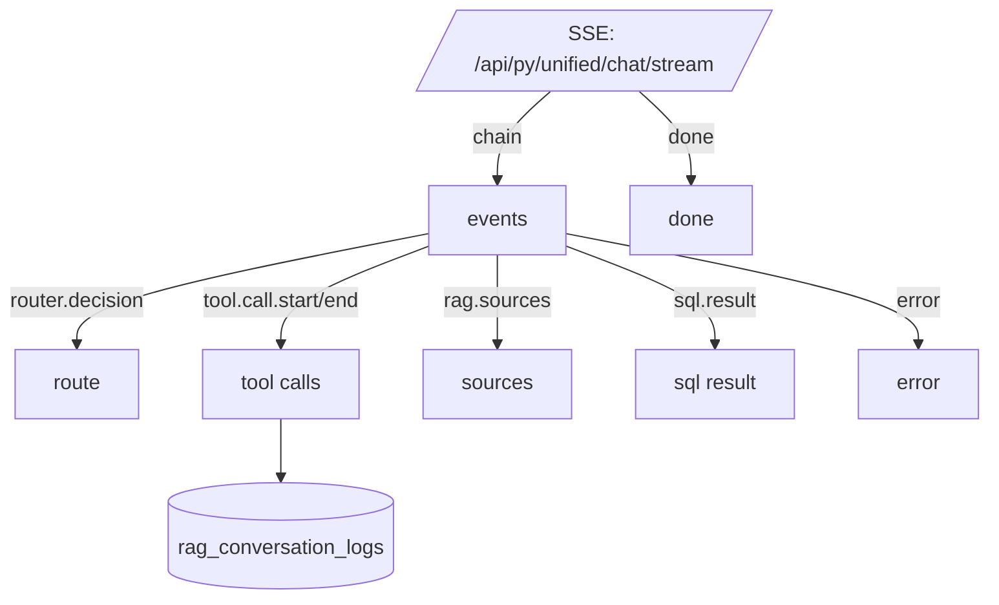

<!-- gate_ctx_c dual_track role=ai path=docs/_tech_graph/14_runtime_observability.ai.md -->
```mermaid
flowchart TD
  %% Runtime / Observability View (SSE events + error branches)
  %% 注意：仅运行/排障视角，不重复业务主链路

  %% === SSE Envelope ===
  REQ[[HTTP Request]] --"->"--> SSE{{SSE?}}
  // → api/unified_chat.py::handle_unified_chat_stream

  SSE --"[yes]"--> EV[[event: chain]]
  SSE --"[yes]"--> DONE[[event: done]]
  // → api/unified_chat.py::_sse

  SSE --"[no]"--> JSON[[JSON response]]
  // → api/unified_chat.py::handle_unified_chat

  %% === Core event types (chain) ===
  EV --"type=router.decision"--> R1[[router.decision]]
  EV --"type=tool.call.start"--> TCS[[tool.call.start]]
  EV --"type=tool.call.end"--> TCE[[tool.call.end]]
  EV --"type=rag.query_expand"--> QX[[rag.query_expand]]
  EV --"type=rag.sources"--> RS[[rag.sources]]
  EV --"type=sql.result"--> SQLR[[sql.result]]
  EV --"type=assistant.message"--> AM[[assistant.message]]
  EV --"type=latency"--> LAT[[latency]]
  EV --"type=error"--> ERR[[error]]
  // → api/unified_chat.py::_event

  %% === tool.call payload keys (用于排障最短链路) ===
  TCS --"payload"--> TCS_KEYS["{tool, input}"]
  TCE --"payload"--> TCE_KEYS["{output, error, latency_ms}"]
  // → api/unified_chat.py::_event + tool.call.* payload

  %% === rag.sources (证据链) ===
  RS --"payload.sources[*]"--> SRC_KEYS["{id, content, filename, score, path, url}"]
  // → api/unified_chat.py::_build_rag_sources_event
  // → api/index.py::build_sources_payload

  %% === sql.result (Text2SQL 结果) ===
  SQLR --"payload"--> SQL_KEYS["{sql, columns, rows[0..20], truncated}"]
  // → api/unified_chat.py#L425

  %% === Error shortest paths ===
  ERR --"stage=router"--> E_ROUTER[[未实现工具路由 / 参数错误]]
  ERR --"stage=rag.embed"--> E_EMB[[Embedding error -> keyword-only]]
  ERR --"stage=rag.retrieve"--> E_RPC[[RPC error / retries exhausted]]
  ERR --"stage=text2sql.generate_sql"--> E_GENSQL[[validate_sql_readonly [err]]]
  ERR --"stage=text2sql.execute_sql"--> E_EXECSQL[[TEXT2SQL_DATABASE_URL missing / DB error]]
  // → api/unified_chat.py::handle_unified_chat(_stream)
  // → api/text2sql_core.py::execute_select_sql

  %% === Log sink ===
  AM --"::archives"--> LOG[[save_debug_log]]
  // → api/database_manager.py::save_debug_log
  LOG --"->"--> DB[(DB: rag_conversation_logs)]

  %% === Debug toggles (边界：只列变量名) ===
  ENV[[Debug env toggles]] --"->"--> ENV_KEYS["DEBUG_RAG / RAG_DEBUG / NODE_ENV / DEBUG_INGEST / DEBUG_INTENT_CACHE / DEBUG_AGENT_DB_LOG / DEBUG_ROUTER_EVIDENCE / DEBUG_ROUTER_EVIDENCE_DB / DEBUG_ROUTER_TRACE_DB"]
  // → api/index.py::_rag_debug_enabled
  // → api/ingest_pipeline.py#L33

  classDef phase fill:#e1f5fe,stroke:#01579b,stroke-width:2px;
  classDef payload fill:#f3e5f5,stroke:#4a148c,stroke-width:1px;
  classDef data fill:#e8f5e9,stroke:#1b5e20,stroke-width:1px;
  classDef err fill:#ffebee,stroke:#b71c1c,stroke-width:1px;

  class REQ,SSE,EV,DONE,JSON phase
  class R1,TCS,TCE,QX,RS,SQLR,AM,LAT phase
  class TCS_KEYS,TCE_KEYS,SRC_KEYS,SQL_KEYS,ENV_KEYS payload
  class DB data
  class ERR,E_ROUTER,E_EMB,E_RPC,E_GENSQL,E_EXECSQL err
```

---
<!-- gate_ctx_c dual_track role=human path=docs/_tech_graph/14_runtime_observability.md -->


**Debug 开关字面量（drift_check）**：`DEBUG_RAG` `RAG_DEBUG` `NODE_ENV` `DEBUG_INGEST` `DEBUG_INTENT_CACHE` `DEBUG_AGENT_DB_LOG` `DEBUG_ROUTER_EVIDENCE` `DEBUG_ROUTER_EVIDENCE_DB` `DEBUG_ROUTER_TRACE_DB`

