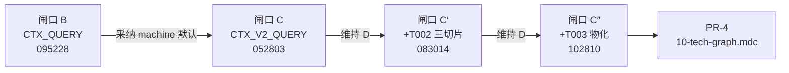
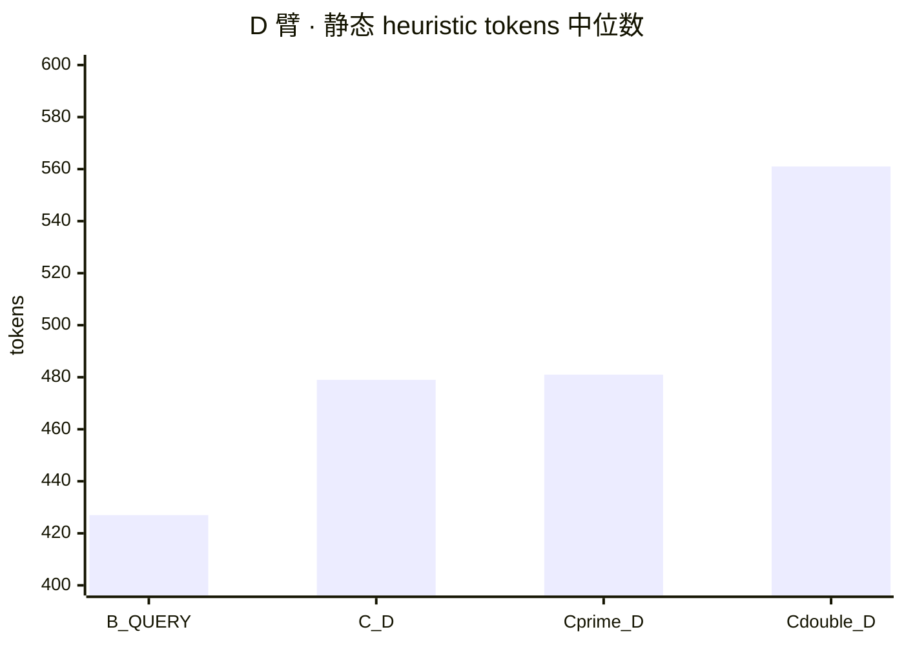
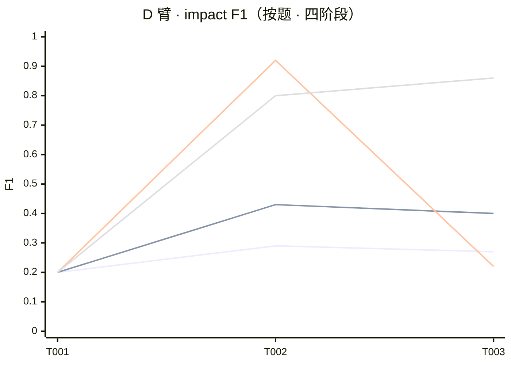
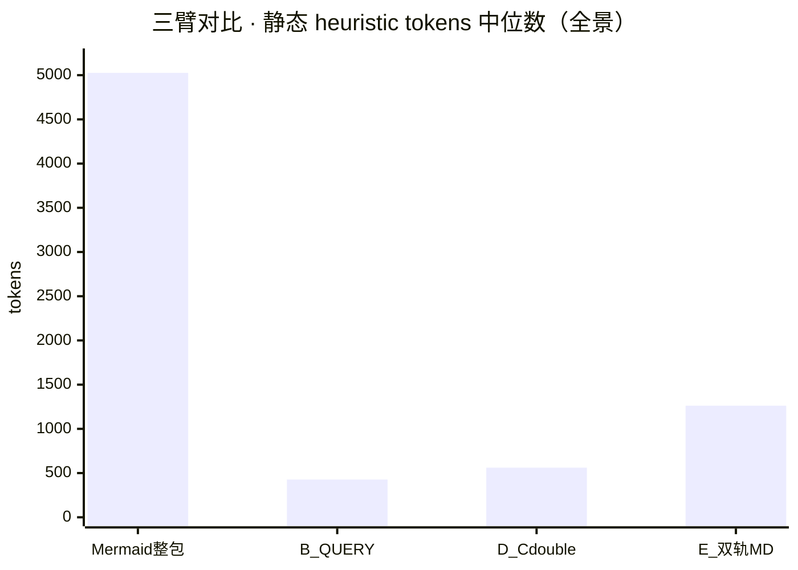
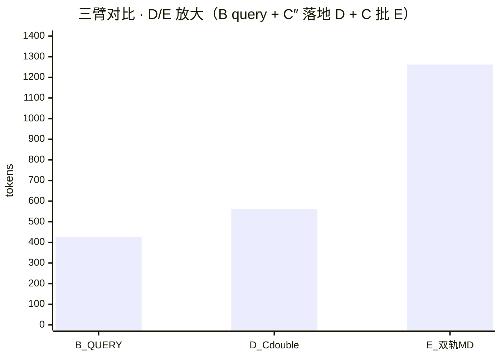

# 全链路对比：Mermaid 双轨（`*.ai.md` + `*.md`）vs 落地方案（`graph_query` + 分题物化）

> **状态**：`reference`（汇总已 accepted 闸口；**非**新 freeze 实验结论）  
> **读者**：产品 / 架构 / 执行 Agent  
> **关联规划**：`Projects/docs/tech_graph/改进方向.md`（R4 阶段对比实验 · 闸口 A～C″）  
> **落地消费规约（后端 Cursor）**：`.cursor/rules/10-tech-graph.mdc`（PR #38 · `main`）  
> **日期**：2026-05-20

---

## 0. 两问速答

### 0.1 现在还能不能做「完整」实验对比？

| 含义 | 能否再做 | 说明 |
| --- | --- | --- |
| **D vs E（子图 JSON vs 精选 `*.ai.md`+`*.md`）** | **能复跑** | 脚本与 `protocol_version.yaml` 仍在；须 **新建** `runs/gate_ctx_c_v1_batch_<YYYYMMDD>_<HHMMSS>/`，**禁止**覆盖 `052803` / `083014` / `102810` |
| **与当前落地完全一致的 D 臂** | **能** | 先 `materialize_gate_c_payloads.py`（C″ freeze），再 `run_gate_c_batch.py --arms CTX_V2_QUERY,CTX_DUAL_MD` |
| **整包 Mermaid / 整包 v1 JSON 作主实验** | **不建议** | 闸口 A/B 已归档（NR-1）；新对比应 **引用** 历史 run，而非重跑抢结论 |
| **「维护轨 + 机器轨」工作流对照** | **不需新 batch** | 双轨 **仍维护**（改 `.ai.md` → 导出 `graph.json`）；实验对比的是 **Agent 主载荷选型**，见 §2 |

**结论**：若要「再跑一轮」验证——**可以**，且应用 **当前 C″ 物化** 作为 D 臂真值；历史三轮 D vs E（`052803` / `083014` / `102810`）已构成 **时间序列**，通常 **不必** 为「落地后」单独再跑，除非图/模型/题集变更。

### 0.2 本文档是什么？

从 **为什么做图论加速** → **各闸口数据** → **工件放哪里、谁更新** → **最终落地清单** 的 **只读汇总**；**不修订** 各闸口 `accepted` 结论文正文。

### 0.3 执行摘要（一句话 + 丰富版）

**一句话（方向正确，宜把「全面」改为「在约定范围内显著」）**  
在 **静态主载荷 token 仅小幅增加**（闸口 B 子图 query 约 **427** → C″ 落地约 **561**，仍约为整包 Mermaid 的 **1/9**、约为双轨 MD 对照臂的 **1/2**）的前提下，通过 **`graph_query` 子图 + 分题清单切片 / 影响面提示**，让 **Cursor Agent** 对后端图谱相关改动的 **影响分析可观测性** 和 **与 gold 对齐能力** 明显增强——**不是**每一题、每一指标都创新高，而是 **在维持「子图默认、双轨仅人读」架构下，把 Agent 该抓的入口与影响路径抓准了**。

**丰富版总结**

| 维度 | 落地前（闸口 B 定子图默认） | 落地后（C″ + `10-tech-graph.mdc`） | 中文指标名 |
| --- | --- | --- | --- |
| **读图成本** | 子图 query，中位 token **427** | 加物化切片，中位 **561**（+约 **31%**） | 静态启发式 token ↓ |
| **入口点识别** | 入口点 F1 中位 **0.857**，T002 偏弱 | 入口点 F1 中位 **0.923**；T003 由 **1.000→0.923**（略降） | **入口点 F1**（原 entry / entrypoints） |
| **影响面识别** | 影响面 F1 中位 **0.267** | 影响面 F1 中位 **0.800**；T003 **0.222→0.857** | **影响面 F1**（原 impact / impacts） |
| **Agent 规约** | 禁止整包 `graph.json`；query 优先 | 明确 T003/Admin：**清单切片 + 影响面**；产出须 **`path` + `kind`** | `.cursor/rules/10-tech-graph.mdc` |
| **架构默认** | `CTX_QUERY` / 子图 | **不变**：仍为 **`CTX_V2_QUERY`**，**不**升双轨 MD | machine 默认轨 |

**术语对照（实验报告 → 中文）**

| 英文 | 中文（本文采用） | 含义 |
| --- | --- | --- |
| entry / entrypoints | **入口点** | 变更从哪条 API/路由/符号进入（gold `entrypoints`） |
| impact / impacts | **影响面**（单条称 **影响项**） | 可能波及的文件路径、种类（gold `impacts[].path` / `kind`） |
| entry F1 | **入口点 F1** | 入口 gold 的 P/R/F1（见 §0.5） |
| impact F1 | **影响面 F1** | 影响项 path/kind 的 P/R/F1（见 §0.5） |
| `manifest_slice` | **清单切片** | 从 `_manifest.json` 抽与题相关的端点/锚点 |
| `impact_surface` | **影响面提示** | 从 gold 枚举 path/kind，减少无 path 的 `ref` 占位 |
| `CTX_V2_QUERY` / D 臂 | **子图查询轨（落地默认）** | `graph.json` 子图 + query，非整包 |
| `CTX_DUAL_MD` / E 臂 | **精选双轨原文轨（对照）** | 配对 `*.ai.md` + `*.md`，人读/实验用 |

**不宜过度宣称的边界**

- **T001** 影响面 F1 仍约 **0.20**，未因 C″ 单独拉高。  
- **T002** 影响面在 C′ 曾达 **0.923**，C″ 为 **0.800**（策略 B 豁免，不阻落地）。  
- **「把控整个项目」** 限于 **已接入 `_tech_graph` + jsonPKmermaid 题集所覆盖的后端 RAG/ingest/契约域**；非全仓所有模块。  
- **维护轨**（`*.md` / `*.ai.md`）照旧人工维护；升级的是 **Agent 消费机器轨的方式**，不是取消双轨。

**对产品/协作的直白含义**  
Agent 仍 **少读**（相对整包图与双轨 MD），但 **读得更准**——尤其 **Admin 入库 / ingest（T003）** 一类题，更少「猜 ref、漏 path」；规则写进 Cursor 后，后续改 `api/`、`ingest_pipeline`、`supabase/sql` 等时，**入口点 + 影响面** 的分析路径与实验证据一致。

### 0.4 指标怎么读：入口点 F1、影响面 F1（协作含义）

#### 入口点 F1（越高通常越好）

| 问题 | 答案 |
| --- | --- |
| **数字高说明什么？** | 模型列出的 **入口点**（API/路由/符号/图节点等）与题集 **标准答案（gold）** 更一致：**少漏入口、也少乱猜入口**。 |
| **对应协作场景** | 「这次改动 **从哪儿动刀**」是否对准——例如是否指向正确的 admin 路由、embedding 配置入口等。 |
| **不保证什么？** | 入口准 **不等于** 连带文件列全；闸口 B 入口点 F1 已约 **0.857**，影响面 F1 仍仅约 **0.267**。 |

#### 影响面 F1（越高通常越好）

| 问题 | 答案 |
| --- | --- |
| **数字高说明什么？** | 模型列出的 **影响项**（`path` + `kind` 等）与 gold **影响面** 更一致：**少写无 path 的含糊 `ref`，少漏该同步改的文件**。 |
| **对应协作场景** | 减轻 **「只改 A，不知道 B、C 也要一起改」**——例如改 ingest 时是否点到 `api/rag_env.py`、`supabase/sql`、`tools/tech_graph_manifest_check.py` 等 gold 中的连带路径。 |
| **本落地的主收益** | C″ 批 T003 影响面 F1 **0.222→0.857**，即此类 **连带改动识别** 在实验题上显著提升。 |

#### 二者关系（记忆用）

```text
入口点 F1  →  「改动的起点找得准不准」
影响面 F1  →  「连带要动的地方列得全不全、路径清不清楚」
```

#### 阅读时勿过度推广

| 边界 | 说明 |
| --- | --- |
| 实验范围 | 仅 **3 道 gold 题** + 固定评分脚本；**不能**等同「全仓永不错漏」。 |
| 分数非 100% | 例如 T001 影响面 F1 仍约 **0.20**；T002 在 C″ 未保持 C′ 峰值。 |
| 与线上体验 | F1 是 **可复现 rubric**；真实 PR 是否少漏改，还需日常 review / 后续抽检。 |

评分细则见各 run 的 `gold_f1.md` 页眉（如 [`…_102810/gold_f1.md`](../runs/gate_ctx_c_v1_batch_20260518_102810/gold_f1.md)）：入口点命中 path/symbol/graph_id；影响项对 path/kind 启发式匹配。

### 0.5 为什么叫 F1？「F」是什么？

| 项 | 说明 |
| --- | --- |
| **名称来源** | **F1** 即 **F1-score**（**F 值**、**F 度量**），信息检索与分类里常用的综合指标；**β=1 的 F-measure** 简写为 F1。 |
| **「F」含义** | **F** 来自 **F-measure**（调和 **精确率** 与 **召回率**），不是 “Feature/File/Flow” 的缩写。 |
| **表内 P / R / F1** | **P** = Precision **精确率**（列出的里有多少是对的）；**R** = Recall **召回率**（gold 里有多少被列出）；**F1** = 二者的调和平均。 |
| **计算公式** | \(\mathrm{F1} = \dfrac{2 \cdot P \cdot R}{P + R}\)；当 \(P\) 或 \(R\) 很低时，F1 会被拉低（**既怕乱列，也怕漏列**）。 |
| **为何用 F1 而非只看 P 或 R** | 只高精确率可能 **漏报**（漏掉该同步的 B）；只高召回率可能 **胡说**（列一堆无关文件）。F1 **同时惩罚** 两种错误，适合评「清单式」入口/影响枚举。 |
| **本实验的两列 F1** | **入口点 F1**：对 `entrypoints` 集合匹配；**影响面 F1**：对 `impacts` 的 path/kind（及 evidence 启发式）匹配——**两套清单、两个 F1**，不可混为一谈。 |

---

## 1. 为什么：问题从哪来

### 1.1 原始痛点

| 痛点 | 表现 | 指向 |
| --- | --- | --- |
| Agent 读图 token 爆炸 | 整仓 `*.ai.md` Mermaid 灌 prompt ≈ **5026** heuristic tokens（闸口 B） | 不能默认整包 Mermaid |
| 影响分析缺 path | LLM 写 `impacts[].ref` 无 `path`/`kind`，F1 低 | 需 gold 对齐的 **impact_surface** |
| 维护与机器语义分裂 | 人改 `.md` / `.ai.md`，机器要 `graph.json` | **双轨制** + 导出器，而非二选一删轨 |

### 1.2 演进逻辑（闸口链）

```text
现状（整包 Mermaid）
    → 闸口 A：Mermaid vs v1 JSON（归档，勿复做主实验）
    → 闸口 B：CTX_QUERY 子图 vs 整包 → 【采纳】machine 默认 = graph_query
    → 闸口 C：D=CTX_V2_QUERY vs E=CTX_DUAL_MD（精选双轨原文）→ 【采纳】维持 D
    → 闸口 C′：D 臂 + T002 三切片物化 → impact F1 提升，仍维持 D
    → 闸口 C″：D 臂 + T003 manifest/impact → T003 impact 0.857，仍维持 D
    → PR-4：.cursor/rules/10-tech-graph.mdc 升格 Agent 消费规约
```

**核心决议**：**不是**用 `*.md`+`*.ai.md` 替换 `graph_query`；而是 **维护轨继续双轨 Mermaid**，**机器轨默认子图查询 + 按需分题物化切片**。

---

## 2. 两种「方案」定义（避免混称）

| 维度 | **方案 E · Mermaid 双轨语料** | **方案 D · 落地方案（machine）** |
| --- | --- | --- |
| **代号** | `CTX_DUAL_MD` | `CTX_V2_QUERY`（+ C′/C″ 物化切片） |
| **主载荷** | 每题 1 组 `10_flow_*.ai.md` + 配对 `*.md`（[`dual_track_manifest.json`](../fixtures/gate_ctx_c_v1/dual_track_manifest.json)） | `graph_v2` **子图 JSON** + query 元数据；T002/T003 可加 `manifest_slice` / `impact_surface` |
| **与维护关系** | **即**维护轨精选片段进 prompt | **来自** `.ai.md` 导出之 `graph.json`，**不**把全文 Mermaid 作默认主载荷 |
| **典型 token（静态中位数）** | **1262**（闸口 C `052803`） | **479**（C）→ **481**（C′）→ **561**（C″） |
| **角色定位** | 人读 / 对照 / 实验臂 E | **Agent machine 默认**（Cursor 规则 + 闸口 B/C/C′/C″） |
| **是否删除 `*.md`** | **否** | **否** — 仍做人友好版与导出源 |

---

## 3. 过程数据：实验与 run 索引

### 3.1 闸口与 freeze 对照

| 闸口 | freeze_id | 主 run 目录 | 结论文 |
| --- | --- | --- | --- |
| A | （闸口 A 协议） | `gate_ctx_ab_v1` 相关 | [`conclusion_gate_ctx_ab_final_zh.md`](./conclusion_gate_ctx_ab_final_zh.md) |
| B | `TECH_GRAPH_S2_FREEZE_20260517_V2_0` | `…/gate_ctx_b_v1_batch_20260517_095228` | [`conclusion_gate_b_ctx_query_v1_zh.md`](./conclusion_gate_b_ctx_query_v1_zh.md) |
| C | `TECH_GRAPH_GATE_C_FREEZE_20260518_V1_0` | `…/gate_ctx_c_v1_batch_20260518_052803` | [`conclusion_gate_c_v2_dual_track_v1_zh.md`](./conclusion_gate_c_v2_dual_track_v1_zh.md) |
| C′ | `TECH_GRAPH_GATE_C_PRIME_F1_FREEZE_20260520_V1_0` | `…/gate_ctx_c_v1_batch_20260518_083014` | [`conclusion_gate_c_prime_f1_v1_zh.md`](./conclusion_gate_c_prime_f1_v1_zh.md) |
| C″ | `TECH_GRAPH_GATE_C_DOUBLE_PRIME_FREEZE_20260520_V1_0` | `…/gate_ctx_c_v1_batch_20260518_102810` | [`conclusion_gate_c_double_prime_v1_zh.md`](./conclusion_gate_c_double_prime_v1_zh.md) |

### 3.2 D vs E 行为向摘要（三批 D 臂演变 · E 臂选材不变）

**E 臂（双轨 MD）**：三批均为精选 3 组双轨，**非**整仓 7 个 `*.ai.md`；静态中位数 **1262**（C）。

| 指标 | C `052803` D | C′ `083014` D | C″ `102810` D | E（C″ 同批） |
| --- | ---: | ---: | ---: | ---: |
| 静态 token 中位数 | 479 | 481 | **561** | **1262** |
| impact F1 中位数 | 0.400 | 0.222 | **0.800** | 0.429 |
| entry F1 中位数 | 0.857 | 0.923 | 0.923 | 0.909 |
| 运行时 total 中位数 | 6018 | — | **5790** | 6565 |

**T003 impact（主 KPI 题）**

| 批 | D impact | E impact |
| --- | ---: | ---: |
| C `052803` | 0.400 | 0.353 |
| C′ `083014` | 0.222 | — |
| C″ `102810` | **0.857** | 0.429 |

**产品粗判（三批一致方向）**：静态 token **D ≪ E**；C″ 后 T003 **D 大幅胜 E**；**无**「改升 E 为默认」证据 → 见 C / C″ 结论文 §3。

### 3.3 D 臂演进：从闸口 B「定 query 默认」到 C″ 落地（数据图）

> **说明**：下图与表均为 **D 臂**（`CTX_QUERY` → `CTX_V2_QUERY` + 物化切片）同一题集、同模型；**非** D vs E 对照（D vs E 见 §3.2）。数值来源：B [`conclusion_gate_b`](./conclusion_gate_b_ctx_query_v1_zh.md) · C/C′/C″ 各 run `gold_f1.md` · 静态 token 来自各批 `materialize_report.json`。

#### 时间线（决策 + 数据批）



#### 图 1 · 静态主载荷 token 中位数（↓ 越少越好）

| 阶段 | 代号 | 中位数 |
| --- | --- | ---: |
| B | `CTX_QUERY` | **427** |
| C | `CTX_V2_QUERY`（canonical） | **479** |
| C′ | + T002 三切片 | **481** |
| C″ | + T003 manifest/impact | **561** |



#### 图 2 · impact F1 中位数（↑ 越高越好）

| 阶段 | 中位数 | T001 | T002 | T003 |
| --- | ---: | ---: | ---: | ---: |
| B `CTX_QUERY` | **0.267** | 0.200 | 0.286 | 0.267 |
| C `052803` | **0.400** | 0.200 | 0.429 | 0.400 |
| C′ `083014` | **0.222** | 0.200 | **0.923** | 0.222 |
| C″ `102810` | **0.800** | 0.200 | 0.800 | **0.857** |



#### 图 3 · entry F1 中位数（↑）

| 阶段 | 中位数 | 备注 |
| --- | ---: | --- |
| B | **0.857** | T002 entry 偏弱（0.667） |
| C | **0.857** | |
| C′ | **0.923** | |
| C″ | **0.923** | T003 entry 0.923（相对 C′ 1.000 略降） |

**读图要点**

- **B→C**：从「定 query 默认」到 graph_v2 子图，token 与 impact 同量级，产品确认 **不换轨**。  
- **C→C′**：T002 impact **0.429→0.923**（物化主因）；T003 impact **回落** → 触发 C″。  
- **C′→C″**：T003 impact **0.222→0.857**；token +80（仍 &lt; 门槛 ≈601）。  
- **整包 vs D vs E**：见 **§3.4 图 4**；运行时 total token 见 [`conclusion_gate_c_double_prime_v1_zh.md`](./conclusion_gate_c_double_prime_v1_zh.md) §3。

### 3.4 相对「整包 Mermaid」的锚点（闸口 B）· 三臂 token 对比图

| arm | 代号 | 静态 heuristic 中位数 | 相对整包 5026 | 来源 |
| --- | --- | ---: | ---: | --- |
| 整包 Mermaid | `CTX_MERMAID` | **5026** | 1.00× | 闸口 B [`materialize_report`](../fixtures/gate_ctx_b_v1/payloads/materialize_report.json) |
| 子图 query（B 定默认） | `CTX_QUERY` | **427** | ≈**0.08×** | 同上 · run `095228` |
| 子图 v2 + 物化（**落地 D**） | `CTX_V2_QUERY`（C″） | **561** | ≈**0.11×** | C″ `materialize_report` · run `102810` |
| 精选双轨 MD（对照 E） | `CTX_DUAL_MD` | **1262** | ≈**0.25×** | 闸口 C `052803`（E 选材与 C″ 批一致） |

> **D 说明**：表中「落地 D」取 **C″ `102810`** 中位数（含 T002 继承切片 + T003 manifest/impact）。canonical C **479**、C′ **481** 仍远低于整包与 E，见 §3.3 图 1。

#### 图 4 · 静态 token 中位数：整包 Mermaid vs query 轨 D vs 双轨 E

**全景**（见柱高数量级差；D 仍贴 x 轴底部属预期）



**放大**（去掉整包，便于读 D vs E）



| 对比 | 倍数（相对左列） |
| --- | --- |
| 整包 → B `CTX_QUERY` | **5026 / 427 ≈ 11.8×** ↓ |
| 整包 → C″ D | **5026 / 561 ≈ 9.0×** ↓ |
| 整包 → E 双轨 | **5026 / 1262 ≈ 4.0×** ↓ |
| **C″ D → E** | **1262 / 561 ≈ 2.25×**（E 仍更肥；行为 F1 见 C″ 结论文 §3） |

---

## 4. 放哪、怎么更新（工件地图）

### 4.1 维护轨（人 + CI · 继续双轨）

| 工件 | 路径 | 何时更新 |
| --- | --- | --- |
| 流程图 AI 协议版 | `docs/_tech_graph/10_flow_*.ai.md` | 改拓扑/异步/错误分支 |
| 人读版 | `docs/_tech_graph/10_flow_*.md` | 与 `.ai.md` 语义等价 |
| 拓扑协议 | `docs/_tech_graph/99_mermaid_protocol.md` | 边标记约定变更 |
| 导出 | `python tools/tech_graph_graph_export.py` | 改 `.ai.md` 后再生 `graph.json` |

### 4.2 机器轨（查询 + 契约）

| 工件 | 路径 | 何时更新 |
| --- | --- | --- |
| 图数据 | `docs/_tech_graph/graph.json`（**勿手改**） | 导出器 |
| 查询 CLI | `tools/tech_graph_graph_query.py` | 新子图能力 |
| manifest / contract | `_manifest.json`、`_contract_manifest.json` | 端点/RPC/契约变更 |

### 4.3 实验轨（jsonPKmermaid · 可复跑）

| 工件 | 路径 |
| --- | --- |
| 协议 | `fixtures/gate_ctx_c_v1/protocol_version.yaml` |
| 双轨选材 | `fixtures/gate_ctx_c_v1/dual_track_manifest.json` |
| 查询种子 | `fixtures/gate_ctx_c_v1/query_seeds.json` |
| 物化 | `fixtures/gate_ctx_c_v1/scripts/materialize_gate_c_payloads.py` |
| 批跑 | `fixtures/gate_ctx_c_v1/scripts/run_gate_c_batch.py` |
| 评分 | `fixtures/gate_ctx_ab_v1/scripts/score_gold_f1.py` |
| D/E payload | `payloads/CTX_V2_QUERY/`、`payloads/CTX_DUAL_MD/` |
| 物化报告 | `payloads/materialize_report.json` |
| 单次 run | `runs/gate_ctx_c_v1_batch_<ts>/`（**只增不改**历史） |
| 结论文 | `reports/conclusion_gate_*.md` |

### 4.4 落地消费（Cursor · 已合并 main）

| 工件 | 路径 |
| --- | --- |
| Agent 规则 | `.cursor/rules/10-tech-graph.mdc` |
| 规则索引 | `.cursor/rules/README.md` |
| task 归档 | `docs/tasks/done/task_engineering_tech_graph_gate_c_double_prime_v1.md` |
| Harness CLOSE | `docs/harness/reviews/…_audit_CLOSE_20260520.md` |

### 4.5 工作区规划（跨仓索引）

| 工件 | 路径 |
| --- | --- |
| 阶段门闸表 | `Projects/docs/tech_graph/改进方向.md` §对比实验门闸 |
| 方案 2 SPEC | `Projects/docs/tech_graph/SPEC/query_graph/scheme_2_graph_query.md` |

---

## 5. 最终落地方案（完全更改清单）

### 5.1 产品 / 架构（不变更部分）

- **维持** `graph_query` + **`CTX_V2_QUERY`** 为 machine 默认（闸口 B + C + C′ + C″ **accepted** 一致）。
- **维持** `docs/_tech_graph/` 下 **`.md` + `.ai.md` 双轨维护**；`graph.json` 仅机器导出物。
- **禁止** 默认整包 Mermaid、`15_e2e` 双轨灌 prompt、因实验升 `CTX_DUAL_MD` 为默认。

### 5.2 相对「仅双轨 MD 进 prompt」的新增能力（C′/C″）

| 能力 | 作用 | 落点 |
| --- | --- | --- |
| `manifest_slice` | Admin/SSE 等题缩小 manifest 锚点 | 物化脚本 + T003 payload |
| `impact_surface` | gold `path`/`kind` 驱动 impacts | 物化脚本 + pytest |
| T002 继承 C′ 三切片 | 守卫 impact ≥0.873（C″ 策略 B 豁免未达项） | 物化脚本 |
| PR-2 token 守门 | T003 depth 2→1，D 中位数 561 | `materialize_report.json` |

### 5.3 Cursor Agent 读取顺序（PR-4 · 已落地）

1. `tech_graph_graph_query.py` 子图 + anchors  
2. `_manifest.json` / `_contract_manifest.json` 切片  
3. **T003 类**：可加 **`manifest_slice` + `impact_surface`**（来自 `tasks.json` gold）  
4. 产出 **须** `impacts[].path` + `kind`  
5. **勿**默认 `cat graph.json` 整包  

详见 `10-tech-graph.mdc` 节「Agent 读取顺序」「jsonPKmermaid 物化轨 vs 默认 machine 轨」。

---

## 6. 若要「再跑一轮完整 D vs E」

### 6.1 前置

- `git checkout main && git pull`
- `RUBRIC_REVIEW_BACKEND=siliconflow`（或 task 约定后端）
- 确认 **不** 修改 `dual_track_manifest.json` 除非有意变更 E 臂选材

### 6.2 命令（与 C″ 结论文 §7 一致）

```bash
cd ai-ink-brain-api-python
python docs/diary/jsonPKmermaid/fixtures/gate_ctx_c_v1/scripts/materialize_gate_c_payloads.py
RUBRIC_REVIEW_BACKEND=siliconflow python docs/diary/jsonPKmermaid/fixtures/gate_ctx_c_v1/scripts/run_gate_c_batch.py --arms CTX_V2_QUERY,CTX_DUAL_MD
python docs/diary/jsonPKmermaid/fixtures/gate_ctx_ab_v1/scripts/score_gold_f1.py \
  --batch-dir docs/diary/jsonPKmermaid/runs/gate_ctx_c_v1_batch_<新时间戳> \
  --tasks docs/diary/jsonPKmermaid/fixtures/gate_ctx_ab_v1/tasks.json
pytest tests -m "not intent_eval and not intent_benchmark"
```

### 6.3 产出与文档

1. 新 `runs/…/`：`gold_f1.md`、`batch_index.json`、`README.md`  
2. 若结论变化：新建 `conclusion_gate_c_*_v2_zh.md` 或 follow-up task；**勿改** 已 `accepted` 正文  
3. 若 bump freeze：更新 `protocol_version.yaml` + task `freeze_id` + 可选 `.mdc` 引用行  

### 6.4 可选扩展对比（非默认 scope）

| 扩展 | 做法 | 注意 |
| --- | --- | --- |
| 加入整包 Mermaid 臂 | 引用闸口 A run | NR-1：不作主结论 |
| 换模型 / 温度 | 改 `protocol_version.yaml` 并 bump freeze | 与历史批不可直接比 |
| 前端仓同型实验 | 需前端 fixtures + 规则 | 本汇总仅后端 |

---

## 7. 对照总表（决策用）

| 问题 | 双轨 `*.ai.md`+`*.md`（E） | 落地方案（D + 物化） |
| --- | --- | --- |
| 日常 Agent 默认读什么？ | **否**（仅实验/人读） | **graph_query 子图 + 切片** |
| 还要维护 Mermaid 吗？ | **要**（维护真值） | **要**（导出源） |
| token 谁更省？ | 约为 D 的 **2～2.6×**（静态） | **胜** |
| T003 impact 谁更好？ | C″ 批 **0.429** | **0.857** |
| 已写进 Cursor？ | 禁止升为默认 | **是**（`10-tech-graph.mdc`） |

---

## 8. 修订记录

| 日期 | 说明 |
| --- | --- |
| 2026-05-20 | v1：汇总闸口 A～C″、落地路径与复跑说明 |
| 2026-05-20 | v1.1：§3.3 增补 B→C″ D 臂演进表 + Mermaid 数据图 |
| 2026-05-20 | v1.2：§3.4 图 4 整包 Mermaid vs D 落地 vs E 双轨 token 柱状图（全景+放大） |
| 2026-05-20 | v1.3：§0.3 执行摘要（一句话丰富版 + entry/impact 中文术语） |
| 2026-05-20 | v1.4：§0.4 入口点/影响面 F1 协作解读；§0.5 F1 命名与 P/R 公式 |
