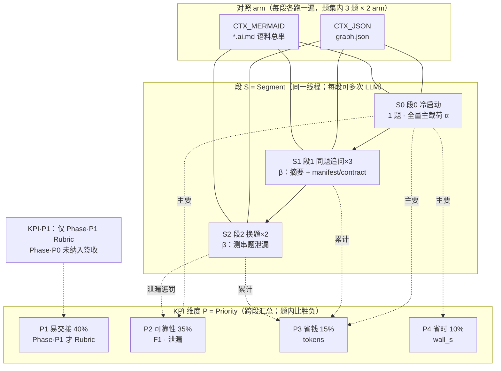

# gate_ctx_ab 定稿结论（初稿）

> **符号表**：[../NOTATION_zh.md](../NOTATION_zh.md)（**Sx=段 / Px=KPI / Rx=规则**；Rx **≠** 单次 LLM 调用）  
> **状态**：`accepted`（Phase·P0 已闭环）· **Phase·P1 双人盲审已汇总**（4/6 需仲裁，见 §6.1）  
> **协议**：[`fixtures/gate_ctx_ab_v1/protocol_version.yaml`](../fixtures/gate_ctx_ab_v1/protocol_version.yaml) · `freeze_id: TECH_GRAPH_S1_FREEZE_20260514_V1_1_3`  
> **日志**：[../EXPERIMENT_LOG.md](../EXPERIMENT_LOG.md)  
> **日期**：2026-05-17  
> **前身**：[`conclusion_gate_ctx_ab_three_tasks_draft_zh.md`](./conclusion_gate_ctx_ab_three_tasks_draft_zh.md)（段·S0）· [`conclusion_s1s2_batch_20260516_152126_zh.md`](./conclusion_s1s2_batch_20260516_152126_zh.md)（段·S1/S2）

---

## 0. 术语（避免混用）

| 符号 | 全称 | 中文 | 含义 |
|------|------|------|------|
| **S0 / S1 / S2** | **Segment** 0/1/2 | 段 0/1/2 | 协议**三段对话**（非「第 x 次 API」）；每段内可含多次 LLM 调用 |
| **P1～P4** | **Priority** KPI 1–4 | 维度 1–4 | P1 易交接 · P2 可靠性 · P3 省钱(token) · P4 省时(wall) |
| **P0 / P0-A / P0-B** | **Phase** 0 … | 实验阶段 | 跑数阶段名；**≠** KPI 的 P1 |
| **R1～R6** | **Rule** 1–6 | 规则 1–6 | §4 **签收门槛**；用多题汇总 KPI 判定；**≠** 单次 LLM 调用 |
| **arm** | — | 对照分支 | `CTX_JSON` vs `CTX_MERMAID` |

下文「胜/负」均为 **题内两 arm 比较**（3 题样本）。完整对照见 [NOTATION_zh.md](../NOTATION_zh.md)。

### 0.1 关系图（Segment × arm × KPI）

**读图**：自上而下是**一次实验会话的时间线**（段·S0→段·S1→段·S2）；左右是**两种主载荷**（arm）；虚线指向该段主要写入的 **KPI 维度**（Phase·P0 已自动化部分）。

**落盘与脚本对应**（便于对照 jsonl 文件名）：

| 段（Segment） | 典型文件名 | Phase·P0 跑法 | 主要 KPI（Priority） |
|---------------|------------|---------------|------------------------|
| S0（段 0） | `…_S0.jsonl` | `run_s0_batch.py`（Repeat·R=3 并行/题） | P3、P4、P2（F1） |
| S1（段 1） | `…_S1_01.jsonl` … `_03` | `run_s1_s2.py` 同线程 | P3（累计） |
| S2（段 2） | `…_S2_01.jsonl` … `_02` | 同上 | P3、P2（泄漏） |

**签收规则 Rule-1～Rule-6**（§4，缩写 **R1～R6 = Rule·规则**）只使用上表 KPI·**P2～P4**；KPI·**P1** 须 **Phase·P1** Rubric，未纳入 Phase·P0 签收。

---

## 1. 实验边界

- **只评 Agent 主上下文**：两 arm 均附 `_manifest.json` + `_contract_manifest.json`；**不**注入 Cursor rules。  
- **不测**：人读 md、双轨 export/维护工时、静态闸口 A 以外的工程成本。  
- **KPI·P2（F1）**：`score_gold_f1.py` 启发式匹配 gold（非双人 Rubric）。  
- **段·S0 性能**：每题 canonical batch **Repeat·R=3 并行**，离群剔除后取中位数（见各 batch `aggregate.md`）。  
- **段·S1/S2**：单会话全协议，`context_strategy: beta`（段·S0 全量 + 段·S1/S2 摘要）；批跑 [`…_152126`](../runs/gate_ctx_ab_v1_s1s2_20260516_152126/)。

---

## 2. 段·S0 主表（Segment 0 · canonical batch）

### 2.0 列名解读

| 列名 | 全称 / 来源 | 含义 | 对应 KPI | 聚合方式（本表数字） |
|------|-------------|------|----------|----------------------|
| **题** | `task_id` 简写 | 题集内一道工程题（T001～T003） | — | 每题各 2 行（JSON / Mermaid 各一行） |
| **topic** | `tasks.json` → `topic_id` | 题的主题标签（用于 S2 换题时避免同 tag 相邻） | — | 只读标识，不参与计分 |
| **arm** | 对照分支 | `JSON` = `CTX_JSON`（`graph.json`）；`Mermaid` = `CTX_MERMAID`（`*.ai.md` 语料总串） | — | 与题组合为一次「段·S0 实验单元」 |
| **wall_s** ↓ | `wall_total` / `wall_s` | 单次 LLM 调用的**墙钟耗时**（秒），越低越好 | **KPI·P4** 省时 | 每题×每 arm：**Repeat·R=3** 并行 → 剔除离群 → **中位数**（见 batch `aggregate.md`） |
| **tokens** ↓ | `total_tokens` | API 返回的 **`prompt_tokens + completion_tokens`**，越低越好 | **KPI·P3** 省钱 | 同上，**中位数** |
| **entry F1** ↑ | `entrypoints` F1 | 模型输出 `entrypoints[]` 与 gold 入口集合的 **F1**（启发式匹配 path / symbol / graph_id） | **KPI·P2** 可靠性 | 该 batch 内该 arm 全部有效 jsonl 的 **均值**（`score_gold_f1.py --batch-dir` → `gold_f1.md`） |
| **impact F1** ↑ | `impacts` F1 | 模型输出 `impacts[]` 与 gold 影响集合的 **F1**（path + kind + graph_id 启发式） | **KPI·P2** 可靠性 | 同上 |
| **run** | batch 目录 | 该题 **canonical** 段·S0 批跑落盘路径（`run_s0_batch.py`） | — | 三题各 1 个 batch；T001 勿与已删的 `110751` 混用 |

**共同前提（读数前）**

- 每一格 performance（wall_s / tokens）来自 **段·S0 的 LLM 调用**，不是 S1/S2，也不是 Rule·R1 的「规则编号」。  
- 剔除规则（各 batch `aggregate.md` 一致）：`wall > 120s` 或 `> 2.5×` 该 arm 当轮中位数，或 `status != ok`；表中为剔除后的 **中位数**。  
- F1 为 **启发式**自动分，非 Phase·P1 双人 Rubric；详见 [`score_gold_f1.py`](../fixtures/gate_ctx_ab_v1/scripts/score_gold_f1.py) 与 [`tasks.json`](../fixtures/gate_ctx_ab_v1/tasks.json) 内 `gold`。

↓ / ↑：该列**越低越好**或**越高越好**。

| 题 | topic | arm | wall_s ↓ | tokens ↓ | entry F1 ↑ | impact F1 ↑ | run |
|----|-------|-----|---------:|-----------:|-----------:|------------:|-----|
| T001 | `rag_env_embedding` | JSON | **17.4** | **12159** | **0.822** | **0.396** | [`111037`](../runs/gate_ctx_ab_v1_batch_20260516_111037/) |
| T001 | | Mermaid | 32.5 | 12609 | 0.794 | 0.325 | |
| T002 | `unified_chat_sse` | JSON | **39.0** | **12044** | 0.667 | 0.309 | [`121253`](../runs/gate_ctx_ab_v1_batch_t2_unified_sse_chain_con_20260516_121253/) |
| T002 | | Mermaid | 47.6 | 12571 | **0.939** | 0.340 | |
| T003 | `ingest_rpc` | JSON | **45.3** | **12258** | 0.909 | 0.424 | [`144300`](../runs/gate_ctx_ab_v1_batch_T003_ingest_admin_rpc_20260516_144300/) |
| T003 | | Mermaid | 57.8 | 12810 | **1.000** | **0.483** | |

三 batch 共 **6/6** 次段·S0 调用 `parse_ok`（每 batch：Repeat·R=3 轮 × 2 arm，剔除后每 arm 有效 n=2～3）。

### 2.1 段·S0 按 KPI（Priority）粗判（题级胜负）

| KPI（Priority） | 度量 | CTX_JSON | CTX_MERMAID |
|-----------------|------|----------|-------------|
| **P4** 省时 | wall_s 中位数 | **3/3 胜** | 0/3 |
| **P3** 省钱 | total_tokens 中位数 | **3/3 胜** | 0/3 |
| **P2** 入口 | entrypoints F1 | 1/3（T001） | **2/3**（T002、T003） |
| **P2** 影响 | impacts F1 | 1/3（T001） | **2/3**（T002、T003） |

**张力**：KPI·P3/P4 全胜 JSON；KPI·P2（F1）**1:2 偏 Mermaid**。

---

## 3. 段·S1/S2 主表（Segment 1+2 · `152126` · β）

| 题 | arm | 段·S0 tokens | **会话累计 tokens** ↓ | 段·S2 泄漏合计 ↓ |
|----|-----|----------:|------------------------:|--------------:|
| T001 | JSON / Mermaid | 11801 / 12368 | **141365** / 148257 | 6 / 5 |
| T002 | JSON / Mermaid | 12456 / 12816 | 159335 / **154664** | 4 / 4 |
| T003 | JSON / Mermaid | 12366 / 13037 | **154026** / 155509 | 7 / 8 |
| **arm 中位数** | JSON / Mermaid | ~12208 / ~12740 | **154026** / 154664 | ~2.8 / ~2.8 |

- **36/36** 次 LLM 调用 API `ok`（6 会话 × 6 段内调用）；不宜用离群墙钟（如 T001 JSON 段·S2-1 **645s**）单独定论「谁更快」。  
- 段·S0 单条 F1（非 Repeat·R=3 批跑）：见 [`gold_f1_s1s2_s0_segments.md`](./gold_f1_s1s2_s0_segments.md)，趋势与 §2 一致。

### 3.1 段·S1/S2 按 KPI（Priority）粗判

| KPI（Priority） | 度量 | CTX_JSON | CTX_MERMAID |
|-----------------|------|----------|-------------|
| **P3** 累计 token | 3 题会话末 | **2/3 胜**（T001、T003） | 1/3（T002） |
| **P3** arm 中位数 | 3 题 | **略低（≈0.4%）** | 略高 |
| **P2** 泄漏 | 段·S2 启发式合计 | 相当（~2.8/会话） | 相当 |

多轮下 JSON **未明显更费 token**；T002 单题累计 Mermaid 更低，不足以翻转段·S0 的 KPI·P3 优势叙事。

---

## 4. 签收规则（Rule · 书面化）

> **Rx = Rule（规则）**，编号 **1～6**；每条规则用 **多题汇总的 KPI** 判定，**不是**「第 x 次 LLM 调用」。  
> KPI 权重见 [`01_experiment`](../01_experiment_json_vs_mermaid_kpi_v1.md)：**KPI·P1 40% > P2 35% > P3 15% > P4 10%**。  
> **Phase·P0** 仅覆盖 KPI·**P2～P4** 自动化部分；KPI·**P1** 须 **Phase·P1** 双人 Rubric。

### 4.1 硬门槛（须 Rule-1～Rule-6 同时满足才签收 `CTX_JSON` 为 Agent 默认）

| 规则 Rule | 条件（引用的 KPI） | 本实验结果 | 满足？ |
|-----------|-------------------|------------|--------|
| **Rule-1（R1）** | KPI·**P3**：段·S0 批跑 token，JSON **≥ 2/3 题**不高于 Mermaid | **3/3** | ✅ |
| **Rule-2（R2）** | KPI·**P4**：段·S0 批跑 wall_s，JSON **≥ 2/3 题**不高于 Mermaid | **3/3** | ✅ |
| **Rule-3（R3）** | KPI·**P2 入口**：段·S0 entrypoints F1，JSON **≥ 2/3 题**不劣于 Mermaid（ε=0.05） | **1/3**（仅 T001） | ❌ |
| **Rule-4（R4）** | KPI·**P2 影响**：段·S0 impacts F1，同上 **≥ 2/3 题**不劣 | **1/3** | ❌ |
| **Rule-5（R5）** | KPI·**P3**：段·S1/S2 批 arm 累计 token 中位数，JSON ≤ Mermaid × 1.05 | 154026 vs 154664（≈0.96×） | ✅ |
| **Rule-6（R6）** | KPI·**P2**：段·S2 泄漏 arm 均值差 ≤ 1 条/会话 | ~2.8 vs ~2.8 | ✅ |

**签收判定**：Rule-1 ∧ … ∧ Rule-6 → **当前 ❌（未满足 Rule-3、Rule-4）**。

### 4.2 软倾向（不构成签收，仅指导试点）

| 场景 | 建议 |
|------|------|
| 只关心 **token/墙钟**（KPI·P3/P4 主导） | 可试点 **JSON 主载荷**；接受 T002/T003 入口召回风险 |
| 关心 **可交接 / 入口准确**（KPI·P2 主导） | **维持双轨**：Agent 用 JSON，人读与流程图维护用 Mermaid（与现有 `_tech_graph` 双轨一致） |
| 需要 **书面签收** | 先完成 **Phase·P1 Rubric**（6 条段·S0 输出 × 双人盲审），再复核 Rule-3/Rule-4 |

### 4.3 可选放宽（变更须写进实验日志）

若产品接受「**2/3 题 KPI·P2 不劣即可**」且将 **T001 视为 embedding 特例**，仍无法过关：T002、T003 入口 F1 明显偏 Mermaid。  
若改为「**仅 KPI·P3+P4 达标即默认 JSON**」，则与 **Rule-3/Rule-4** 冲突——须在 [`01_experiment`](../01_experiment_json_vs_mermaid_kpi_v1.md) bump 版本并重新公示。

---

## 5. 选型建议

### 5.1 一句话

**在现有三题、Phase·P0 度量下：不签收「生产 Agent 一律 `graph.json` 主载荷」；若短期只为降 token/墙钟，可小流量试点 JSON，但须在 T002/T003 类题上接受更低 entry F1，并保留 Mermaid 人读轨与 `graph.json` 机器轨双轨同步。**

### 5.2 分角色

| 角色 | 建议 |
|------|------|
| **Agent / BFF 上下文** | 继续以 **`graph.json` 为候选主载荷**（性能已验证）；**非最终默认**，待 Phase·P1 或业务接受 Rule-3 豁免 |
| **图谱维护 / PR 审查** | **继续维护 Mermaid `.ai.md`**（KPI·P2 入口在 2/3 题更稳） |
| **CI / 契约** | 仍以 `_manifest.json` + `_contract_manifest.json` 为真值锚，与 arm 无关 |

### 5.3 与静态闸口 A 的关系

轴 II 静态：JSON 20224 B / Mermaid 20953 B，启发式 token **5056 vs 5026**（≈1:1）。  
行为实验差异来自 **Agent 解析与结构化输出**，非字节数 alone。

---

## 6. 局限与 Phase·P1

| 项 | 说明 |
|----|------|
| 样本 | 3 题、1 模型、1 freeze；外推有限 |
| KPI·P2 | P0 启发式 F1 + P1 人审（R1/R2） |
| KPI·P1 | 双人 Rubric 已填；见 §6.1 |
| β 摘要 | 段·S1 历史仍膨胀；未测更短摘要模板 |
| 离群 | 个别 wall_s 离群已剔除或标注，不进入 Rule-4 以外的「谁更快」 |

### 6.1 Phase·P1 盲审（Reviewer·R1 + R2 · 已汇总）

- **样本**：6 条段·S0（`152126`）  
- **落盘**：[`p1/scores/reviewer_R1.csv`](../fixtures/gate_ctx_ab_v1/p1/scores/reviewer_R1.csv) · [`reviewer_R2.csv`](../fixtures/gate_ctx_ab_v1/p1/scores/reviewer_R2.csv)  
- **汇总**：[`p1/scores/aggregate_p1.md`](../fixtures/gate_ctx_ab_v1/p1/scores/aggregate_p1.md)（阈值 |Δ|≥15）

**双人分歧**：**4/6** 样本需仲裁（P1-001～003、P1-006）；P1-004/005 一致（T002/T003 的 Mermaid 臂）。

**按 arm 粗算**（各样本取 R1/R2 中点再题均；**仲裁前 provisional**）：

| arm | P1 均值 | P2 均值 | 相对 |
|-----|--------:|--------:|------|
| CTX_JSON | **49** | **55** | P1/P2 均低于 Mermaid |
| CTX_MERMAID | **63** | **86** | 同上 |

**与 P0 对照**：

- **一致**：人审 **P2（可靠性/可交接质量）** 仍偏 **Mermaid**，强化 §4 中 Rule-3/Rule-4 未过关叙事。  
- **张力**：P0 的 **P3/P4** 仍偏 JSON；P1 不推翻「省钱/省时 JSON 更优」，但说明 **默认 JSON 时交付质量风险更大**。  
- **选型**：**仍不签收**「一律 JSON」；若试点 JSON，须接受 **人审 P2 显著低于 Mermaid（约 55 vs 86）** 及 T002/T003 脚本 F1 劣势。Rule·R1–R6 **不修改**；仲裁后可更新本节终值。

---

## 7. 数据索引

| 内容 | 路径 |
|------|------|
| S0 batch ×3 | [`runs/README.md`](../runs/README.md) |
| S1/S2 全量 | [`runs/gate_ctx_ab_v1_s1s2_20260516_152126/`](../runs/gate_ctx_ab_v1_s1s2_20260516_152126/) · [`aggregate.md`](../runs/gate_ctx_ab_v1_s1s2_20260516_152126/aggregate.md) |
| S0 F1 逐 batch | 各 batch 内 `gold_f1.md` |
| S1/S2 批内 S0 F1 | [`gold_f1_s1s2_s0_segments.md`](./gold_f1_s1s2_s0_segments.md) |
| 题集 gold | [`fixtures/gate_ctx_ab_v1/tasks.json`](../fixtures/gate_ctx_ab_v1/tasks.json) |

---

## 8. 修订记录

| 版本 | 日期 | 说明 |
|------|------|------|
| draft-v0.9 | 2026-05-17 | 合并 S0 + S1/S2 + 决策规则 R1–R6 + 选型建议 |
| draft-v0.9.1 | 2026-05-17 | §0.1 增加 Segment × arm × KPI 关系图 |
| draft-v0.9.2 | 2026-05-17 | 符号消歧：Rule vs LLM vs Repeat；链 [NOTATION_zh.md](../NOTATION_zh.md) |
| draft-v0.9.3 | 2026-05-17 | §2.0 段·S0 主表列名解读 |
| accepted-p1 | 2026-05-17 | §6.1 P1 双人盲审汇总（aggregate_p1） |
