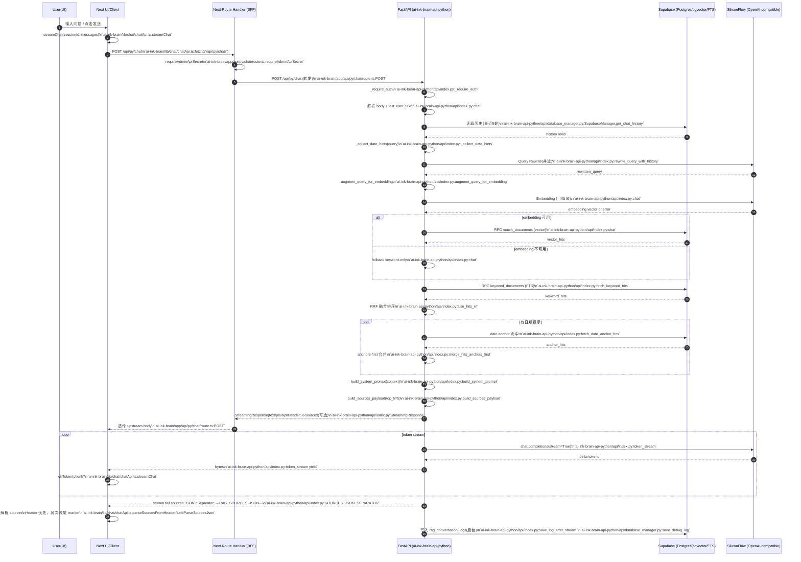

# RAG Chat 端到端调用流程（v1 / 2026-04-16）

> 目的：从「前端输入问题」开始，完整描述到「LLM 流式回答」结束的调用链路；并在每个环节标注 **触发的方法 + 所在文件**，方便后续版本对比与演进复盘。

---

## 1. 端到端流程图（Mermaid）

---

## 2. 逐步说明（每步：做什么 / 为什么 / 触发点）

### 2.1 前端：从 UI 到发起流式请求

- **做什么**
  - UI 将用户输入组织为 `messages[]`（含历史），并携带 `sessionId`。
  - 调用 `streamChat()` 发起 `POST /api/py/chat`，并以 ReadableStream 方式持续消费响应。
- **触发点（文件/方法）**
  - `ai-ink-brain/lib/chat/chatApi.ts:streamChat()`
- **关键约束**
  - sources（证据链）解析优先来自响应头 `x-sources`，若缺失则从流末尾的 `---RAG_SOURCES_JSON---` 后解析 JSON（兜底）。

### 2.2 Next BFF：显式转发到 FastAPI（避免 rewrites 不稳定）

- **做什么**
  - Next Route Handler 对 `/api/py/chat` 做鉴权检查，然后将原始 body 透传给 `PY_API_URL/api/py/chat`。
- **触发点（文件/方法）**
  - `ai-ink-brain/app/api/py/chat/route.ts:POST()`
  - `ai-ink-brain/app/api/py/chat/route.ts:requireAdminApiSecret()`（来自 `@/lib/auth`）
- **关键约束**
  - 若上游返回 `x-sources` 过大，会触发 Node/undici `UND_ERR_HEADERS_OVERFLOW`；该路由会返回更可读的 502 文本提示，要求后端在 header 超限时省略 header，仅保留流尾 JSON 兜底。

### 2.3 后端：鉴权与请求校验

- **做什么**
  - 校验 `Authorization: Bearer ...` / `x-blog-admin-token` / `x-admin-token` 中任意一种 token，匹配 **`SYNC_ADMIN_SECRET`**（`admin_secret()` 真值；`CHAT_API_SECRET` / `NEXT_PUBLIC_ADMIN_SECRET` 已废弃 fallback）。
  - 校验 body：必须包含 `messages[]` 与 `session_id`，并提取最后一条 user 消息作为 `query`。
- **触发点（文件/方法）**
  - `ai-ink-brain-api-python/api/index.py:_require_auth()`
  - `ai-ink-brain-api-python/api/index.py:chat()`（入口）

### 2.4 后端：历史读取（用于 Query Rewrite）

- **做什么**
  - 读取该 `session_id` 最近 5 轮问答历史，供 query rewrite 把“最新问题”改写为自包含检索语句（减少指代、提升召回稳定性）。
- **触发点（文件/方法）**
  - `ai-ink-brain-api-python/api/database_manager.py:SupabaseManager.get_chat_history()`
  - `ai-ink-brain-api-python/api/index.py:rewrite_query_with_history()`

### 2.5 后端：日期提示（Date Hints）与 Embedding 输入增强

- **做什么**
  - 从 `query` 中提取日期形态（如 `YYYY-MM-DD` / `MM-DD` 等），形成 `date_hints`。
  - 将日期提示以 `TitleAnchor:` 的形式追加到 embedding 输入，使向量空间更容易靠近目标日记/日志内容。
- **触发点（文件/方法）**
  - `ai-ink-brain-api-python/api/index.py:_collect_date_hints()`
  - `ai-ink-brain-api-python/api/index.py:augment_query_for_embedding()`

### 2.6 后端：Embedding（带优雅降级）

- **做什么**
  - 调用 embedding 服务生成向量；若 embedding 失败（额度/网络/上游异常等），降级为 **keyword-only（FTS）** 检索，保证服务“半离线可用”。
- **触发点（文件/方法）**
  - `ai-ink-brain-api-python/api/index.py:chat()`（embedding 逻辑在该函数内部）
- **关键约束**
  - 当使用 `Qwen3-Embedding` 系列模型时，会显式传 `dimensions`（维度需与 `documents.embedding vector(N)` 一致）。

### 2.7 后端：Hybrid 检索（Vector + FTS）与 RRF 融合

- **做什么**
  - Vector 路：调用 Supabase RPC `match_documents`（pgvector）。
  - Keyword 路：调用 Supabase RPC `keyword_documents`（FTS）。
  - 将两路按 **RRF（Reciprocal Rank Fusion）** 融合排序，输出融合后的候选集。
  - 若存在 `date_hints`，额外执行“日期锚点命中”，并把命中内容置顶合并（anchors-first），降低“主题相近但日期不对”的误召回。
- **触发点（文件/方法）**
  - `ai-ink-brain-api-python/api/index.py:fetch_keyword_hits()`
  - `ai-ink-brain-api-python/api/index.py:fuse_hits_rrf()`
  - `ai-ink-brain-api-python/api/index.py:fetch_date_anchor_hits()`
  - `ai-ink-brain-api-python/api/index.py:merge_hits_anchors_first()`

### 2.8 后端：System Prompt + 证据链（Sources）

- **做什么**
  - 将命中文档片段裁剪、拼接为 `context`，生成 system prompt，约束模型“基于检索片段回答、避免胡编”。
  - 从命中结果提取 sources（Top 3~5）供前端展示引用卡片。
  - sources 传输采取“双通道”：
    - 优先：响应头 `x-sources`（percent-encoding 的 JSON）
    - 兜底：在流末尾追加 `---RAG_SOURCES_JSON---` + JSON
- **触发点（文件/方法）**
  - `ai-ink-brain-api-python/api/index.py:build_system_prompt()`
  - `ai-ink-brain-api-python/api/index.py:build_sources_payload()`
  - `ai-ink-brain-api-python/api/index.py:SOURCES_JSON_SEPARATOR`

### 2.9 后端：LLM 流式生成 + 返回 StreamingResponse

- **做什么**
  - 以 `stream=True` 方式调用 chat.completions，逐 chunk `yield` 给客户端。
  - 在 finally 阶段（且客户端未断开）追加 sources JSON 尾巴（兜底）。
  - 返回 `StreamingResponse(media_type="text/plain; charset=utf-8")`，并在 header 未超限时带 `x-sources`。
- **触发点（文件/方法）**
  - `ai-ink-brain-api-python/api/index.py:token_stream()`
  - `ai-ink-brain-api-python/api/index.py:StreamingResponse(...)`

### 2.10 后端：会话日志落库（后台任务，不阻塞响应）

- **做什么**
  - 在流式生成结束后，将 query / rewritten_query / retrieved_context（截断）/ response / latency / 模型信息等写入 `rag_conversation_logs`，用于可观测性与聊天历史恢复。
- **触发点（文件/方法）**
  - `ai-ink-brain-api-python/api/index.py:save_log_after_stream()`
  - `ai-ink-brain-api-python/api/database_manager.py:SupabaseManager.save_debug_log()`

---

## 3. 补充：聊天历史接口（用于刷新后还原 UI）

- **接口**：`GET /api/py/chat/history?session_id=...&limit=...`
- **触发点（文件/方法）**
  - `ai-ink-brain-api-python/api/index.py:chat_history()`
  - `ai-ink-brain-api-python/api/database_manager.py:SupabaseManager.list_session_turns()`
- **前端消费点**
  - `ai-ink-brain/lib/chat/chatApi.ts:fetchChatHistory()`
  - `ai-ink-brain/app/api/py/chat/history/route.ts`（BFF 转发，逻辑与 `/api/py/chat` 类似）

---

## 4. 版本化约定（后续演进对比）

- 本目录为版本快照：`docs/flows/rag-chat/`
- 文件名建议：`v{N}_YYYY-MM-DD_rag_chat_end_to_end.md`
- 每次对以下任一项有结构性调整时，新增一个版本文件：
  - 检索策略（Hybrid/锚点/阈值/融合）
  - sources 传输协议（header/流尾）
  - 日志结构与字段（`rag_conversation_logs`）
  - 鉴权方式与 header 约定（Authorization / x-blog-admin-token）

