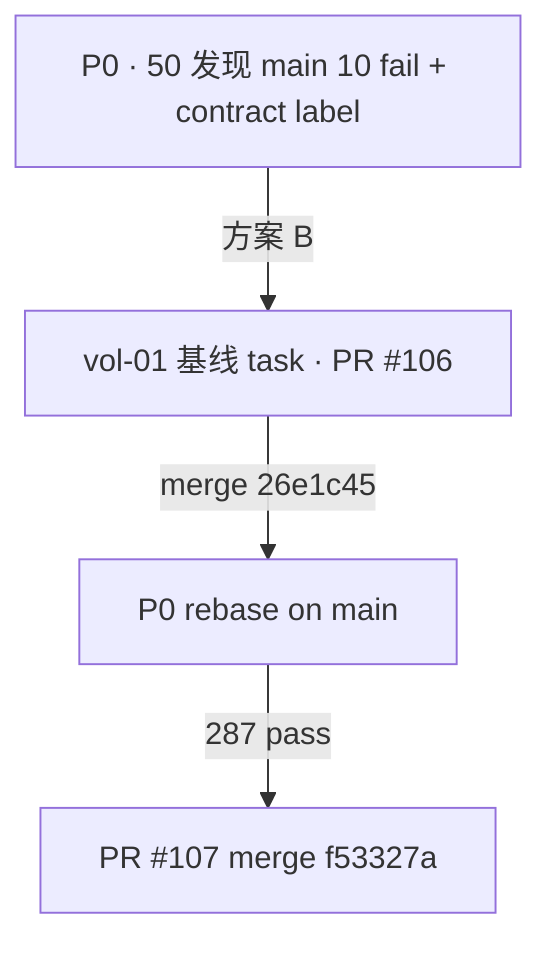

# 03 · Harness 闭环（P0）

> **task_slug**：`chatbi_graph_p0_foundation_v1` · **分支**：`task/chatbi-graph-p0-foundation-v1`  
> **test_strategy**：`required` · **audit_profile**：`post_close`

---

## 1. 帽链总览（含 R1→R2）

```text
10 草案
  → 22 R1（有阻塞：§10/Delta/验收表未齐）
  → 10 回填 task
  → 22 R2（零阻塞 · 待人签）
  → 人签 HG-TASK-DRAFT / HG-AUDIT-R1
  → 30 feat(chatbi) b43ae3e
  → 40 自检（P0 pass · 全集 10 fail · 选 B 背景）
  → 50 pass-with-notes（P0 增量 OK · Strict merge 被基线债阻塞）
  → rebase on #106 → 287 pass → PR #107 merge f53327a
```

Invoke 目录：[`docs/harness/invokes/by-task/chatbi_graph_p0_foundation_v1/`](../../../harness/invokes/by-task/chatbi_graph_p0_foundation_v1/)

---

## 2. 各帽要点

| 帽 | 日期 | 关键产出 |
| --- | --- | --- |
| **10** | 06-03 | Task-P0 草案 |
| **22 R1** | 06-03 | B-1～B-4 阻塞清单 → 交 10 回填 |
| **10 回填** | 06-03 | §10 冻结 · Delta · 失败路径 · validate OK |
| **22 R2** | 06-03 | 零阻塞 · 可开 30（待人签） |
| **人签** | 06-03 | `ab4ca03` · author `cyning` |
| **30** | 06-03 | `b43ae3e` · 共享层 + graph + 专测 |
| **40** | 06-03 | P0 范围 pass · 全集未绿 · 记录选 B |
| **50** | 06-03 | pass-with-notes · 10 fail = main 同集 |

---

## 3. 50 当时 vs merge 后

| 维度 | 50（06-03 · P0 分支） | merge 后（#106+#107 on main） |
| --- | --- | --- |
| P0 专测 | **10/10 pass** | 10/10 |
| 全集 pytest | **277 pass · 10 fail** | **287 pass** |
| contract_check | **fail**（`label` · main 同） | **pass**（#106 修） |
| unified_chat diff | **0 行** | 0 行 |
| Strict merge | **不建议**（基线债） | **可**（Required 绿） |

50 正确区分：**P0 增量无回归** vs **分支基线阻塞 Strict** — 见 [`reinspect_chatbi_graph_p0_foundation_v1_20260603_v1.md`](../../../tasks/reinspect_results/reinspect_chatbi_graph_p0_foundation_v1_20260603_v1.md) Judgment 节。

---

## 4. 与 vol-01 的衔接（选 B 决策链）



**维护者决策**（非 Agent 默认）：不在 P0 PR 夹带 `conftest` / manifest 修复，保持 **Delta 可审计**。

vol-01 叙事：[`vol-01-baseline-merge-gate/`](../vol-01-baseline-merge-gate/)

---

## 5. human_gate

| gate_id | commit | 结论 |
| --- | --- | --- |
| HG-TASK-DRAFT | `ab4ca03` | 人签 · R2 后 |
| HG-AUDIT-R1 | `ab4ca03` | 人签 · 非 Agent 代填 |

---

## 6. AI Coding 可复用点

1. **22 两回合**：复杂 task 先 R1 列阻塞 → 10 回填 → R2 零阻塞，比 30 中途改 task 便宜。
2. **50 Fresh Context**：不读 30 invoke 长文；对照 task + diff + 独立命令 — P0 50 据此判定「10 fail 非 b43ae3e 引入」。
3. **两 PR 顺序写进 task `blocks`**：避免 babysit 时误 merge #107 先于 #106。

---

## 指针

- R1：`task_chatbi_graph_p0_foundation_v1_audit_R1_20260603.md`
- R2：`task_chatbi_graph_p0_foundation_v1_audit_R2_20260603.md`
