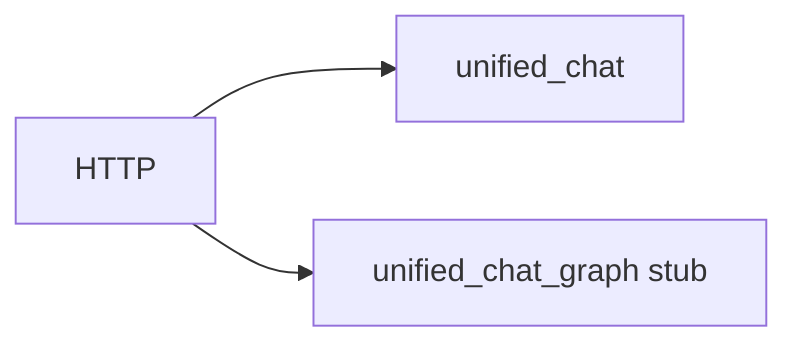

# 04 · 架构前后

## 大纲（待编写）

- [ ] `agent.py` 行数：~1342 → ~1083（迁出共享层）
- [ ] 新模块职责表（见 [`ARCHITECTURE_LAYERS.md`](../_meta/ARCHITECTURE_LAYERS.md)）
- [ ] `git diff origin/main -- api/unified_chat.py` **空** — D-2 证据
- [ ] Mermaid 简图：Legacy Unified vs Graph stub 并行

## 待补图

