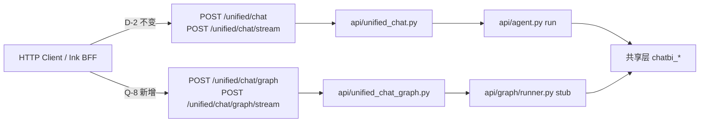

# 04 · 架构前后

> 三层对照详见 [`_meta/ARCHITECTURE_LAYERS.md`](../_meta/ARCHITECTURE_LAYERS.md)

---

## 1. 运行面：Legacy 与 Graph 并行



| 路由 | P0 用户感知 | 实现 |
| --- | --- | --- |
| Legacy Unified | Ink 页面 **无变化** | `unified_chat.py` + `agent.run` |
| Graph | 仅 curl/联调 | stub JSON/SSE · **无** 真实 RAG/Text2SQL 环 |

---

## 2. 代码面：P0 前 → 后

### Before（简化）

```text
api/agent.py          (~1342 行 · 事件+模型+失败+run 全堆)
api/unified_chat.py   (Legacy 编排)
api/index.py          (Legacy 路由)
```

### After（P0）

```text
api/chatbi_events.py          # ① 从 agent 抽出
api/chatbi_agent_models.py
api/chatbi_failure.py
api/agent.py                  (~1078 行 · run 仍大 · 行为不变)
api/graph/state.py            # ② ChatBIState + 边表
api/graph/runner.py           # ③ stub 节点
api/unified_chat_graph.py     # ④ Graph HTTP 薄层
api/unified_chat.py           # D-2：未改行为
api/index.py                  # + Q-8 两路由
```

---

## 3. 模块职责表

| 模块 | Legacy 用 | Graph 用 | P0 状态 |
| --- | ---: | ---: | --- |
| `chatbi_events` | ✓ | ✓（stub SSE） | 生产级抽取 |
| `chatbi_failure` | ✓ | ✓（边表消费预留） | 生产级 |
| `graph/state.py` | — | ✓ | 边表草案 |
| `graph/runner.py` | — | ✓ | stub only |
| `unified_chat_graph.py` | — | ✓ | 薄 handler |
| `agent.py` | ✓ | —（P1 再迁 run） | 瘦身未改语义 |

---

## 4. D-2 硬证据

```bash
# P0 分支相对 main
git diff origin/main...HEAD -- api/unified_chat.py
# （空）

# merge 后仍可 spot-check
git show f53327a -- api/unified_chat.py
# （无该文件变更）
```

50 与专测均将此作为 **P0 非回归** 核心断言。

---

## 5. 边表：Legacy vs Graph（D-3）

Intent 超时（`LLM_API_TIMEOUT`）：

| 路径 | 边表目标 | 含义（P0） |
| --- | --- | --- |
| **Legacy** | `intent_v1_fallback` | 保留现有 v1 规则回退 |
| **Graph** | `direct_answer` | 方案 A：不走 v1 规则路由 |

P0 **只冻结表结构 + 单测**；真实 Graph Agent 消费边表在 **P1**。

---

## 6. 图谱与 manifest

- `_manifest.json`：登记 Q-8 两 POST（`manifest_check`）
- `99_spec.md` drift 索引：登记端点字面量（`drift_check` · 见 vol-02-06）
- 流程图增量：Roadmap §4.4 · `_tech_graph` 时间线 `02_version.md`

---

## 指针

- 调研 SPEC §4.3 D-1～D-5：`docs/spec/research/SPEC-Research-SelfChain-vs-LangGraph-v1_zh.md`
- P1 架构预告：[`vol-04-p1/`](../vol-04-p1/)
