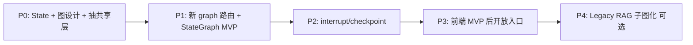

# SPEC — 调研：自研链式编排 vs LangGraph 思想 · 引入工作清单（v1）

| 项 | 内容 |
| --- | --- |
| **状态** | `draft`（调研 · 无 task 绑定 · **§4.3 D-1～D-5 已人拍板**） |
| **日期** | 2026-06-03（**D-1～D-5 冻结**：2026-06-03） |
| **范围** | 本仓 Chat / Unified Chat / Agent 编排层向 **图 + 状态机** 演进的可行性 |
| **非范围** | 具体 PR、依赖版本、Harness task、前端 Timeline 改版 |
| **关联真值** | `docs/spec/v2-agent/SPEC-ChatBI-V2-Agent-Overview.md` · `docs/spec/v2-agent/SPEC-ChatBI-V2-ReAct-Loop.md` · `docs/_tech_graph/00_main.ai.md` |
| **配对调研** | [`SPEC-Research-SelfChain-vs-LangChain-v1_zh.md`](./SPEC-Research-SelfChain-vs-LangChain-v1_zh.md) |

---

## 0. 结论摘要（TL;DR）

1. 本仓 **未使用 LangGraph 库**；V2 `ChatBIAgent.run` 已是 **手写 ReAct 循环**，与 LangGraph **思想最近**，但缺 **显式 State、声明式边、checkpoint/interrupt**。
2. 引入 LangGraph 思想的核心收益：**控制流可声明/可测/可可视化**、**人机协同标准化**（plan preview / clarify）、**断点续跑**；非「为了用 LangGraph 而用」。
3. **最小可行路径（MVP）**：P0 State + 图设计 → P1 **新路由** `/api/py/unified/chat/graph(.stream)` + 抽共享层；**不动** 现有 `unified_chat.py` → P2 interrupt / checkpoint。
4. **选型已冻结（§4.3）**：自研 StateGraph；Graph 路径不接入 V1 规则路由（Intent 超时走 **方案 A**）；新 SSE type 允许；入口曝光由 **前端** 控制，后端 **常开** 服务。
5. **对外约束**：Graph 路径 `done.mode` 与核心 agent/tool 语义（策略 B）须 parity；Graph 路径 SSE 为 **契约 superset**（见 D-5）。

---

## 1. 背景：现状 vs LangGraph 概念

### 1.1 本仓当前编排形态

| LangGraph 概念 | 本仓现状 | 主要落点 |
| --- | --- | --- |
| **State** | 分散在局部变量、`events[]`、`AgentRunView` | `unified_chat.py`、`agent.py`、`index.py` |
| **Node** | 各阶段函数（rewrite / embed / retrieve / intent / tool） | `query_rewrite.py`、`rag_recall_tools.py`、`intent_agent.py`、`tools.py` |
| **Edge / 条件路由** | 规则路由 + `FailureTypeHandler` + `for` 循环 | `intent_router.py`、`agent.py` |
| **Graph 入口** | HTTP handler 内嵌编排 | `handle_unified_chat*`、`chat()` |
| **Checkpoint / 中断恢复** | 部分：`session_id` 历史、`plan_execution_token` | `agent_memory.py`、`chatbi_plan_token.py` |
| **Human-in-the-loop** | clarify / plan preview 已实现，仍为代码分支 | `agent.py` |
| **Streaming** | 自定义 `emit()` → SSE | `unified_chat.py`、`agent.py` |

### 1.2 LangGraph 思想指什么

本 SPEC 中 **LangGraph 思想** 包括（**不要求** 一定安装 `langgraph` 包）：

- **单一 Graph State** 在节点间流转；
- **节点** 为纯函数 `(state) -> partial_state`；
- **边** 含 **条件边**（由 `error_code`、confidence、step 计数等路由）；
- **interrupt / resume** 支持人机闸与 plan 确认；
- **checkpointer** 支持 thread 级断点与调试回放；
- **子图** 嵌套（如 Text2SQL 内部 retrieve→sql→execute→summary）。

若采用官方库，则为上述思想的参考实现 + `astream_events` 等 API。

### 1.3 与 LangChain 的关系

LangGraph 构建在 LangChain Runnable 生态之上；本仓若无 LangChain，可选择：

- **A**：自研轻量 `StateGraph`（仅借鉴思想）；
- **B**：引入 `langgraph` + `langchain-core`，Tool/RAG 层逐步包装。

LangChain 概念对齐见配对 SPEC；本节聚焦 **图编排增量**。

---

## 2. 链式 vs 图式：为何要动

| 链式（现状） | LangGraph 思想 |
| --- | --- |
| 控制流埋在 Python 代码里 | 控制流是 **可声明、可可视化** 的图 |
| 状态隐式传递 | **显式 State**，易单测、易 debug |
| plan token / clarify 为特殊分支 | **interrupt + resume** 为一等公民 |
| 失败 fallback 散落多处 | **条件边 + 统一 failure 节点** |
| 难以 step 级回放 | **checkpoint + thread_id** |

**触发条件（何时值得做）**：

- Agent 步骤与 fallback 规则继续膨胀（`agent.py` 已 1300+ 行）；
- 需要 **标准化** plan preview / 澄清 / 多工具并行；
- 需要 **运行态断点**（超时续跑、调试回放）；
- 团队需要 **图级** 单测与 CI（边表驱动）。

**不做的理由**：

- 仅 V1 固定 RAG 链、无动态路由；
- 团队不愿引入 LangGraph/LangChain 依赖；
- 短期无 HITL / checkpoint 产品需求。

---

## 3. 工作清单总览

| 阶段 | 主题 | 优先级 |
| --- | --- | --- |
| **§4** | 架构决策与边界 | P0 · 必须先做 |
| **§5** | 统一 State Schema | P0 |
| **§6** | 节点拆分与图拓扑 | P0 |
| **§7** | 工具层 / 子图适配 | P1 |
| **§8** | SSE / 事件流适配 | P1 |
| **§9** | HITL + Checkpoint | P2 |
| **§10** | 路由层收敛 | P2 |
| **§11** | 测试与验收 | 全程 |
| **§12** | 依赖与运维 | 引库时 |
| **§13** | 文档与治理 | 采纳时 |

---

## 4. 架构决策与边界（P0）

### 4.1 必答选型题

| ID | 决策 | 选项 | **冻结结论** |
| --- | --- | --- | --- |
| D-1 | 是否引入 `langgraph` 库 | 自研 StateGraph / 官方 langgraph | **自研**（见 §4.3） |
| D-2 | 迁移范围 | 仅 Agent / 改现有 Unified / 含 Legacy chat | **新 Graph 版 Unified Chat**（见 §4.3） |
| D-3 | V1 规则路由 | 保留 fallback / 不接入 | **不接入**；Intent 超时 **方案 A**（见 §4.3） |
| D-4 | 入口与灰度 | 后端 env 开关 / 前端选路由 | **前端控展示**；后端常开（见 §4.3） |
| D-5 | SSE 契约 | 严格旧 type / 允许新增 | **Graph 路径允许新增 type**（见 §4.3） |

### 4.2 硬约束（不可破）

- 对外 **V1 mode**（rag / text2sql / no_data）与 **策略 B** agent 事件（V2 总规 §2.1–§2.2）；
- **`_contract_manifest.json`** CI 须绿；
- **FailureTypeHandler gating**（V2 总规 §2.4、§2.4.1）语义不变；
- **ChatBI SQL Gate、Prompt Guard** 仍为独立前置节点。

### 4.3 冻结决策（2026-06-03 · 人拍板）

#### D-1 · 自研 StateGraph

- **不引入** `langgraph` / `langchain-core` 库。
- MVP 范围：**显式 State + 条件边 + 节点单测**；持久 checkpointer **后置**（P2）。
- RAG 召回 / hybrid RRF **暂不** 图化；Graph 节点调用现有 `tools.py`。

#### D-2 · 新 Graph 版 Unified Chat（并行 · 旧路径不动）

| 项 | 约定 |
| --- | --- |
| **新入口** | `POST /api/py/unified/chat/graph` · `POST /api/py/unified/chat/graph/stream`（命名可 task 阶段微调，须登记 `_manifest`） |
| **旧入口** | `unified_chat.py` / 现有 `CHATBI_USE_AGENT` 路径 **不改行为** |
| **共享层** | 必须先抽：`tools`、`intent_agent`、`agent_memory`、`chatbi_plan_token`、prompt guard、SQL gate、SSE 帧构造（建议 `api/chatbi_events.py`） |
| **禁止** | 在 Graph handler 内 copy-paste 大段 `unified_chat.py` 而未抽共享模块 |

MVP 实现体：自研 `StateGraph` 编排环，**语义参考** `ChatBIAgent.run`，**不替换** 其源码直至 parity 验证通过。

#### D-3 · 不接入 V1 规则路由 · Intent 超时方案 A

Graph 路径 **不** 调用 `intent_router.py`（不降级到 V1 关键词 + DDL/FTS 证据链）。

**与 V2 总规 §2.4 的差异（仅 Graph 路径）**：

| 失败类型 | 旧 Unified（V2 总规） | **Graph 路径（冻结）** |
| --- | --- | --- |
| LLM Intent 超时 / `LLM_API_TIMEOUT` | 降级 V1 规则路由 | **方案 A**：`direct_answer` + 结构化 `error` / `agent.think`（说明意图识别不可用）；`final_mode=no_data`；`ok` 按产品约定（建议 `ok=true` 带降级答案，或 `ok=false` — **开 task 时二选一并写入 contract**） |

**仍保留**（非 V1 规则路由）：

- `decide_intent_v2` 主路径；
- 低置信度 fallback 链（`confidence < INTENT_MIN_CONFIDENCE` → 预设 tool 链 / clarify）；
- `FailureTypeHandler` 工具失败 gating（§2.4.1）。

#### D-4 · 前端控入口展示 · 后端常开

| 层 | 责任 | 约定 |
| --- | --- | --- |
| **后端** | 注册并服务 Graph 路由 | **始终可用**（与现有 Unified 并列）；**不设** `CHATBI_GRAPH_ENABLED` 类 env 做访客级关停 |
| **前端 / BFF** | 是否调用 Graph URL、是否在 UI 暴露入口 | **前端全权**；前期仅 **本地 / dev** 展示；**MVP 验收通过前**不对生产访客开放半成品 |
| **后端非范围** | 访客可见性、A/B、UI 开关 | **不考虑** — 不在后端实现「谁能看到 Graph 入口」 |

与 `CHATBI_USE_AGENT`：**解耦**。Graph 路径不依赖该 env；前端通过 **选择 endpoint**（旧 `/unified/chat` vs 新 `/unified/chat/graph`）切换。

#### D-5 · Graph 路径 SSE 契约 superset

- Graph 路径 **允许新增** SSE `type`（如 `graph.node.start`、`graph.edge.take` — 开 task 时定名并写入 `_contract_manifest.json`）。
- **不删除、不修改** 现有 type 语义；旧 Unified 路径契约 **不变**。
- 新增 type 须过 `tech_graph_contract_check`；前端仍遵守 **未知 type 忽略**（V2 总规 §2.1）。
- Graph 路径须保证 **`done` / `mode` / 核心 agent.\*** 与旧路径 **parity**（新 type 仅增强 Timeline）。

---

## 5. 统一 State Schema（P0）

### 5.1 目标

用 **单一 TypedDict / Pydantic 模型** 替代 `agent.py` / `unified_chat.py` 中分散变量。

### 5.2 建议字段（示意 · 非实现）

```python
class ChatBIState(TypedDict):
    # --- 输入 ---
    query: str
    session_id: str | None
    prefer: str
    plan_execution_token: str | None
    run_id: str
    debug_llm_prompts: bool

    # --- 上下文 ---
    history: list[dict]           # tools 侧 [{query, response}, ...]
    intent_history: list[dict]    # [{role, content}, ...]

    # --- 决策 ---
    intent: IntentDecision | None
    router: RouterDecision | None
    clarify_eligible: bool

    # --- 执行 ---
    current_tool: ToolName | None
    tool_results: list[ToolResult]   # reducer: append
    steps: list[AgentStepView]       # reducer: append
    step_number: int
    max_steps: int

    # --- 输出 ---
    final_answer: str | None
    final_mode: str | None
    ok: bool

    # --- 可观测 ---
    events: list[dict]            # reducer: append · SSE 帧
    started_at: float
    error: str | None

    # --- 元数据 ---
    metadata: dict                # latency、debug_router 等
```

### 5.3 工作项

| # | 工作 | 产出 |
| --- | --- | --- |
| S-1 | 梳理各节点 **读/写** 字段（`graph_query` 影响面） | 字段 ownership 表 |
| S-2 | 定义 **reducer** 字段（`events`、`tool_results`、`steps`） | Schema 文档 |
| S-3 | 与 `rag_conversation_logs` persist 字段对齐 | `agent_memory.py` 映射表 |
| S-4 | 与 `AgentRunView` 最终组装对齐 | `finalize` 节点契约 |

---

## 6. 节点拆分与图拓扑（P0）

### 6.1 建议节点

| 节点 ID | 职责 | 现有逻辑 |
| --- | --- | --- |
| `prompt_guard` | Query 扫描短路 | `_unified_prompt_guard_short_circuit_events` |
| `load_memory` | 加载会话历史 | `AgentMemoryStore.load` |
| `intent_decide` | LLM / prefer 意图 | `decide_intent_v2`、prefer override |
| `router_emit` | 下发 `router.decision` | `agent.py` G2 emit |
| `clarify_gate` | 低置信澄清短路 | `CHATBI_V3_LOW_CONFIDENCE_CLARIFY` |
| `plan_preview` | SQL/RAG preview + mint token | `chatbi_plan_token.py` |
| `tool_rag` | RAG 检索+生成 | `rag_search_execute` |
| `tool_text2sql` | Text2SQL 全链 | `text2sql_query` tool |
| `tool_direct` | 直接回答 | `direct_answer` |
| `failure_route` | 按 error_code 选下一工具 | `FailureTypeHandler` |
| `step_limit` | max_steps / max_latency 检查 | env `AGENT_MAX_*` |
| `finalize` | 组装 `AgentRunView` | `agent.run` 尾部 |
| `persist_log` | 写 `rag_conversation_logs` | `_await_persist_chatbi_v2_agent_log` |

### 6.2 建议条件边（示例）

```text
START → prompt_guard
prompt_guard --[abort]--> END
prompt_guard --[ok]--> load_memory → intent_decide

intent_decide --> clarify_gate
intent_decide --"[LLM_API_TIMEOUT / intent 失败]"--> tool_direct   # D-3 方案 A · 见 §4.3
clarify_gate --[clarify]--> END (agent.clarify)
clarify_gate --[plan_preview]--> plan_preview --[interrupt]--> END
clarify_gate --[execute]--> tool_* (由 intent / token 决定)

tool_rag --[ok]--> finalize
tool_rag --[RAG_RETRIEVE_EMPTY + gating]--> failure_route --> tool_text2sql | tool_direct
tool_text2sql --[SQL_* errors]--> failure_route --> retry | tool_rag | finalize

failure_route --[continue]--> tool_* (next)
failure_route --[stop]--> finalize
step_limit --[exceeded]--> finalize
finalize --> persist_log --> END
```

### 6.3 Legacy RAG 子图（可选 · P4）

独立子图，供 `/api/py/chat` 或 `rag_search` 内部复用：

```text
rewrite → embed → hybrid_recall → fuse → context_build → llm_answer → sources
```

锚点：`index.py::chat`、`tools.py::rag_search_execute`。

### 6.4 工作项

| # | 工作 | 产出 |
| --- | --- | --- |
| G-1 | Mermaid 图写入 `docs/_tech_graph/`（与 `00_main.ai.md` 对齐） | `10_flow_agent_graph.ai.md`（待建） |
| G-2 | 节点 **单一职责** 清单 + 禁止 handler 继续膨胀 | 节点 README |
| G-3 | 条件边 **真值表**（error_code × gating × 下一节点） | 与 V2 总规 §2.4 一致 |
| G-4 | Text2SQL 是否 **嵌套子图** 决策 | ADR 条目 |

---

## 7. 工具层 / 子图适配（P1）

### 7.1 原则

- 节点函数 **不直接** 操作 HTTP；只读写 State；
- `ToolResult.error_code` 为 **条件边唯一真值**（与现 Agent 一致）；
- Text2SQL 内部（retrieve → sql → gate → execute → summary）可：
  - **方案 A**：单节点内保持现有函数调用；
  - **方案 B**：LangGraph subgraph（便于单测 SQL 阶段）。

### 7.2 工作项

| # | 工作 |
| --- | --- |
| T-1 | `tools.py` 三个 Tool 包装为 `(state) -> partial_state` |
| T-2 | 保留 `chatbi_sql_gate` 在 text2sql 节点内或独立 `sql_gate` 节点 |
| T-3 | `FailureTypeHandler` 逻辑迁入 `failure_route` 节点 + 边表 |
| T-4 | V1 `decide_intent` 作为 `intent_fallback` 节点（LLM 超时） |

---

## 8. SSE / 事件流适配（P1）

### 8.1 约束

前端 Timeline 消费固定 `type` + `payload`；图编排 **不得** 破坏 contract。

须映射的事件类型（节选）：

- `agent.step.start` / `agent.step.end`
- `agent.intent` / `agent.think`
- `agent.llm.start` / `agent.llm.delta` / `agent.llm.end`
- `router.decision`
- `tool.call.start` / `tool.call.end`
- `agent.clarify` / `agent.plan.preview`
- `latency` / `done`

### 8.2 工作项

| # | 工作 |
| --- | --- |
| E-1 | 图 **on_node_start/end** 钩子 → `_agent_chain` / `_event` 同形 payload |
| E-2 | 保留 `_emit_simulated_llm` 行为（非 token 级上游） |
| E-3 | LangGraph `astream_events`（若引库）→ 适配层单测 + 快照 |
| E-4 | 变更时更新 `_contract_manifest.json` + `tech_graph_contract_check` |

---

## 9. Human-in-the-loop + Checkpoint（P2）

### 9.1 现状痛点

- `plan_execution_token`：手工 mint/verify，跨请求 **模拟** 状态机；
- `agent.clarify`：低置信分支嵌在 `agent.run`；
- 无 **运行态** checkpoint（仅 DB 对话历史）。

### 9.2 LangGraph 标准模式

| 场景 | 机制 |
| --- | --- |
| Plan preview | `interrupt_before("tool_text2sql")` → 用户确认 → `invoke` resume |
| Clarify | `interrupt_after("clarify_gate")` → 用户选 prefer → resume |
| 多轮 | `thread_id = session_id` + checkpointer |
| 超时续跑 | 同一 `thread_id` 从最后 checkpoint 继续 |

### 9.3 与 Supabase 的关系

| 存储 | 职责 |
| --- | --- |
| Checkpointer（Memory/Postgres） | **运行态**、interrupt 快照、调试回放 |
| `rag_conversation_logs` | **业务对话**历史、审计、Intent 上下文 |

须决策：**双写** vs **checkpointer 仅运行时、DB 仍为业务真值**（见开放问题 Q-4）。

### 9.4 工作项

| # | 工作 |
| --- | --- |
| H-1 | 用 interrupt 替换 `plan_execution_token` 主路径（token 可保留兼容期） |
| H-2 | Clarify 与 plan preview 统一为 **interrupt 节点** |
| H-3 | 选型 checkpointer 后端（内存 / Postgres / Redis） |
| H-4 | 定义 `thread_id` 与 `session_id` 映射与 TTL |

---

## 10. 路由层收敛（P2 · Graph 路径）

### 10.1 目标

Graph 路径 **不改造** 现有 `unified_chat.py`；新 handler 仅负责 `auth → initial state → graph → response`。

### 10.2 目标拓扑（Graph Unified Chat handler）

```text
POST /api/py/unified/chat/graph(.stream):
  auth → parse body → build initial state
  → self StateGraph.invoke / astream
  → map final state → JSONResponse / SSE done
```

现有 `unified_chat.py` **保持** V1 + `CHATBI_USE_AGENT` 行为直至 Graph MVP 验收后由产品决定是否 deprecate。

### 10.3 工作项

| # | 工作 |
| --- | --- |
| R-1 | 新路由注册 + `_manifest.json` 登记（**不**改旧路由） |
| R-2 | 文档化：Graph 与 `CHATBI_USE_AGENT` **解耦**；前端选 endpoint（§4.3 D-4） |
| R-3 | `prefer=tool:*`、Intent 超时方案 A 等行为 **Graph 专属** 测试 + 与旧路径 diff 文档 |

---

## 11. 测试与验收

| 类别 | 内容 |
| --- | --- |
| **节点单测** | mock State in/out；无 HTTP |
| **边表测试** | `(error_code, gating) → next_node` 参数化 |
| **SSE 快照** | 关键路径 events 序列 vs contract |
| **Parity** | 图路径 vs 现有 `ChatBIAgent.run` 同 query 结果 |
| **性能** | P50/P95 不劣于 V2 总规 §2.3 |
| **回归** | `pytest tests -m "not intent_eval and not intent_benchmark"` |
| **Eval** | Agent eval 集无显著退化 |

涉及 `api/` 且将来 task 标记 `test_strategy: required` 时，须 **50 落盘** 后再关账（Harness 通则；本调研稿不创建 task）。

---

## 12. 依赖与运维（D-1 自研 · 不引库）

| 项 | 说明 |
| --- | --- |
| 依赖 | **无新增** LangGraph/LangChain；沿用 `openai`、FastAPI、现有自研模块 |
| 路由 | Graph 端点 **常开** 注册；访客是否使用由 **前端** 控制（§4.3 D-4） |
| 观测 | 节点级 latency 写入现有 JSON log / `rag_conversation_logs` |
| 镜像 | 无 LangChain 依赖树增量 |

---

## 13. 文档与治理（采纳时）

| # | 工作 |
| --- | --- |
| DOC-1 | 更新 `docs/_tech_graph/00_main.ai.md` Agent 分支 |
| DOC-2 | 新建 `10_flow_agent_graph.ai.md`（或扩 V2 ReAct 规） |
| DOC-3 | 更新 / 新建 `docs/spec/v3-agent/` L0 条目（若进入主业务线） |
| DOC-4 | 本 research SPEC 状态 `draft` → `accepted` 须配 task + 图谱 export CI |

---

## 14. 建议迁移路径



| 阶段 | 交付 | 风险 |
| --- | --- | --- |
| **P0** | State Schema、节点/边表、共享模块抽取、Mermaid | 低 |
| **P1** | 新 `/unified/chat/graph*` + StateGraph；SSE superset；Intent 超时 A | 中 |
| **P2** | plan/clarify interrupt；checkpointer | 中 |
| **P3** | 前端接 Graph endpoint（**MVP 前仅 local/dev**）；旧 Unified 仍默认 | 产品 |
| **P4** | `index.py` / `chain_chat` 子图 | 可选 |

**禁止**：P1 未绿前修改现有 `unified_chat.py` 行为或让生产访客走 Graph 路径。

---

## 15. 开放问题

| ID | 问题 | 状态 |
| --- | --- | --- |
| Q-1 | 自研 StateGraph vs 官方 `langgraph`？ | **已关闭 → 自研（D-1）** |
| Q-2 | Text2SQL 单节点 vs subgraph？ | 待 task |
| Q-3 | Checkpointer 存储选型与运维？ | 待 task（P2） |
| Q-4 | Checkpointer 与 `rag_conversation_logs` 双写策略？ | 待 task（P2） |
| Q-5 | `plan_execution_token` 兼容期多长？ | 待 task |
| Q-6 | 是否允许新增 SSE event type？ | **已关闭 → Graph 路径允许（D-5）** |
| Q-7 | Intent 超时方案 A 的 `ok` 字段：`true` 降级答 vs `false` 硬失败？ | **开 task 时冻结** |
| Q-8 | Graph 新路由最终 path 命名 | **开 task 时登记 manifest** |

---

## 16. 关键代码锚点（实施时必读）

| 模块 | 路径 |
| --- | --- |
| Agent 主循环 | `api/agent.py` — `ChatBIAgent.run` |
| Unified 入口（旧） | `api/unified_chat.py` — `handle_unified_chat` / `_stream` |
| **Graph 入口（新 · 待建）** | `api/unified_chat_graph.py`（建议）— §4.3 D-2 |
| Legacy RAG | `api/index.py` — `chat()` |
| Text2SQL chain | `api/chain_chat.py` |
| Tool 层 | `api/tools.py` |
| Intent V2 | `api/intent_agent.py` |
| Plan token | `api/chatbi_plan_token.py` |
| Memory | `api/agent_memory.py` |
| V2 架构真值 | `docs/spec/v2-agent/SPEC-ChatBI-V2-Agent-Overview.md` |
| ReAct 规 | `docs/spec/v2-agent/SPEC-ChatBI-V2-ReAct-Loop.md` |
| SSE 契约 | `docs/_tech_graph/_contract_manifest.json` |

---

## 修订记录

| 日期 | 摘要 |
| --- | --- |
| 2026-06-03 | 初版 draft：现状映射、工作清单 §4–§14、迁移路径、开放问题 |
| 2026-06-03 | **§4.3 冻结 D-1～D-5**；D-3 方案 A；D-4 前端控展示/后端常开；同步 §0/§10/§12/§14/§15 |
