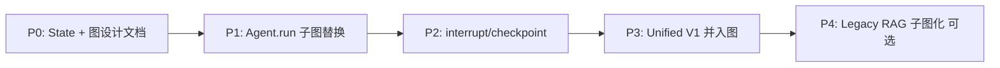

# SPEC — 调研：自研链式编排 vs LangGraph 思想 · 引入工作清单（v1）

| 项 | 内容 |
| --- | --- |
| **状态** | `draft`（调研 · 无 task 绑定） |
| **日期** | 2026-06-03 |
| **范围** | 本仓 Chat / Unified Chat / Agent 编排层向 **图 + 状态机** 演进的可行性 |
| **非范围** | 具体 PR、依赖版本、Harness task、前端 Timeline 改版 |
| **关联真值** | `docs/spec/v2-agent/SPEC-ChatBI-V2-Agent-Overview.md` · `docs/spec/v2-agent/SPEC-ChatBI-V2-ReAct-Loop.md` · `docs/_tech_graph/00_main.ai.md` |
| **配对调研** | [`SPEC-Research-SelfChain-vs-LangChain-v1_zh.md`](./SPEC-Research-SelfChain-vs-LangChain-v1_zh.md) |

---

## 0. 结论摘要（TL;DR）

1. 本仓 **未使用 LangGraph 库**；V2 `ChatBIAgent.run` 已是 **手写 ReAct 循环**，与 LangGraph **思想最近**，但缺 **显式 State、声明式边、checkpoint/interrupt**。
2. 引入 LangGraph 思想的核心收益：**控制流可声明/可测/可可视化**、**人机协同标准化**（plan preview / clarify）、**断点续跑**；非「为了用 LangGraph 而用」。
3. **最小可行路径（MVP）**：P0 State Schema + 图设计 → P1 仅替换 `ChatBIAgent.run` 循环 → P2 interrupt 替换 `plan_execution_token` 手工分支；**不建议** 同时改 `unified_chat.py` + `index.py` + `chain_chat.py`。
4. **对外约束不变**：SSE `_contract_manifest.json` 与 V1 `mode` 语义（策略 B）须保持；图编排在内，Timeline 在外。

---

## 1. 背景：现状 vs LangGraph 概念

### 1.1 本仓当前编排形态

| LangGraph 概念 | 本仓现状 | 主要落点 |
| --- | --- | --- |
| **State** | 分散在局部变量、`events[]`、`AgentRunView` | `unified_chat.py`、`agent.py`、`index.py` |
| **Node** | 各阶段函数（rewrite / embed / retrieve / intent / tool） | `query_rewrite.py`、`rag_recall_tools.py`、`intent_agent.py`、`tools.py` |
| **Edge / 条件路由** | 规则路由 + `FailureTypeHandler` + `for` 循环 | `intent_router.py`、`agent.py` |
| **Graph 入口** | HTTP handler 内嵌编排 | `handle_unified_chat*`、`chat()` |
| **Checkpoint / 中断恢复** | 部分：`session_id` 历史、`plan_execution_token` | `agent_memory.py`、`chatbi_plan_token.py` |
| **Human-in-the-loop** | clarify / plan preview 已实现，仍为代码分支 | `agent.py` |
| **Streaming** | 自定义 `emit()` → SSE | `unified_chat.py`、`agent.py` |

### 1.2 LangGraph 思想指什么

本 SPEC 中 **LangGraph 思想** 包括（**不要求** 一定安装 `langgraph` 包）：

- **单一 Graph State** 在节点间流转；
- **节点** 为纯函数 `(state) -> partial_state`；
- **边** 含 **条件边**（由 `error_code`、confidence、step 计数等路由）；
- **interrupt / resume** 支持人机闸与 plan 确认；
- **checkpointer** 支持 thread 级断点与调试回放；
- **子图** 嵌套（如 Text2SQL 内部 retrieve→sql→execute→summary）。

若采用官方库，则为上述思想的参考实现 + `astream_events` 等 API。

### 1.3 与 LangChain 的关系

LangGraph 构建在 LangChain Runnable 生态之上；本仓若无 LangChain，可选择：

- **A**：自研轻量 `StateGraph`（仅借鉴思想）；
- **B**：引入 `langgraph` + `langchain-core`，Tool/RAG 层逐步包装。

LangChain 概念对齐见配对 SPEC；本节聚焦 **图编排增量**。

---

## 2. 链式 vs 图式：为何要动

| 链式（现状） | LangGraph 思想 |
| --- | --- |
| 控制流埋在 Python 代码里 | 控制流是 **可声明、可可视化** 的图 |
| 状态隐式传递 | **显式 State**，易单测、易 debug |
| plan token / clarify 为特殊分支 | **interrupt + resume** 为一等公民 |
| 失败 fallback 散落多处 | **条件边 + 统一 failure 节点** |
| 难以 step 级回放 | **checkpoint + thread_id** |

**触发条件（何时值得做）**：

- Agent 步骤与 fallback 规则继续膨胀（`agent.py` 已 1300+ 行）；
- 需要 **标准化** plan preview / 澄清 / 多工具并行；
- 需要 **运行态断点**（超时续跑、调试回放）；
- 团队需要 **图级** 单测与 CI（边表驱动）。

**不做的理由**：

- 仅 V1 固定 RAG 链、无动态路由；
- 团队不愿引入 LangGraph/LangChain 依赖；
- 短期无 HITL / checkpoint 产品需求。

---

## 3. 工作清单总览

| 阶段 | 主题 | 优先级 |
| --- | --- | --- |
| **§4** | 架构决策与边界 | P0 · 必须先做 |
| **§5** | 统一 State Schema | P0 |
| **§6** | 节点拆分与图拓扑 | P0 |
| **§7** | 工具层 / 子图适配 | P1 |
| **§8** | SSE / 事件流适配 | P1 |
| **§9** | HITL + Checkpoint | P2 |
| **§10** | 路由层收敛 | P2 |
| **§11** | 测试与验收 | 全程 |
| **§12** | 依赖与运维 | 引库时 |
| **§13** | 文档与治理 | 采纳时 |

---

## 4. 架构决策与边界（P0）

### 4.1 必答选型题

| ID | 决策 | 选项 |
| --- | --- | --- |
| D-1 | 是否引入 `langgraph` 库 | 自研 StateGraph / 官方 langgraph |
| D-2 | 迁移范围 | 仅 Agent 路径 / 全 Unified Chat / 含 Legacy `/api/py/chat` |
| D-3 | V1 规则路由 | 保留为 fallback 节点 / 逐步废弃 |
| D-4 | 灰度开关 | 如 `CHATBI_USE_LANGGRAPH` 与 `CHATBI_USE_AGENT` 关系 |
| D-5 | SSE 契约 | 严格映射现有 type / 允许新增 graph 事件 |

### 4.2 硬约束（不可破）

- 对外 **V1 mode**（rag / text2sql / no_data）与 **策略 B** agent 事件（V2 总规 §2.1–§2.2）；
- **`_contract_manifest.json`** CI 须绿；
- **FailureTypeHandler gating**（V2 总规 §2.4、§2.4.1）语义不变；
- **ChatBI SQL Gate、Prompt Guard** 仍为独立前置节点。

### 4.3 建议默认（调研倾向 · 待冻结）

- **D-1**：Agent 环引 `langgraph` 或自研等价物；RAG 召回层 **暂不** 图化；
- **D-2**：MVP 仅 **`ChatBIAgent.run`**；
- **D-4**：LangGraph 路径作为 `CHATBI_USE_AGENT=true` 的子开关或替代实现；
- **D-5**：**严格映射** 现有 SSE type，图内部状态不泄露新 type。

---

## 5. 统一 State Schema（P0）

### 5.1 目标

用 **单一 TypedDict / Pydantic 模型** 替代 `agent.py` / `unified_chat.py` 中分散变量。

### 5.2 建议字段（示意 · 非实现）

```python
class ChatBIState(TypedDict):
    # --- 输入 ---
    query: str
    session_id: str | None
    prefer: str
    plan_execution_token: str | None
    run_id: str
    debug_llm_prompts: bool

    # --- 上下文 ---
    history: list[dict]           # tools 侧 [{query, response}, ...]
    intent_history: list[dict]    # [{role, content}, ...]

    # --- 决策 ---
    intent: IntentDecision | None
    router: RouterDecision | None
    clarify_eligible: bool

    # --- 执行 ---
    current_tool: ToolName | None
    tool_results: list[ToolResult]   # reducer: append
    steps: list[AgentStepView]       # reducer: append
    step_number: int
    max_steps: int

    # --- 输出 ---
    final_answer: str | None
    final_mode: str | None
    ok: bool

    # --- 可观测 ---
    events: list[dict]            # reducer: append · SSE 帧
    started_at: float
    error: str | None

    # --- 元数据 ---
    metadata: dict                # latency、debug_router 等
```

### 5.3 工作项

| # | 工作 | 产出 |
| --- | --- | --- |
| S-1 | 梳理各节点 **读/写** 字段（`graph_query` 影响面） | 字段 ownership 表 |
| S-2 | 定义 **reducer** 字段（`events`、`tool_results`、`steps`） | Schema 文档 |
| S-3 | 与 `rag_conversation_logs` persist 字段对齐 | `agent_memory.py` 映射表 |
| S-4 | 与 `AgentRunView` 最终组装对齐 | `finalize` 节点契约 |

---

## 6. 节点拆分与图拓扑（P0）

### 6.1 建议节点

| 节点 ID | 职责 | 现有逻辑 |
| --- | --- | --- |
| `prompt_guard` | Query 扫描短路 | `_unified_prompt_guard_short_circuit_events` |
| `load_memory` | 加载会话历史 | `AgentMemoryStore.load` |
| `intent_decide` | LLM / prefer 意图 | `decide_intent_v2`、prefer override |
| `router_emit` | 下发 `router.decision` | `agent.py` G2 emit |
| `clarify_gate` | 低置信澄清短路 | `CHATBI_V3_LOW_CONFIDENCE_CLARIFY` |
| `plan_preview` | SQL/RAG preview + mint token | `chatbi_plan_token.py` |
| `tool_rag` | RAG 检索+生成 | `rag_search_execute` |
| `tool_text2sql` | Text2SQL 全链 | `text2sql_query` tool |
| `tool_direct` | 直接回答 | `direct_answer` |
| `failure_route` | 按 error_code 选下一工具 | `FailureTypeHandler` |
| `step_limit` | max_steps / max_latency 检查 | env `AGENT_MAX_*` |
| `finalize` | 组装 `AgentRunView` | `agent.run` 尾部 |
| `persist_log` | 写 `rag_conversation_logs` | `_await_persist_chatbi_v2_agent_log` |

### 6.2 建议条件边（示例）

```text
START → prompt_guard
prompt_guard --[abort]--> END
prompt_guard --[ok]--> load_memory → intent_decide

intent_decide --> clarify_gate
clarify_gate --[clarify]--> END (agent.clarify)
clarify_gate --[plan_preview]--> plan_preview --[interrupt]--> END
clarify_gate --[execute]--> tool_* (由 intent / token 决定)

tool_rag --[ok]--> finalize
tool_rag --[RAG_RETRIEVE_EMPTY + gating]--> failure_route --> tool_text2sql | tool_direct
tool_text2sql --[SQL_* errors]--> failure_route --> retry | tool_rag | finalize

failure_route --[continue]--> tool_* (next)
failure_route --[stop]--> finalize
step_limit --[exceeded]--> finalize
finalize --> persist_log --> END
```

### 6.3 Legacy RAG 子图（可选 · P4）

独立子图，供 `/api/py/chat` 或 `rag_search` 内部复用：

```text
rewrite → embed → hybrid_recall → fuse → context_build → llm_answer → sources
```

锚点：`index.py::chat`、`tools.py::rag_search_execute`。

### 6.4 工作项

| # | 工作 | 产出 |
| --- | --- | --- |
| G-1 | Mermaid 图写入 `docs/_tech_graph/`（与 `00_main.ai.md` 对齐） | `10_flow_agent_graph.ai.md`（待建） |
| G-2 | 节点 **单一职责** 清单 + 禁止 handler 继续膨胀 | 节点 README |
| G-3 | 条件边 **真值表**（error_code × gating × 下一节点） | 与 V2 总规 §2.4 一致 |
| G-4 | Text2SQL 是否 **嵌套子图** 决策 | ADR 条目 |

---

## 7. 工具层 / 子图适配（P1）

### 7.1 原则

- 节点函数 **不直接** 操作 HTTP；只读写 State；
- `ToolResult.error_code` 为 **条件边唯一真值**（与现 Agent 一致）；
- Text2SQL 内部（retrieve → sql → gate → execute → summary）可：
  - **方案 A**：单节点内保持现有函数调用；
  - **方案 B**：LangGraph subgraph（便于单测 SQL 阶段）。

### 7.2 工作项

| # | 工作 |
| --- | --- |
| T-1 | `tools.py` 三个 Tool 包装为 `(state) -> partial_state` |
| T-2 | 保留 `chatbi_sql_gate` 在 text2sql 节点内或独立 `sql_gate` 节点 |
| T-3 | `FailureTypeHandler` 逻辑迁入 `failure_route` 节点 + 边表 |
| T-4 | V1 `decide_intent` 作为 `intent_fallback` 节点（LLM 超时） |

---

## 8. SSE / 事件流适配（P1）

### 8.1 约束

前端 Timeline 消费固定 `type` + `payload`；图编排 **不得** 破坏 contract。

须映射的事件类型（节选）：

- `agent.step.start` / `agent.step.end`
- `agent.intent` / `agent.think`
- `agent.llm.start` / `agent.llm.delta` / `agent.llm.end`
- `router.decision`
- `tool.call.start` / `tool.call.end`
- `agent.clarify` / `agent.plan.preview`
- `latency` / `done`

### 8.2 工作项

| # | 工作 |
| --- | --- |
| E-1 | 图 **on_node_start/end** 钩子 → `_agent_chain` / `_event` 同形 payload |
| E-2 | 保留 `_emit_simulated_llm` 行为（非 token 级上游） |
| E-3 | LangGraph `astream_events`（若引库）→ 适配层单测 + 快照 |
| E-4 | 变更时更新 `_contract_manifest.json` + `tech_graph_contract_check` |

---

## 9. Human-in-the-loop + Checkpoint（P2）

### 9.1 现状痛点

- `plan_execution_token`：手工 mint/verify，跨请求 **模拟** 状态机；
- `agent.clarify`：低置信分支嵌在 `agent.run`；
- 无 **运行态** checkpoint（仅 DB 对话历史）。

### 9.2 LangGraph 标准模式

| 场景 | 机制 |
| --- | --- |
| Plan preview | `interrupt_before("tool_text2sql")` → 用户确认 → `invoke` resume |
| Clarify | `interrupt_after("clarify_gate")` → 用户选 prefer → resume |
| 多轮 | `thread_id = session_id` + checkpointer |
| 超时续跑 | 同一 `thread_id` 从最后 checkpoint 继续 |

### 9.3 与 Supabase 的关系

| 存储 | 职责 |
| --- | --- |
| Checkpointer（Memory/Postgres） | **运行态**、interrupt 快照、调试回放 |
| `rag_conversation_logs` | **业务对话**历史、审计、Intent 上下文 |

须决策：**双写** vs **checkpointer 仅运行时、DB 仍为业务真值**（见开放问题 Q-4）。

### 9.4 工作项

| # | 工作 |
| --- | --- |
| H-1 | 用 interrupt 替换 `plan_execution_token` 主路径（token 可保留兼容期） |
| H-2 | Clarify 与 plan preview 统一为 **interrupt 节点** |
| H-3 | 选型 checkpointer 后端（内存 / Postgres / Redis） |
| H-4 | 定义 `thread_id` 与 `session_id` 映射与 TTL |

---

## 10. 路由层收敛（P2）

### 10.1 目标

将 L1 规则 / L2 LLM Intent / L3 Failure 路由 **收敛为图上的条件边**，减少 `unified_chat.py` 双份 V1/V2 逻辑。

### 10.2 目标拓扑（Unified Chat handler）

```text
HTTP handler:
  auth → parse body → build initial state
  → graph.invoke / graph.astream
  → map final state → JSONResponse / SSE done
```

`unified_chat.py` **不再** 内含数百行 if agent else v1。

### 10.3 工作项

| # | 工作 |
| --- | --- |
| R-1 | V1 unified 路径图化或标记 deprecated |
| R-2 | `CHATBI_USE_AGENT` 与 graph 开关关系文档化 |
| R-3 | `prefer=tool:*` 等行为 **parity 测试** |

---

## 11. 测试与验收

| 类别 | 内容 |
| --- | --- |
| **节点单测** | mock State in/out；无 HTTP |
| **边表测试** | `(error_code, gating) → next_node` 参数化 |
| **SSE 快照** | 关键路径 events 序列 vs contract |
| **Parity** | 图路径 vs 现有 `ChatBIAgent.run` 同 query 结果 |
| **性能** | P50/P95 不劣于 V2 总规 §2.3 |
| **回归** | `pytest tests -m "not intent_eval and not intent_benchmark"` |
| **Eval** | Agent eval 集无显著退化 |

涉及 `api/` 且将来 task 标记 `test_strategy: required` 时，须 **50 落盘** 后再关账（Harness 通则；本调研稿不创建 task）。

---

## 12. 依赖与运维（引库时）

| 项 | 说明 |
| --- | --- |
| 依赖 | `langgraph`、`langchain-core`；可选 `langchain-openai` 适配 SiliconFlow `base_url` |
| 版本 | 锁定 minor；评估与现有 `openai` SDK 并存 |
| 观测 | 节点级 latency 写入现有 JSON log / `rag_conversation_logs` |
| 镜像 | 依赖树体积 vs 自研 StateGraph |

---

## 13. 文档与治理（采纳时）

| # | 工作 |
| --- | --- |
| DOC-1 | 更新 `docs/_tech_graph/00_main.ai.md` Agent 分支 |
| DOC-2 | 新建 `10_flow_agent_graph.ai.md`（或扩 V2 ReAct 规） |
| DOC-3 | 更新 / 新建 `docs/spec/v3-agent/` L0 条目（若进入主业务线） |
| DOC-4 | 本 research SPEC 状态 `draft` → `accepted` 须配 task + 图谱 export CI |

---

## 14. 建议迁移路径



| 阶段 | 交付 | 风险 |
| --- | --- | --- |
| **P0** | State Schema、节点/边表、Mermaid | 低 |
| **P1** | `ChatBIAgent.run` → graph；SSE 映射；parity 测试 | 中 |
| **P2** | plan/clarify interrupt；checkpointer | 中 |
| **P3** | `unified_chat` 瘦身；V1 废弃策略 | 高 |
| **P4** | `index.py` / `chain_chat` 子图 | 可选 |

**禁止**：P1 未绿前同时改三条 HTTP 入口。

---

## 15. 开放问题

| ID | 问题 |
| --- | --- |
| Q-1 | 自研 StateGraph vs 官方 `langgraph`？ |
| Q-2 | Text2SQL 单节点 vs subgraph？ |
| Q-3 | Checkpointer 存储选型与运维？ |
| Q-4 | Checkpointer 与 `rag_conversation_logs` 双写策略？ |
| Q-5 | `plan_execution_token` 兼容期多长？ |
| Q-6 | 是否允许新增 SSE event type（如图 debug）？ |

---

## 16. 关键代码锚点（实施时必读）

| 模块 | 路径 |
| --- | --- |
| Agent 主循环 | `api/agent.py` — `ChatBIAgent.run` |
| Unified 入口 | `api/unified_chat.py` — `handle_unified_chat` / `_stream` |
| Legacy RAG | `api/index.py` — `chat()` |
| Text2SQL chain | `api/chain_chat.py` |
| Tool 层 | `api/tools.py` |
| Intent V2 | `api/intent_agent.py` |
| Plan token | `api/chatbi_plan_token.py` |
| Memory | `api/agent_memory.py` |
| V2 架构真值 | `docs/spec/v2-agent/SPEC-ChatBI-V2-Agent-Overview.md` |
| ReAct 规 | `docs/spec/v2-agent/SPEC-ChatBI-V2-ReAct-Loop.md` |
| SSE 契约 | `docs/_tech_graph/_contract_manifest.json` |

---

## 修订记录

| 日期 | 摘要 |
| --- | --- |
| 2026-06-03 | 初版 draft：现状映射、工作清单 §4–§14、迁移路径、开放问题 |
