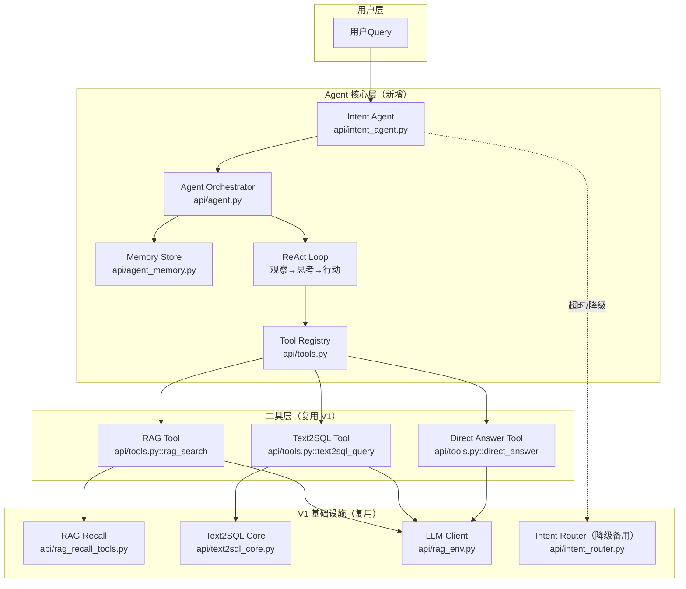

# SPEC: ChatBI V2 —— Agent 架构升级（总规）

> **状态**：implemented（后端 P0+P1 主线已合；**与纸面目标的差距**以 §7.4 全量对照为准）  
> **版本**：v2（已按审查意见修订）  
> **日期**：2026-04-27（**文档对齐**：2026-05-07 — §7 验收勾选、任务索引、§7.4 / §7.5；**2026-05-09** — §2.6 多轮契约、§7.5.5 L6、子规 `SPEC-ChatBI-V2-Multiturn-Semantics.md`（多轮语义承接））  
> **负责人**：cyning  
> **关联任务（真值）**：`docs/tasks/done/task_chatbi_v2_agent_p0_backend.md`（P0 归档）· `docs/tasks/done/task_chatbi_v2_agent_p1_behavior.md`（P1 总览，含 Eval/C/D；**已归档**）· `SPEC-ChatBI-V2-Gap-Checklist.md`（缺口快照）

---

## 1. 背景与目标

### 1.1 现状（V1 的问题）

ChatBI V1 是**规则路由系统**，不是 Agent：

| 维度 | V1 现状 | V2 目标 |
|------|---------|---------|
| 决策方式 | 关键词规则匹配（`intent_router.py`） | LLM 自主推理决策 |
| 执行流程 | 固定 if/else 分支（`unified_chat.py`） | ReAct 动态循环 |
| 错误处理 | 直接报错返回 | 按失败类型 fallback |
| 多轮工具 | ❌ 单工具一次执行 | ✅ 多工具协作 |
| 中间反馈 | ❌ 不反馈给决策层 | ✅ 观察-思考-行动循环 |

### 1.2 V2 核心目标

将 ChatBI 从"智能路由系统"升级为"LLM 自主决策的 Agent 架构"：

1. **LLM 自主决策**：根据 Query 内容自主选择工具（RAG / Text2SQL / Direct Answer）
2. **ReAct 循环**：支持多步推理、错误恢复、工具切换
3. **多工具协作**：复杂查询可串行/并行调用多个工具
4. **记忆管理**：多轮对话保持上下文
5. **事件流兼容**：对外保留 V1 mode 语义，内部新增 agent.* 事件（策略 B）

---

## 2. 关键设计决策（审查收口）

### 2.1 事件流策略：策略 B

| 项目 | 约定 |
|------|------|
| 新增事件 | `agent.step.start` / `agent.think` / `agent.step.end` / `agent.intent` / `agent.final` |
| 契约更新 | **必须**同步写入 `_contract_manifest.json`（SSE 契约真值，含 `type_values` + `payload_min_keys_by_type`）；`_manifest.json` 仅管基础设施元数据（端点/RPC/表/env）。两层清单缺一不可，见 Events.md §6 |
| 前端约束 | 收到未知 type 时**忽略，不报错**（SSE 标准行为） |
| CI 校验 | manifest 必须包含所有事件类型，否则阻断 |

### 2.2 Mode 映射：对外保留 V1 语义

| V2 Tool 名（内部） | 对外 Mode | 说明 |
|-------------------|----------|------|
| `rag_search` | `rag` | 文档检索 |
| `text2sql_query` | `text2sql` | 数据库查询 |
| `direct_answer` | `no_data` | 直接回答 |

**约定**：Agent 内部用 tool 名，输出到事件流时转换回 V1 mode。前端 Timeline、日志、统计无需改动。

### 2.3 性能指标：P50/P95 分位

| 指标 | P50 目标 | P95 上限 | 超时回退 |
|------|---------|---------|---------|
| Intent LLM 调用 | 200ms | 500ms | V1 规则路由 |
| Agent 单步 | 1.5s | 3s | 标记失败 |
| 整体响应 | 3s | 8s | 返回错误 |

**max_steps 上界推导**：假设每步 2s（LLM 500ms + Tool 1.5s），max_steps=5 → 上界 10s，加上 Intent 500ms → 整体上界 10.5s < 15s 硬上限。

### 2.4 Fallback：按失败类型分类

| 失败类型 | 判定标准 | fallback 策略 |
|---------|---------|--------------|
| SQL 生成失败 | `error_code=SQL_GEN_SYNTAX/EMPTY` | 重试 1 次 → 仍失败则换 `rag_search` |
| SQL 执行失败 | `error_code=SQL_EXEC_TABLE_NOT_FOUND/PERMISSION_DENIED` | 换 `rag_search`（查文档看正确表名） |
| SQL 无数据 | `error_code=SQL_EXEC_NO_DATA` | 直接回答"未查到数据"，不换工具 |
| RAG 无命中 | `error_code=RAG_RETRIEVE_EMPTY` | **Gated**：满足结构化聚合意图才换 `text2sql_query`，否则换 `direct_answer` 或追问（见 §2.4.1） |
| RAG 不确定 | `error_code=RAG_GENERATE_UNCERTAIN` | 换 `direct_answer` 或追问用户 |
| LLM API 超时 | `error_code=LLM_API_TIMEOUT` | 降级到 V1 规则路由 |
| 低置信度 | `confidence < 0.6`（`INTENT_MIN_CONFIDENCE` 默认值 `0.6`，可通过环境变量配置） | 按预设路径：`rag` → `text2sql` → `direct` |

#### 2.4.1 RAG 无命中 → SQL 的 Gating 条件

RAG 检索无命中（`error_code=RAG_RETRIEVE_EMPTY`）时，**不能无条件 fallback 到 `text2sql_query`**。大量概念/文档问题也会出现 hits==0（如知识库缺失），此时换 SQL 会触发无意义的 SQL 生成与执行（浪费 + 风险 + 误触数据库查询的糟糕体验）。

**Gating 条件**（满足任一即可 fallback 到 SQL，否则 fallback 到 `direct_answer` 或追问）：

| 条件 | 说明 | 判定方式 |
|------|------|---------|
| 条件 A：Intent 原始决策含 SQL 特征 | 用户问题在 Intent 阶段已被判定为倾向 SQL（如 `intent.tool == "text2sql_query"` 或 `intent.fallback == "text2sql_query"`） | 复用 Intent 结果 |
| 条件 B：LLM 二次判定倾向 SQL | 由轻量 LLM（或规则）二次判断 query 是否"需要结构化数据聚合" | `structured_signals.llm_prefers_sql = true` |
| 条件 C：Query 含聚合语义信号 | 问题涉及金额、数量、时间范围、排名、对比等结构化统计特征 | `structured_signals.has_aggregation_signals = true`（由轻量语义分析产出，非关键词匹配） |

> **默认行为**：不满足 gating → 换 `direct_answer`（"未找到相关文档，请问您是想查询数据吗？"）或追问澄清，**绝不盲目执行 SQL**。

### 2.5 Reasoning 分级输出

| 级别 | 内容 | 输出位置 | 鉴权 |
|------|------|---------|------|
| 用户级 | 1-2 句话摘要（如"正在查询数据库"） | SSE `agent.think` payload.summary | 无 |
| 内部级 | 完整 reasoning、raw_response、prompt | 日志 / 调试接口 `/api/py/admin/agent/debug` | admin token |

### 2.6 多轮对话（后端契约与前后端分工）

> **结论（后端）**：Unified Chat V2 Agent 路径**已支持**多轮上下文，前提是调用方在**每一轮**请求体中传入**同一**非空 `session_id`，并依赖 `rag_conversation_logs` 落库成功（见 `api/agent_memory.py`、`api/unified_chat.py::_await_persist_chatbi_v2_agent_log`；失败时 SSE 先发 `error`/`stage=agent_db`，`done` 带 `persist` 字段）。  
> **结论（前端）**：`ai-ink-brain` 当前页面若**未**在后续请求中回传服务端认可的 `session_id`，则用户体验仍为**单轮**；该缺口在**前端 / BFF**，不改变后端契约。

#### 2.6.1 HTTP 与字段约定

| 字段 | 类型 | 必填 | 说明 |
|------|------|------|------|
| `query` | string | 是 | 当前轮用户问题 |
| `session_id` | string \| null | **多轮时视为必填** | 会话稳定标识（建议客户端 `uuid4`）；**全轮次保持一致** |
| `prefer` | string | 否 | 与既有 Unified Chat 一致（`auto` / `rag` / `text2sql` / `no_data` 等） |

- **首轮**：客户端应直接生成并传入 `session_id`（**不要**依赖服务端分配；JSON 响应 / SSE `meta` 会**回显**同一 `session_id`，便于客户端校验）。
- **`session_id` 为空或缺省**：`AgentMemoryStore.load` 返回空历史；V2 Agent **不会**写入 `rag_conversation_logs`（persist 视为 `skipped`），后续轮无法从 DB 恢复上下文。

#### 2.6.2 历史窗口与数据真值

| 环节 | 行为 | 代码锚点 |
|------|------|----------|
| 加载 | 按 `session_id` 查询 `rag_conversation_logs`，`order(created_at, desc=True).limit(5)`，再**反转为时间正序**，构造 `{ "query", "response" }` 列表 | `api/agent_memory.py::AgentMemoryStore.load` |
| Intent | 将上述列表展开为 `role: user` / `role: assistant` 消息序列，供意图模型使用 | `api/agent.py`（`intent_history`） |
| Intent 提示窗口 | 与 `intent_agent` 内 **最近 6 条** role 消息块对齐（避免指代过短） | `api/intent_agent.py`（`history_block`、`[-6:]`） |
| 工具侧 | `text2sql` / `rag` 等工具收到的 `history` 为 **`turn_history` 最近 6 条**（同轮多步执行中会在内存追加本条 `query` 与中间回答形态，与 DB 条目不混） | `api/agent.py`（`call_history = turn_history[-6:]`） |
| 持久化 | 每轮对话结束在 SSE **`done` 之前** `await` 落库（`insert`，含 `agent_steps` / `tool_results` 等，超时见 `CHATBI_AGENT_DB_PERSIST_TIMEOUT_S`）；**非**每 ReAct 步写库 | `api/unified_chat.py::_await_persist_chatbi_v2_agent_log` |

**与 §4 Memory 文字的关系**：总规「最近 5 轮」在实现上按 **最近 5 条 `rag_conversation_logs` 行**（每行 = 用户一问 + 助手一答）计，与 §7.1 勾选口径一致。

#### 2.6.3 竞态与观测

- **异步落库**：首轮 `insert` 为 `asyncio.to_thread` 触发，若客户端**极短间隔**连发第二轮，存在第二轮 `load` 时尚未读到首轮行的 **best-effort** 窗口；L6 验收建议在轮间 **≥1s** 或待首轮 SSE `done` 后再发第二轮。
- **SSE**：首条 `chain` 中 `type: meta` 的 `payload` 含 `run_id`、`mode`、`session_id`（与请求一致），可用于前端调试与 L4/L6 抓包对照。

#### 2.6.4 L6 与前后端分工（摘要）

| 层级 | 多轮责任 |
|------|----------|
| 后端 | 校验并实现 §2.6.1–2.6.3 |
| BFF / 前端 | 分配或存储 `session_id`，并在**每次** `unified/chat`（JSON 或 `stream`）请求中携带；Timeline UI 是否展示多轮由产品决定，**与后端是否具备多轮能力无关** |

#### 2.6.5 多轮语义承接（与传输层解耦）

**§2.6.1–2.6.4** 只保证 **会话连续**与**历史可注入**；**不**保证追问在业务上一定接得住（指代消解、次轮 SQL 是否仍锚定上一轮表、「未查到数据」根因等）。该类 **L2/L3/L4** 分层、可选 **query rewrite**、结构化锚点与验收草案见子规：

- **`SPEC-ChatBI-V2-Multiturn-Semantics.md`**

---

## 3. 架构总览



---

## 4. 核心模块设计

### 4.1 Intent Agent (`api/intent_agent.py`)

**职责**：LLM 驱动的意图识别，替代 V1 的规则路由。

**设计要点**：
- 不再使用关键词规则匹配
- 基于 LLM 语义推理选择 Tool
- 输出置信度和 reasoning（可解释）
- 低置信度时自动 fallback
- **超时 3s 回退到 V1 规则路由**

**详细设计**：见 `SPEC-ChatBI-V2-Intent.md`

### 4.2 Agent Orchestrator (`api/agent.py`)

**职责**：ReAct 循环主控，协调工具调用与记忆管理。

```python
class ChatBIAgent:
    """ChatBI V2 Agent 核心"""
    
    def __init__(self, tools: list[Tool], llm_client: OpenAI, memory: MemoryStore):
        self.tools = {t.name: t for t in tools}
        self.llm = llm_client
        self.memory = memory
        self.max_steps = int(os.getenv("AGENT_MAX_STEPS", "5"))  # 从 10 改为 5
    
    async def run(self, query: str, session_id: str | None = None) -> AgentResult:
        """
        ReAct 循环：
        1. 观察当前状态（用户Query + 历史）
        2. LLM 思考：该用什么工具
        3. 执行工具
        4. 观察结果 → 循环或结束
        """
        history = self.memory.load(session_id) if session_id else []
        
        for step in range(self.max_steps):
            # 构建 Observation
            observation = self._build_observation(query, history)
            
            # LLM 思考 + 决策
            decision = await self._llm_decide(observation, list(self.tools.values()))
            
            if decision.action_type == "final_answer":
                return AgentResult(answer=decision.content, history=history)
            
            # 执行 Tool
            tool = self.tools[decision.tool_name]
            result = await tool.execute(**decision.parameters)
            
            # 失败处理：按失败类型 fallback
            if not result.success:
                result = await self._handle_failure(result, decision, step)
            
            # 记录历史
            history.append(StepRecord(
                thought=decision.thought,
                action=decision.action,
                observation=result,
            ))
            
            # 保存记忆
            if session_id:
                self.memory.save(session_id, history)
        
        return AgentResult(answer="达到最大步数，未能完成", history=history)
```

### 4.3 Tool 抽象 (`api/tools.py`)

**职责**：统一工具接口，复用 V1 能力。

**重要**：新增 Tool 需要：注册 + schema + execute + 测试，Prompt 从 registry 自动生成。

```python
from dataclasses import dataclass
from typing import Any, Callable

@dataclass
class Tool:
    name: str
    description: str
    parameters: dict[str, Any]  # JSON Schema
    execute: Callable[..., Any]

# V1 RAG 封装为 Tool
rag_tool = Tool(
    name="rag_search",
    description="从文档库中检索信息，适合概念解释、技术文档查询、非结构化数据问题",
    parameters={...},
    execute=rag_search_execute
)
```

### 4.4 Memory Store (`api/agent_memory.py`)

**职责**：管理多轮对话的短期记忆。

**最小可用记忆**：最近 5 轮对话 + 最近 3 次 tool 结果摘要。

**Schema**：复用 `rag_conversation_logs`，新增 `agent_steps` JSONB 字段。

**上限**：单 session 最多 20 轮，超限时保留最近 10 轮，30 天自动归档。

详细设计见 `SPEC-ChatBI-V2-Memory.md`。

---

## 5. 事件流兼容（策略 B）

### 5.1 事件类型

| 事件类型 | 说明 | 来源 | 前端处理 |
|---------|------|------|---------|
| `router.decision` | 保留，内容变为 Agent 初始决策 | V2 | 兼容 |
| `agent.step.start` | Agent 步骤开始 | V2 新增 | **可忽略** |
| `agent.think` | LLM 思考摘要（用户级） | V2 新增 | **可忽略** |
| `agent.intent` | 意图识别结果 | V2 新增 | **可忽略** |
| `tool.call.start` | 工具调用开始 | V1 已有 | 兼容 |
| `tool.call.end` | 工具调用结束 | V1 已有 | 兼容 |
| `sql.result` | SQL 执行结果 | V1 已有 | 兼容 |
| `rag.sources` | RAG 检索来源 | V1 已有 | 兼容 |
| `agent.step.end` | Agent 步骤结束 | V2 新增 | **可忽略** |
| `agent.final` | Agent 最终决策 | V2 新增 | **可忽略** |
| `assistant.message` | 最终回答 | V1 已有 | 兼容 |
| `latency` | 耗时统计 | V1 已有 | 兼容 |
| `error` | 错误 | V1 已有 | 兼容 |

### 5.2 契约更新

- **事件类型与 payload 键**：新增 `agent.*` 事件必须同步写入 `docs/_tech_graph/_contract_manifest.json`（补 `type_values` + `payload_min_keys_by_type`）。
- **基础设施元数据**：若新增端点 / env / anchors，同步更新 `docs/_tech_graph/_manifest.json`。
- 两层清单缺一不可，CI 校验通过后方可合并。

详细设计见 `SPEC-ChatBI-V2-Events.md` §6。

---

## 6. 与 V1 的对比

| 场景 | V1 处理 | V2 处理 |
|------|---------|---------|
| "什么是 RAG" | 规则 → RAG 分支 → 检索 → 回答 | Agent 选 `rag_search` → 回答 |
| "昨天销售额" | 规则 → Text2SQL 分支 → SQL → 回答 | Agent 选 `text2sql_query` → 回答 |
| "翻译这句话" | 规则 → no_data 分支 → 直接回答 | Agent 选 `direct_answer` → 回答 |
| "销售额下降原因" | ❌ 无法处理（单工具） | Agent 多步：`text2sql_query` → 发现异常 → `rag_search` → 综合分析 |
| "SQL 执行失败" | ❌ 直接报错 | 按失败类型 fallback（重试/换工具/反思） |
| "帮我看看数据" | 随机 fallback | LLM 推理判断是 SQL 还是 RAG |

---

## 7. 验收标准

> **说明**：下列 `[x]` / `[ ]` 表示**相对本总规条文**的当前达成度；**不以「是否合并某张任务单」为口径**。细粒度证据见 **`docs/tasks/done/task_chatbi_v2_agent_p1_behavior.md`**（已归档）、P1-Eval 子任务、diary、`tests/_out/` 归档与 §7.4。

### 7.1 功能验收

- [x] Agent 能根据 Query 自主选择正确工具（**Intent**：60 条金标 + `intent_eval` / P1-D 归档；macro-F1 约 **0.95+** 量级；**RAG 桶**曾存在 **22/24** 与超时相关误判，见 diary，**不等同于**「全场景 >90% 永真」）
- [ ] 支持多步推理（至少 2 个工具串行调用）（**`AGENT_MAX_STEPS` 默认 5** 已具备；**典型「SQL→RAG」串联**依赖失败/fallback 触发路径，**缺独立 E2E 黄金用例与压测报告**，见 Gap §8 / §7.4）
- [x] SQL 执行失败等按 **`error_code`** 分支 fallback / gating（**部分**：`FailureTypeHandler` + `RAG_RETRIEVE_EMPTY` gating 已落地；与 Overview §2.4 **逐条等价**仍建议走 §7.5 L5 深度用例）
- [x] 多轮对话能保持上下文（**最近 5 条**会话从 `rag_conversation_logs` 加载，见 `api/agent_memory.py`；与 spec「5 轮」口径一致按「条」计；**契约与验收口径**见 **§2.6**、**§7.5.5**）
- [x] SSE 事件流对外兼容（**mode** 仍为 `rag` / `text2sql` / `no_data`；`agent.*` 为增量事件；契约见 `_contract_manifest.json`）

### 7.2 性能验收

| 指标 | P50 | P95 | 测试方法 |
|------|-----|-----|---------|
| Intent 决策 | 200ms | 500ms | 压力测试 100 次 |
| Agent 单步 | 1.5s | 3s | 压力测试 50 次 |
| 整体响应 | 3s | 8s | 端到端测试 |
| 并发 | 与 V1 持平 | — | 负载测试 |

- [ ] **纸面 P50/P95 未达标（已知）**：真实 SiliconFlow Intent 延迟与 **§2.3** 目标差距大；`CHATBI_V2_INTENT_TIMEOUT_S` 顶满时出现 **`v1_fallback`**（见 P1-Eval / P1-D 日志）。**验收改以「可观测 + 退化正确」为主**，数值目标保留为后续优化项。

### 7.3 代码验收

- [x] 新增文件：`api/intent_agent.py`, `api/agent.py`, `api/tools.py`, `api/agent_memory.py`
- [x] 修改文件：`api/unified_chat.py`（接入 Agent + SSE）
- [x] 保留文件：`api/intent_router.py`（降级备用）
- [x] 契约更新：`docs/_tech_graph/_contract_manifest.json`（`agent.*` + `payload_min_keys_by_type`）；`_manifest.json` 与 env 以 `PROJECT_CONFIG_AI_INK_BRAIN_API_PYTHON.md` 为准
- [x] 测试覆盖：**60 条** Intent 集 + stub/缓存/统一聊天 V2 单测（`pytest tests` **55** 条收集口径；其中 **2** 条 `intent_eval` / `intent_benchmark` 默认 skip）

### 7.4 全量实现对照（总规 × 仓，不限任务单）

| 维度 | 总规要求（摘要） | 后端 `ai-ink-brain-api-python` | 前端 `ai-ink-brain` | DB / 运维 | 测试与证据 | 结论 |
|------|------------------|-------------------------------|---------------------|-----------|------------|------|
| 契约 `agent.*` | `_contract_manifest.json` 真值 | 已维护；`tech_graph_contract_check` 门禁 | `chain-chat` 类型含 `agent.*`；未知事件应忽略 | — | CI / 本地 contract_check | **已对齐** |
| Unified 接入 | `CHATBI_USE_AGENT` 分流 | `unified_chat` JSON + SSE 路径已实现 | BFF 透传依赖部署 `PY_API_URL` / env | — | `test_unified_chat_backend_v2_agent.py` 等 | **已对齐**（部署面另验） |
| Intent 质量 | macro-F1、三桶准确率 | P1-Eval + **P1-D** Prompt/历史窗口；**RAG 桶仍有超时边界** | 不参与 | — | `tests/_out/intent_llm_*`、diary | **部分**（质量达标为主路径，非全 query 宇宙） |
| Intent 延迟 | §2.3 P50/P95 | 实际上游常 **秒级**；`v1_fallback` 可观测 | — | — | benchmark 脚本、评测 `latency_ms` | **缺口**（相对纸面指标） |
| ReAct 多步 | ≥2 工具、max_steps | `AGENT_MAX_STEPS`、步内换工具逻辑存在 | Timeline 未要求消费全部 `agent.*` | — | 缺专门 E2E 黄金场景 | **部分** |
| Fallback / gating | §2.4 `error_code` 映射 | `ToolResult` + `FailureTypeHandler` + RAG→SQL gating | — | — | 单元测覆盖**不等同**全矩阵 | **部分** |
| 记忆 / 多轮 | 最近 5 轮等；**同 `session_id` 跨请求** | `agent_memory.load` **最近 5 条**；**须非空 `session_id`** 才 V2 落库；Intent/工具 **6 条**窗口见 §2.6 | **页面未传 `session_id` 时等价单轮** | **生产库须已迁移** SQL 列 | §2.6、§7.5.5 L6、P0 迁移 | **后端已具备**；**全链路依赖前端传参** |
| reasoning 分级 | 用户摘要 vs 内部 | SSE `agent.think` 摘要；完整链路日志 / admin | 仅展示摘要类事件 | — | 人工 SSE 抽查 | **需持续对照** |
| 压测 / 并发 | §7.2 最后一行 | 未作为阻断交付 | — | — | P1 子任务「压力脚本报告」仍 **open** | **缺口** |

### 7.5 深度回归操作（建议固定为发布前 Checklist）

以下按 **L0→L7 由浅入深**；**越深越接近「全量相对总规」**，成本越高（外呼、密钥、时长）。

**约定**：命令均在仓库根 **`ai-ink-brain-api-python`** 执行。下文 **`PYTHONPATH=.`** 可改为先执行 **`export PYTHONPATH=.`**，则后续命令可省略该前缀。

#### 7.5.1 环境变量与密钥（勿写入可复制的一行命令、勿提交）

在 **`.env`** 或当前 shell 中 **`export`**（**密钥类**只放本机，勿贴 PR / 聊天公开处）：

| 变量 | L1 | L2 | L3 | L4（HTTP 打流） | 说明 |
|------|:--:|:--:|:--:|:--:|------|
| **`SILICONFLOW_API_KEY`** | 必 | 必 | — | — | Intent 真实 LLM / 基准外呼 |
| **`INTENT_LLM_MODEL`** | 选 | 选 | — | — | 默认见 `PROJECT_CONFIG` |
| **`CHATBI_V2_INTENT_EVAL`** | `true` | — | — | — | 打开 `-m intent_eval` |
| **`CHATBI_V2_INTENT_LLM`** | `true`（真实） / `false`（stub） | `true` 推荐 | — | — | 与评测脚本内 `real_llm` 一致 |
| **`CHATBI_V2_INTENT_EVAL_OUT`** | 选 | — | — | — | 导出 JSONL/CSV 路径；未设则落默认文件名（见 `tests/_out/README.md`） |
| **`CHATBI_V2_INTENT_EVAL_PROGRESS`** | 选 | — | — | — | 默认 `true`；过吵可 `false` |
| **`CHATBI_V2_INTENT_BENCH_RUN`** | — | `true` | — | — | 打开 `intent_benchmark` |
| **`CHATBI_V2_INTENT_BENCH_N`** | — | 选 | — | — | 默认 `100` |
| **`CHATBI_V2_INTENT_BENCH_COLD_WARM`** | — | 选 | — | — | 冷/热两轮，见 `benchmark_intent_latency.py` 注释 |
| **`CHATBI_USE_AGENT`** | — | — | `true` | 服务端须 `true` | L3 单测；L4 打流前 API 进程环境 |
| **`SYNC_ADMIN_SECRET` 或 `API_KEY`** | — | — | 单测内 monkeypatch | 与 Bearer 一致 | Legacy/admin：`Authorization: Bearer <与之一致>` |
| **`API_BASE`** | — | — | — | 选 | L4 `curl` 目标主机，如 `http://127.0.0.1:8000`（与本地 `uvicorn` 端口一致） |

**说明（L1 与超时）**：`tests/test_intent_agent_accuracy.py` 的 `_run_eval` 虽传入 `timeout=3.0`，但 `decide_intent_v2` 内 **`_effective_intent_llm_timeout_s` 优先读取 `CHATBI_V2_INTENT_TIMEOUT_S`**（见 `api/intent_agent.py`）；故 **Intent 评测实际等待上限以 env 为准**。归档验收见 **`docs/diary/2026-05-07-l0-l3-regression-acceptance.md`**。

#### 7.5.2 一行命令（非密钥开关可内联；密钥仅依赖 7.5.1）

**pytest 日志**：**`-v`** 逐条用例名；**`-s`** 等价 **`--capture=no`**，把用例里的 **`print` / `[intent_eval]` 进度与 Summary`** 打到终端（否则会被 pytest 吞掉）。

| 层级 | 目的 | 一行命令 |
|------|------|----------|
| **L0** | 契约 + 全量 pytest（默认 2 skip） | `unset CHATBI_V2_INTENT_EVAL CHATBI_V2_INTENT_BENCH_RUN 2>/dev/null; unset CHATBI_V2_INTENT_LLM 2>/dev/null; PYTHONPATH=. python tools/tech_graph_contract_check.py && PYTHONPATH=. python -m pytest tests -q --tb=short` |
| **L1** | 60 条 Intent 评测（**须已 export `SILICONFLOW_API_KEY` 等**；真实 LLM） | `CHATBI_V2_INTENT_EVAL=true CHATBI_V2_INTENT_LLM=true CHATBI_V2_INTENT_EVAL_OUT=tests/_out/intent_llm_$(date +%Y%m%d_%H%M%S).jsonl PYTHONPATH=. python -m pytest tests/test_intent_agent_accuracy.py -m intent_eval -v -s --tb=short` |
| **L1′** | 同上但 **stub**（无上游，仅验证导出/门禁） | `CHATBI_V2_INTENT_EVAL=true CHATBI_V2_INTENT_LLM=false CHATBI_V2_INTENT_EVAL_OUT=tests/_out/intent_llm_stub.jsonl PYTHONPATH=. python -m pytest tests/test_intent_agent_accuracy.py -m intent_eval -v -s --tb=short` |
| **L2** | Intent 延迟基准（**须密钥 + `CHATBI_V2_INTENT_BENCH_RUN`**） | `CHATBI_V2_INTENT_BENCH_RUN=true CHATBI_V2_INTENT_LLM=true CHATBI_V2_INTENT_BENCH_N=100 PYTHONPATH=. python -m pytest tests/benchmark_intent_latency.py -m intent_benchmark -v -s --tb=short` |
| **L2′** | 同逻辑脚本入口（不经 pytest marker） | `CHATBI_V2_INTENT_LLM=true CHATBI_V2_INTENT_BENCH_N=100 PYTHONPATH=. python tests/benchmark_intent_latency.py` |
| **L3** | Unified V2 Agent 单测 | `CHATBI_USE_AGENT=true PYTHONPATH=. python -m pytest tests/test_unified_chat_backend_v2_agent.py -q --tb=short` |

**通过准则（摘要）**：L0 → contract **OK** 且 **53 passed + 2 skipped**（与当前收集一致）；L1 → `n==60` 且 macro / 三桶 / `v1_fallback` 对照归档或任务红线；L2 → 终端或日志中有分位数/样本延迟；L3 → 全绿。

#### 7.5.3 L4 — SSE 全链路与事件序（详细流程）

**目的**：验证运行中的 API 输出的 **`chain` / SSE** 与 **`docs/_tech_graph/_contract_manifest.json`**、`SPEC-ChatBI-V2-Events.md` 中 **事件类型与最小 payload** 一致；并确认 **未知 type 不导致前端崩溃**（策略 B）。

**前置（环境）**

1. 在 **`.env`** 或 shell 中：`CHATBI_USE_AGENT=true`；配置 **`SYNC_ADMIN_SECRET` 或 `API_KEY`**（Legacy/admin 路由 Bearer；Unified 用 ChatBI visitor token）；配置 **`SILICONFLOW_*` / `SUPABASE_*`** 等使 **真实 Agent 路径可跑通**（与线上一致或 staging 等价）。  
2. `export API_BASE=http://127.0.0.1:8000`（端口以实际为准）。  
3. `export ADMIN_TOKEN='<与 SYNC_ADMIN_SECRET 或 API_KEY 相同的明文>'`（**勿**写入仓库、勿提交 shell 历史若可配置 `HISTCONTROL`）。

**操作步骤**

1. **启动 API**（仓库根，已激活 venv）：`python -m uvicorn main:app --host 127.0.0.1 --port 8000`（若 `README` 端口不同则同步改 `API_BASE`）。  
2. **健康检查**（可选）：`curl -sS "${API_BASE}/"` 或项目已有 health 路径。  
3. **发起流式 Unified Chat**（一行示例，密钥用环境变量）：  
   `curl -sN -H "Authorization: Bearer ${ADMIN_TOKEN}" -H "Content-Type: application/json" -d '{"query":"昨天销售额多少","session_id":null}' "${API_BASE}/api/py/unified/chat/stream"`  
4. **收集输出**：将终端完整输出保存为 `sse_sample_*.txt`，或重定向 `tee`。  
5. **对照契约**：逐条解析 `data: {…}` 内 **`type`** 序列；核对是否出现 **`agent.step.start` → `agent.think` / `agent.intent` → `tool.call.start` / `tool.call.end` → … → `agent.step.end` / `agent.final` → `assistant.message` / `latency` / `done`**（与当次实际工具路径一致即可，允许分支差异）。打开 **`_contract_manifest.json`** 中 `sse.chain.type_values` 与 `payload_min_keys_by_type`，确认每条类型的 **必填键** 均存在。  
6. **前端抽查（可选同次）**：浏览器打开 `ai-ink-brain` 对应页，同一 `PY_API_URL` 指向该 API，走流式对话，确认 **Console 无未捕获异常**、Timeline **可忽略未知 agent 事件**。

**为何后台终端可能「没有日志」**（常见误解）

- **设计如此**：`handle_unified_chat_stream` 的 Agent SSE 路径 **不向 stdout 逐条打印** `chain` 事件（避免噪声、避免在共享日志里泄露 query/推理全文）；**L4 的主观测面是客户端收到的 SSE**（`curl … | tee sse.txt`），不是 uvicorn 控制台刷屏。  
- **uvicorn 默认**：一般只看到 **HTTP 访问行**（若开启 access log），**不会**打印响应体里的每条 SSE。  
- **需要更多服务端轨迹时**（仍非「每条 SSE」）：  
  - 请求 JSON 带 **`"debug_router": true`**（与 `DEBUG_ROUTER_*` 协同），便于路由证据 / `router_trace` **落库**与部分诊断（见 `unified_chat.py` 分支）；  
  - 环境变量 **`DEBUG_AGENT_DB_LOG=1`**：Agent 轮次写 **`rag_conversation_logs`** 失败时会有 **`print`**（非成功路径默认仍安静）；  
  - 自行在本地临时加 `logging` / `print` 仅限排障，**勿**当生产依赖。  
- **若完全无 HTTP 访问日志**：确认启动命令是否带 **`--access-log`**（视 uvicorn 版本与默认而定），或检查是否把进程输出重定向到文件。

**通过准则**：无 **500**；SSE 流正常结束（`done`）；**契约键不缺失**；前端不白屏。

#### 7.5.4 L5 — Fallback / `error_code` 矩阵（详细流程）

**目的**：证明 **`api/agent.py` 中 `FailureTypeHandler`** 与 Overview **§2.4 / §2.4.1** 的映射一致，**尤其 `RAG_RETRIEVE_EMPTY` → SQL 的 gating**。

**前置**

1. 通读 **`api/agent.py`** 中 `FailureTypeHandler`（及 `api/tools.py` 中 `ToolResult` / `error_code` 枚举）。  
2. 列出矩阵表：行 = **`error_code`**（如 `SQL_GEN_SYNTAX`、`SQL_EXEC_TABLE_NOT_FOUND`、`RAG_RETRIEVE_EMPTY`、`LLM_API_TIMEOUT` 等），列 = **预期下一动作**（重试 / 换工具 / 直接答 / 追问）。

**操作步骤**

1. **单测路径**：在 `tests/test_unified_chat_backend_v2_agent.py`（或新建 `tests/test_chatbi_v2_fallback_*.py`）为每个 **`error_code`** 增加 **mock `ToolResult`**，断言 **下一步工具名 / 是否结束 / `structured_signals` 参与 gating**。优先覆盖 **§2.4.1** 三条 gating 分支。  
2. **集成路径（可选）**：启动 API（同 L4），对会触发 **SQL 失败 / RAG 空命中** 的 query 做手工请求（需可控测试库或 mock 层）；抓取 **SSE + 服务端日志**，对照矩阵表打勾。  
3. **归档**：将矩阵表（Markdown 或表格）保存到 **`docs/diary/`** 或任务单「实现备忘」，并注明 **commit / 日期**。

**通过准则**：矩阵 **无「未定义行为」**；**RAG 空命中** 在未满足 gating 时 **不得**盲启 `text2sql_query`。

#### 7.5.5 L6 — 跨仓端到端（详细流程）

**目的**：验证 **Next BFF → Python API → SSE → 前端 UI** 全链路。

**前置**

1. **Python API**：同 L4 启动，且 **`CHATBI_USE_AGENT=true`**。  
2. **前端 `ai-ink-brain`**：`.env.local`（或部署环境）中 **`PY_API_URL`**（或项目真值表中的等价变量）指向 **`API_BASE`**；如需鉴权，与 BFF 约定一致。  
3. **浏览器**：Chrome DevTools → **Network** 保留 **`stream`** 请求。

**操作步骤**

1. `ai-ink-brain` 目录：`npm install`（若未装）→ `npm run dev`（以该仓 `README` 为准）。  
2. 打开 **Unified Chat / Chain** 相关页面，发送 **至少 2 类 query**（如「概念类」+「查数类」）。  
3. 在 Network 中确认 **SSE 事件顺序** 与 L4 文档一致；在 UI 中确认 **最终回答与 mode**（`rag` / `text2sql` / `no_data`）合理。  
4. **（可选）Supabase**：若生产已迁移 **`agent_steps` / `tool_results`**，在 Dashboard 抽查 **`rag_conversation_logs`** 新行是否写入 **JSONB**（注意 **service role**，勿在前端暴露）。

**通过准则（单轮 UI）**：无 **401/500**；用户可见回答与 mode 合理。

---

##### 7.5.5.1 L6 — 多轮对话（后端契约验收，**推荐纳入 L6 必做**）

> **背景**：Ink-Brain 页面可能尚未在请求体中**固定回传** `session_id`，则即使用户连续发送多条消息，后端仍按**孤立单轮**处理（见 **§2.6**）。本小节用 **可重复的 curl / API 客户端** 验收「后端多轮」，与 UI 是否已接线**解耦**；待前端接好 `session_id` 后，可将同一脚本改为在浏览器 Network 中核对请求体。

**前置（追加）**

- 与 L4 相同：`API_BASE`、`ADMIN_TOKEN`、**Supabase 可写**（否则历史始终为空，多轮无意义）。  
- 固定会话：`export SESSION_ID="$(python3 -c 'import uuid; print(uuid.uuid4())')"`（或 `uuidgen`）。

**操作步骤（SSE `stream`）**

1. **第一轮**：发送带业务锚点的问题（便于第二轮指代），且 **必须**带 `session_id`：  
   `curl -sN -H "Authorization: Bearer ${ADMIN_TOKEN}" -H "Content-Type: application/json" -d "{\"query\":\"2025年1月销售额是多少\",\"session_id\":\"${SESSION_ID}\"}" "${API_BASE}/api/py/unified/chat/stream" | tee /tmp/l6_turn1.txt`  
2. 等待流结束（出现 **`done`**），**间隔 ≥1s**（规避异步落库竞态，见 §2.6.3）。  
3. **第二轮**：使用**同一** `SESSION_ID`，发送依赖上下文的追问（指代 / 省略主语均可），示例：  
   `curl -sN -H "Authorization: Bearer ${ADMIN_TOKEN}" -H "Content-Type: application/json" -d "{\"query\":\"那2月呢？和1月比怎么样\",\"session_id\":\"${SESSION_ID}\"}" "${API_BASE}/api/py/unified/chat/stream" | tee /tmp/l6_turn2.txt`  
4. **（推荐）对照 Intent**：在 `/tmp/l6_turn2.txt` 中查找 **`agent.intent`**（或完整链路日志）；第二轮的意图 / 工具选择应能利用「已在首轮建立的语义锚点」（**人工判读**即可，不设固定 F1）。  
5. **（可选）DB 证据**：在 Supabase 对 `rag_conversation_logs` 按 `session_id = SESSION_ID` 过滤，应 **≥2** 行，且按 `created_at` 升序阅读的 `query` 与两轮提问一致。

**负例（可选一条）**

- 两轮使用 **不同** `session_id`，第二轮不应依赖第一轮锚点；用于确认隔离性。

**通过准则（多轮）**

- [ ] 两轮请求均 **200**，SSE 正常结束；首轮 **`meta.payload.session_id`** 与请求体一致。  
- [ ] 第二轮回答或 `agent.intent` / `agent.think` 摘要 **在人工判读下**体现对首轮话题的延续（非完全无关的冷启动）。  
- [ ] **负例**：不同 `session_id` 时第二轮不「误继承」另一会话内容。  
- [ ] **（若验 DB）** 同 `session_id` 下日志行数符合预期。

**与 UI 的关系**：当前前端若无多轮：**L6 仍可通过 §7.5.5.1 对后端打勾**；全栈「页面内多轮」待前端实现 `session_id` 生命周期后，将 §7.5.5 步骤 2 扩展为「在 UI 连续发问且 Network 请求体含同一 `session_id`」即可。

#### 7.5.6 L7 — 运维与配置（详细流程）

**目的**：生产/staging **配置与代码版本、DB 迁移**一致；**评测开关不外泄**。

**操作步骤**

1. 打开 **`docs/meta/PROJECT_CONFIG_AI_INK_BRAIN_API_PYTHON.md`**，与 **部署平台环境变量** 逐项核对（**`CHATBI_USE_AGENT`**、**`SILICONFLOW_*`**、**`CHATBI_V2_INTENT_*`**、**`DEBUG_*`** 等）。  
2. **强制**：生产 **`CHATBI_V2_INTENT_EVAL=false`**、**`CHATBI_V2_INTENT_BENCH_RUN` 不设或为 false**；**勿**将 **`CHATBI_V2_INTENT_EVAL_OUT`** 指到生产只读卷以外的敏感路径。  
3. **数据库**：在 Supabase **SQL Editor** 执行或核对迁移：表 **`rag_conversation_logs`** 含 **`agent_steps` / `tool_results`**（定义见 `supabase/sql/create_rag_conversation_logs.sql` 或等价迁移）；**生产**执行前先在 **staging** 验证。  
4. **发布后烟测**：对 **`POST /api/py/unified/chat/stream`** 执行 **L4 同款 curl**（使用 **生产** `API_BASE` 与 **轮换密钥**）；再跑 **L0**（可对 CI 仓库 tag，不必在生产机跑 pytest 全量，按团队规范）。

**通过准则**：配置无 **评测误开**；DB schema 与代码 **无漂移**；烟测 **200 + SSE 正常**。

---

**最小发布前组合**：**L0 + L3** 必做；发版说明含 Intent 质量时加 **L1**；承诺延迟 SLA 时加 **L2**；对外宣称「与总规 §2.4 完全等价」时加 **L5**；**上线前后**建议 **L7 + L4 烟测**；全栈体验加 **L6**；**宣称支持多轮 / 记忆**时加 **L6 §7.5.5.1**（可与纯 UI L6 拆分验收）。

---

## 8. 风险与回退

| 风险 | 应对措施 |
|------|---------|
| LLM 决策不准 | 置信度阈值 + 按失败类型 fallback + V1 规则路由降级 |
| 延迟增加 | P95 上限 8s，超时自动降级；max_steps=5 控制上界 |
| Token 消耗增加 | Intent 用轻量模型（Qwen-Turbo）；缓存相同 query 结果 |
| 调试困难 | agent.think 输出摘要；完整 reasoning 进日志；admin 调试接口 |
| 契约漂移 | CI 校验 `_contract_manifest.json`（SSE 契约真值）+ `_manifest.json`（基础设施），两层缺一不可 |

---

## 9. 时间线

| 阶段 | 时间 | 产出 |
|------|------|------|
| Phase 1 | 4/28-4/30 | Tool 封装 + Intent Agent + Agent 核心骨架 |
| Phase 2 | 5/1-5/4 | ReAct 循环 + 记忆管理 + Fallback 策略 |
| Phase 3 | 5/5-5/7 | 接入 Unified Chat + 事件流兼容 + 契约更新 |
| Phase 4 | 5/8-5/11 | 测试（准确率/性能）+ 优化 + 文档（**2026-05-07**：§7 / Gap / P1 总览 **文档对齐**；**性能纸面目标**仍见 §7.2） |

---

## 10. 关联文档

- 子需求：
  - `SPEC-ChatBI-V2-Intent.md` — 意图识别升级设计
  - `SPEC-ChatBI-V2-Tool-Design.md` — Tool 接口与实现
  - `SPEC-ChatBI-V2-ReAct-Loop.md` — ReAct 循环详细设计
  - `SPEC-ChatBI-V2-Memory.md` — 记忆管理设计
  - `SPEC-ChatBI-V2-Events.md` — 事件流兼容设计
  - `SPEC-ChatBI-V2-Gap-Checklist.md` — 缺口快照（与 §7.4 互补；下文 P0 各节为历史审计原文）
  - `SPEC-ChatBI-V2-Incremental-SSE-Timeline-vNext.md` — **下一版**：执行期增量 SSE、LLM 子步流式、**默认左右双栏**（左 Timeline / 右 **执行链路**；不验收移动端）（§11.3）
- 技术图谱：
  - `docs/_tech_graph/10_flow_rag.md`
  - `docs/_tech_graph/11_flow_text2sql.md`
  - `docs/_tech_graph/_manifest.json` · `_contract_manifest.json`（SSE 真值）
- 任务单：
  - `docs/tasks/done/task_chatbi_v2_agent_p0_backend.md`
  - `docs/tasks/done/task_chatbi_v2_agent_p1_behavior.md`（及子链 P1-Eval / P1-C / P1-D；**已归档至** `docs/tasks/done/`）
- 回归归档：
  - `docs/diary/2026-05-07-l0-l3-regression-acceptance.md` — **L0–L3** 本轮验收表（**入库需** `git add -f`，`docs/*` 默认 ignore）
  - `docs/diary/2026-05-07-l4-sse-acceptance.md` — **L4**（curl SSE 样本 + 前端 Timeline；**Intent 超时 / v1_fallback 不记 L4 失败**）

---

## 11. 验收冻结与「V2 当前里程碑」声明（2026-05-07）

### 11.1 L5–L7

**状态**：**暂停**后续集中验收（排期再开）；**不**表示总规 **§7.4** 或 **Gap** 已自动清零。恢复时继续执行 **§7.5.4–§7.5.6** 并回写 **Gap 快照 / §7.4**。

### 11.2 V2 暂结口径

在 **L0–L4 已通过** 且 **P0 / P1 主线已交付** 的前提下，**暂时以「V2 可交付里程碑」结案**；未覆盖项仍以 **Gap** 与 **§7.4** 中「部分 / 缺口」行为准，避免对外宣称为 **总规全文 100% 闭合**。

### 11.3 下一版交互（SPEC）

**增量 SSE + LLM 子步流式 + 默认左右双栏**（左 Timeline / 右 **执行链路**；单栏为可选降级；不验收移动端）：见 **`SPEC-ChatBI-V2-Incremental-SSE-Timeline-vNext.md`**。
