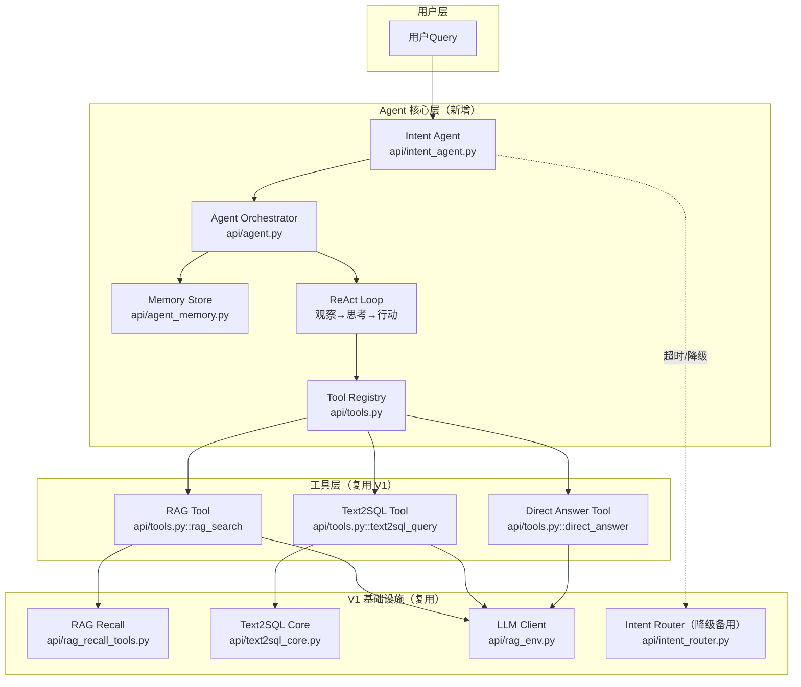

# SPEC: ChatBI V2 —— Agent 架构升级（总规）

> **状态**：implemented（后端 P0+P1 主线已合；**与纸面目标的差距**以 §7.4 全量对照为准）  
> **版本**：v2（已按审查意见修订）  
> **日期**：2026-04-27（**文档对齐**：2026-05-07 — §7 验收勾选、任务索引、§7.4 / §7.5）  
> **负责人**：cyning  
> **关联任务（真值）**：`docs/tasks/done/task_chatbi_v2_agent_p0_backend.md`（P0 归档）· `docs/tasks/active/task_chatbi_v2_agent_p1_behavior.md`（P1 总览，含 Eval/C/D）· `SPEC-ChatBI-V2-Gap-Checklist.md`（缺口快照）

---

## 1. 背景与目标

### 1.1 现状（V1 的问题）

ChatBI V1 是**规则路由系统**，不是 Agent：

| 维度 | V1 现状 | V2 目标 |
|------|---------|---------|
| 决策方式 | 关键词规则匹配（`intent_router.py`） | LLM 自主推理决策 |
| 执行流程 | 固定 if/else 分支（`unified_chat.py`） | ReAct 动态循环 |
| 错误处理 | 直接报错返回 | 按失败类型 fallback |
| 多轮工具 | ❌ 单工具一次执行 | ✅ 多工具协作 |
| 中间反馈 | ❌ 不反馈给决策层 | ✅ 观察-思考-行动循环 |

### 1.2 V2 核心目标

将 ChatBI 从"智能路由系统"升级为"LLM 自主决策的 Agent 架构"：

1. **LLM 自主决策**：根据 Query 内容自主选择工具（RAG / Text2SQL / Direct Answer）
2. **ReAct 循环**：支持多步推理、错误恢复、工具切换
3. **多工具协作**：复杂查询可串行/并行调用多个工具
4. **记忆管理**：多轮对话保持上下文
5. **事件流兼容**：对外保留 V1 mode 语义，内部新增 agent.* 事件（策略 B）

---

## 2. 关键设计决策（审查收口）

### 2.1 事件流策略：策略 B

| 项目 | 约定 |
|------|------|
| 新增事件 | `agent.step.start` / `agent.think` / `agent.step.end` / `agent.intent` / `agent.final` |
| 契约更新 | **必须**同步写入 `_contract_manifest.json`（SSE 契约真值，含 `type_values` + `payload_min_keys_by_type`）；`_manifest.json` 仅管基础设施元数据（端点/RPC/表/env）。两层清单缺一不可，见 Events.md §6 |
| 前端约束 | 收到未知 type 时**忽略，不报错**（SSE 标准行为） |
| CI 校验 | manifest 必须包含所有事件类型，否则阻断 |

### 2.2 Mode 映射：对外保留 V1 语义

| V2 Tool 名（内部） | 对外 Mode | 说明 |
|-------------------|----------|------|
| `rag_search` | `rag` | 文档检索 |
| `text2sql_query` | `text2sql` | 数据库查询 |
| `direct_answer` | `no_data` | 直接回答 |

**约定**：Agent 内部用 tool 名，输出到事件流时转换回 V1 mode。前端 Timeline、日志、统计无需改动。

### 2.3 性能指标：P50/P95 分位

| 指标 | P50 目标 | P95 上限 | 超时回退 |
|------|---------|---------|---------|
| Intent LLM 调用 | 200ms | 500ms | V1 规则路由 |
| Agent 单步 | 1.5s | 3s | 标记失败 |
| 整体响应 | 3s | 8s | 返回错误 |

**max_steps 上界推导**：假设每步 2s（LLM 500ms + Tool 1.5s），max_steps=5 → 上界 10s，加上 Intent 500ms → 整体上界 10.5s < 15s 硬上限。

### 2.4 Fallback：按失败类型分类

| 失败类型 | 判定标准 | fallback 策略 |
|---------|---------|--------------|
| SQL 生成失败 | `error_code=SQL_GEN_SYNTAX/EMPTY` | 重试 1 次 → 仍失败则换 `rag_search` |
| SQL 执行失败 | `error_code=SQL_EXEC_TABLE_NOT_FOUND/PERMISSION_DENIED` | 换 `rag_search`（查文档看正确表名） |
| SQL 无数据 | `error_code=SQL_EXEC_NO_DATA` | 直接回答"未查到数据"，不换工具 |
| RAG 无命中 | `error_code=RAG_RETRIEVE_EMPTY` | **Gated**：满足结构化聚合意图才换 `text2sql_query`，否则换 `direct_answer` 或追问（见 §2.4.1） |
| RAG 不确定 | `error_code=RAG_GENERATE_UNCERTAIN` | 换 `direct_answer` 或追问用户 |
| LLM API 超时 | `error_code=LLM_API_TIMEOUT` | 降级到 V1 规则路由 |
| 低置信度 | `confidence < 0.6`（`INTENT_MIN_CONFIDENCE` 默认值 `0.6`，可通过环境变量配置） | 按预设路径：`rag` → `text2sql` → `direct` |

#### 2.4.1 RAG 无命中 → SQL 的 Gating 条件

RAG 检索无命中（`error_code=RAG_RETRIEVE_EMPTY`）时，**不能无条件 fallback 到 `text2sql_query`**。大量概念/文档问题也会出现 hits==0（如知识库缺失），此时换 SQL 会触发无意义的 SQL 生成与执行（浪费 + 风险 + 误触数据库查询的糟糕体验）。

**Gating 条件**（满足任一即可 fallback 到 SQL，否则 fallback 到 `direct_answer` 或追问）：

| 条件 | 说明 | 判定方式 |
|------|------|---------|
| 条件 A：Intent 原始决策含 SQL 特征 | 用户问题在 Intent 阶段已被判定为倾向 SQL（如 `intent.tool == "text2sql_query"` 或 `intent.fallback == "text2sql_query"`） | 复用 Intent 结果 |
| 条件 B：LLM 二次判定倾向 SQL | 由轻量 LLM（或规则）二次判断 query 是否"需要结构化数据聚合" | `structured_signals.llm_prefers_sql = true` |
| 条件 C：Query 含聚合语义信号 | 问题涉及金额、数量、时间范围、排名、对比等结构化统计特征 | `structured_signals.has_aggregation_signals = true`（由轻量语义分析产出，非关键词匹配） |

> **默认行为**：不满足 gating → 换 `direct_answer`（"未找到相关文档，请问您是想查询数据吗？"）或追问澄清，**绝不盲目执行 SQL**。

### 2.5 Reasoning 分级输出

| 级别 | 内容 | 输出位置 | 鉴权 |
|------|------|---------|------|
| 用户级 | 1-2 句话摘要（如"正在查询数据库"） | SSE `agent.think` payload.summary | 无 |
| 内部级 | 完整 reasoning、raw_response、prompt | 日志 / 调试接口 `/api/py/admin/agent/debug` | admin token |

---

## 3. 架构总览



---

## 4. 核心模块设计

### 4.1 Intent Agent (`api/intent_agent.py`)

**职责**：LLM 驱动的意图识别，替代 V1 的规则路由。

**设计要点**：
- 不再使用关键词规则匹配
- 基于 LLM 语义推理选择 Tool
- 输出置信度和 reasoning（可解释）
- 低置信度时自动 fallback
- **超时 3s 回退到 V1 规则路由**

**详细设计**：见 `SPEC-ChatBI-V2-Intent.md`

### 4.2 Agent Orchestrator (`api/agent.py`)

**职责**：ReAct 循环主控，协调工具调用与记忆管理。

```python
class ChatBIAgent:
    """ChatBI V2 Agent 核心"""
    
    def __init__(self, tools: list[Tool], llm_client: OpenAI, memory: MemoryStore):
        self.tools = {t.name: t for t in tools}
        self.llm = llm_client
        self.memory = memory
        self.max_steps = int(os.getenv("AGENT_MAX_STEPS", "5"))  # 从 10 改为 5
    
    async def run(self, query: str, session_id: str | None = None) -> AgentResult:
        """
        ReAct 循环：
        1. 观察当前状态（用户Query + 历史）
        2. LLM 思考：该用什么工具
        3. 执行工具
        4. 观察结果 → 循环或结束
        """
        history = self.memory.load(session_id) if session_id else []
        
        for step in range(self.max_steps):
            # 构建 Observation
            observation = self._build_observation(query, history)
            
            # LLM 思考 + 决策
            decision = await self._llm_decide(observation, list(self.tools.values()))
            
            if decision.action_type == "final_answer":
                return AgentResult(answer=decision.content, history=history)
            
            # 执行 Tool
            tool = self.tools[decision.tool_name]
            result = await tool.execute(**decision.parameters)
            
            # 失败处理：按失败类型 fallback
            if not result.success:
                result = await self._handle_failure(result, decision, step)
            
            # 记录历史
            history.append(StepRecord(
                thought=decision.thought,
                action=decision.action,
                observation=result,
            ))
            
            # 保存记忆
            if session_id:
                self.memory.save(session_id, history)
        
        return AgentResult(answer="达到最大步数，未能完成", history=history)
```

### 4.3 Tool 抽象 (`api/tools.py`)

**职责**：统一工具接口，复用 V1 能力。

**重要**：新增 Tool 需要：注册 + schema + execute + 测试，Prompt 从 registry 自动生成。

```python
from dataclasses import dataclass
from typing import Any, Callable

@dataclass
class Tool:
    name: str
    description: str
    parameters: dict[str, Any]  # JSON Schema
    execute: Callable[..., Any]

# V1 RAG 封装为 Tool
rag_tool = Tool(
    name="rag_search",
    description="从文档库中检索信息，适合概念解释、技术文档查询、非结构化数据问题",
    parameters={...},
    execute=rag_search_execute
)
```

### 4.4 Memory Store (`api/agent_memory.py`)

**职责**：管理多轮对话的短期记忆。

**最小可用记忆**：最近 5 轮对话 + 最近 3 次 tool 结果摘要。

**Schema**：复用 `rag_conversation_logs`，新增 `agent_steps` JSONB 字段。

**上限**：单 session 最多 20 轮，超限时保留最近 10 轮，30 天自动归档。

详细设计见 `SPEC-ChatBI-V2-Memory.md`。

---

## 5. 事件流兼容（策略 B）

### 5.1 事件类型

| 事件类型 | 说明 | 来源 | 前端处理 |
|---------|------|------|---------|
| `router.decision` | 保留，内容变为 Agent 初始决策 | V2 | 兼容 |
| `agent.step.start` | Agent 步骤开始 | V2 新增 | **可忽略** |
| `agent.think` | LLM 思考摘要（用户级） | V2 新增 | **可忽略** |
| `agent.intent` | 意图识别结果 | V2 新增 | **可忽略** |
| `tool.call.start` | 工具调用开始 | V1 已有 | 兼容 |
| `tool.call.end` | 工具调用结束 | V1 已有 | 兼容 |
| `sql.result` | SQL 执行结果 | V1 已有 | 兼容 |
| `rag.sources` | RAG 检索来源 | V1 已有 | 兼容 |
| `agent.step.end` | Agent 步骤结束 | V2 新增 | **可忽略** |
| `agent.final` | Agent 最终决策 | V2 新增 | **可忽略** |
| `assistant.message` | 最终回答 | V1 已有 | 兼容 |
| `latency` | 耗时统计 | V1 已有 | 兼容 |
| `error` | 错误 | V1 已有 | 兼容 |

### 5.2 契约更新

- **事件类型与 payload 键**：新增 `agent.*` 事件必须同步写入 `docs/_tech_graph/_contract_manifest.json`（补 `type_values` + `payload_min_keys_by_type`）。
- **基础设施元数据**：若新增端点 / env / anchors，同步更新 `docs/_tech_graph/_manifest.json`。
- 两层清单缺一不可，CI 校验通过后方可合并。

详细设计见 `SPEC-ChatBI-V2-Events.md` §6。

---

## 6. 与 V1 的对比

| 场景 | V1 处理 | V2 处理 |
|------|---------|---------|
| "什么是 RAG" | 规则 → RAG 分支 → 检索 → 回答 | Agent 选 `rag_search` → 回答 |
| "昨天销售额" | 规则 → Text2SQL 分支 → SQL → 回答 | Agent 选 `text2sql_query` → 回答 |
| "翻译这句话" | 规则 → no_data 分支 → 直接回答 | Agent 选 `direct_answer` → 回答 |
| "销售额下降原因" | ❌ 无法处理（单工具） | Agent 多步：`text2sql_query` → 发现异常 → `rag_search` → 综合分析 |
| "SQL 执行失败" | ❌ 直接报错 | 按失败类型 fallback（重试/换工具/反思） |
| "帮我看看数据" | 随机 fallback | LLM 推理判断是 SQL 还是 RAG |

---

## 7. 验收标准

> **说明**：下列 `[x]` / `[ ]` 表示**相对本总规条文**的当前达成度；**不以「是否合并某张任务单」为口径**。细粒度证据见 `task_chatbi_v2_agent_p1_behavior.md`、P1-Eval 子任务、diary、`tests/_out/` 归档与 §7.4。

### 7.1 功能验收

- [x] Agent 能根据 Query 自主选择正确工具（**Intent**：60 条金标 + `intent_eval` / P1-D 归档；macro-F1 约 **0.95+** 量级；**RAG 桶**曾存在 **22/24** 与超时相关误判，见 diary，**不等同于**「全场景 >90% 永真」）
- [ ] 支持多步推理（至少 2 个工具串行调用）（**`AGENT_MAX_STEPS` 默认 5** 已具备；**典型「SQL→RAG」串联**依赖失败/fallback 触发路径，**缺独立 E2E 黄金用例与压测报告**，见 Gap §8 / §7.4）
- [x] SQL 执行失败等按 **`error_code`** 分支 fallback / gating（**部分**：`FailureTypeHandler` + `RAG_RETRIEVE_EMPTY` gating 已落地；与 Overview §2.4 **逐条等价**仍建议走 §7.5 L5 深度用例）
- [x] 多轮对话能保持上下文（**最近 5 条**会话从 `rag_conversation_logs` 加载，见 `api/agent_memory.py`；与 spec「5 轮」口径一致按「条」计）
- [x] SSE 事件流对外兼容（**mode** 仍为 `rag` / `text2sql` / `no_data`；`agent.*` 为增量事件；契约见 `_contract_manifest.json`）

### 7.2 性能验收

| 指标 | P50 | P95 | 测试方法 |
|------|-----|-----|---------|
| Intent 决策 | 200ms | 500ms | 压力测试 100 次 |
| Agent 单步 | 1.5s | 3s | 压力测试 50 次 |
| 整体响应 | 3s | 8s | 端到端测试 |
| 并发 | 与 V1 持平 | — | 负载测试 |

- [ ] **纸面 P50/P95 未达标（已知）**：真实 SiliconFlow Intent 延迟与 **§2.3** 目标差距大；`CHATBI_V2_INTENT_TIMEOUT_S` 顶满时出现 **`v1_fallback`**（见 P1-Eval / P1-D 日志）。**验收改以「可观测 + 退化正确」为主**，数值目标保留为后续优化项。

### 7.3 代码验收

- [x] 新增文件：`api/intent_agent.py`, `api/agent.py`, `api/tools.py`, `api/agent_memory.py`
- [x] 修改文件：`api/unified_chat.py`（接入 Agent + SSE）
- [x] 保留文件：`api/intent_router.py`（降级备用）
- [x] 契约更新：`docs/_tech_graph/_contract_manifest.json`（`agent.*` + `payload_min_keys_by_type`）；`_manifest.json` 与 env 以 `PROJECT_CONFIG_AI_INK_BRAIN_API_PYTHON.md` 为准
- [x] 测试覆盖：**60 条** Intent 集 + stub/缓存/统一聊天 V2 单测（`pytest tests` **55** 条收集口径；其中 **2** 条 `intent_eval` / `intent_benchmark` 默认 skip）

### 7.4 全量实现对照（总规 × 仓，不限任务单）

| 维度 | 总规要求（摘要） | 后端 `ai-ink-brain-api-python` | 前端 `ai-ink-brain` | DB / 运维 | 测试与证据 | 结论 |
|------|------------------|-------------------------------|---------------------|-----------|------------|------|
| 契约 `agent.*` | `_contract_manifest.json` 真值 | 已维护；`tech_graph_contract_check` 门禁 | `chain-chat` 类型含 `agent.*`；未知事件应忽略 | — | CI / 本地 contract_check | **已对齐** |
| Unified 接入 | `CHATBI_USE_AGENT` 分流 | `unified_chat` JSON + SSE 路径已实现 | BFF 透传依赖部署 `PY_API_URL` / env | — | `test_unified_chat_backend_v2_agent.py` 等 | **已对齐**（部署面另验） |
| Intent 质量 | macro-F1、三桶准确率 | P1-Eval + **P1-D** Prompt/历史窗口；**RAG 桶仍有超时边界** | 不参与 | — | `tests/_out/intent_llm_*`、diary | **部分**（质量达标为主路径，非全 query 宇宙） |
| Intent 延迟 | §2.3 P50/P95 | 实际上游常 **秒级**；`v1_fallback` 可观测 | — | — | benchmark 脚本、评测 `latency_ms` | **缺口**（相对纸面指标） |
| ReAct 多步 | ≥2 工具、max_steps | `AGENT_MAX_STEPS`、步内换工具逻辑存在 | Timeline 未要求消费全部 `agent.*` | — | 缺专门 E2E 黄金场景 | **部分** |
| Fallback / gating | §2.4 `error_code` 映射 | `ToolResult` + `FailureTypeHandler` + RAG→SQL gating | — | — | 单元测覆盖**不等同**全矩阵 | **部分** |
| 记忆 | 最近 5 轮等 | `agent_memory.load` **最近 5 条**；`agent_steps`/`tool_results` 由 unified 落库 | — | **生产库须已迁移** SQL 列 | P0 / 迁移清单 | **部分**（**库表以环境为准**） |
| reasoning 分级 | 用户摘要 vs 内部 | SSE `agent.think` 摘要；完整链路日志 / admin | 仅展示摘要类事件 | — | 人工 SSE 抽查 | **需持续对照** |
| 压测 / 并发 | §7.2 最后一行 | 未作为阻断交付 | — | — | P1 子任务「压力脚本报告」仍 **open** | **缺口** |

### 7.5 深度回归操作（建议固定为发布前 Checklist）

以下按**由浅入深**排列；**越深越接近「全量相对总规」**，成本越高（外呼、密钥、时长）。

| 层级 | 目的 | 操作（仓库根 `ai-ink-brain-api-python`） | 通过准则（摘要） |
|------|------|-------------------------------------------|------------------|
| **L0** | 契约 + 默认零外呼 | `unset CHATBI_V2_INTENT_EVAL CHATBI_V2_INTENT_BENCH_RUN`（可选再 unset `CHATBI_V2_INTENT_LLM`）；`PYTHONPATH=. python tools/tech_graph_contract_check.py`；`PYTHONPATH=. python -m pytest tests -q --tb=short` | contract_check **OK**；pytest **与当前收集条数一致**（如 53 passed + 2 skipped） |
| **L1** | Intent 黄金 60 条（真实 LLM） | 配置 `SILICONFLOW_API_KEY`、`CHATBI_V2_INTENT_LLM=true`、`CHATBI_V2_INTENT_EVAL=true`；`CHATBI_V2_INTENT_EVAL_OUT=tests/_out/intent_llm_<stamp>.jsonl`；`PYTHONPATH=. python -m pytest tests/test_intent_agent_accuracy.py -m intent_eval -v` | macro-F1 / 三桶 / `v1_fallback` 条数对照 **上一轮归档**或任务单红线 |
| **L2** | Intent 延迟分布 | `CHATBI_V2_INTENT_BENCH_RUN=true` 且密钥齐全：`pytest … -m intent_benchmark`；或 `PYTHONPATH=. CHATBI_V2_INTENT_BENCH_N=… python tests/benchmark_intent_latency.py` | 产出 P50/P95 或分位数日志，**与 §2.3 差距**在发布说明中显式记录 |
| **L3** | Unified Agent（JSON） | `CHATBI_USE_AGENT=true`；`pytest tests/test_unified_chat_backend_v2_agent.py -q --tb=short` | 全绿；覆盖 **关闸 / 基础事件** |
| **L4** | SSE 全链路与事件序 | 启动 API；对 **`POST /api/py/unified/chat/stream`**（见 `api/index.py`；经网关时前缀以部署为准）发真实请求，`CHATBI_USE_AGENT=true`，抓 SSE；对照 `SPEC-ChatBI-V2-Events.md` + `_contract_manifest.json` 中 **`agent.step.start` → … → `agent.final`** 与 `tool.*` 穿插关系 | 无契约外必填字段缺失；前端不崩溃（未知 type 忽略） |
| **L5** | Fallback / gating **矩阵** | 构造或调用触发 **`SQL_GEN_*` / `SQL_EXEC_*` / `RAG_RETRIEVE_EMPTY` / `LLM_API_TIMEOUT`** 的场景（单测 + 手工）；核对是否落入 **预期下一工具**而非盲 SQL | 与 `api/agent.py` 中 `FailureTypeHandler` 及 §2.4.1 **逐条一致** |
| **L6** | 跨仓端到端 | 前端 `ai-ink-brain` 指向本 API；走 **流式** ChatBI；开关 Agent | UI、日志、session 与 mode 正确；**生产 Supabase** 行内可见 `agent_steps`（若已迁移） |
| **L7** | 运维与配置 | 对照 `docs/meta/PROJECT_CONFIG_AI_INK_BRAIN_API_PYTHON.md` + 部署环境 `.env`；**禁止**把评测开关带入生产 | 生产 **`CHATBI_V2_INTENT_EVAL=false`** 等；DB migration 与代码版本匹配 |

**最小发布前组合**：**L0 + L3** 必做；发版说明含 Intent 质量时加 **L1**；承诺延迟 SLA 时加 **L2**；对外宣称「与总规 §2.4 完全等价」时加 **L5**。

---

## 8. 风险与回退

| 风险 | 应对措施 |
|------|---------|
| LLM 决策不准 | 置信度阈值 + 按失败类型 fallback + V1 规则路由降级 |
| 延迟增加 | P95 上限 8s，超时自动降级；max_steps=5 控制上界 |
| Token 消耗增加 | Intent 用轻量模型（Qwen-Turbo）；缓存相同 query 结果 |
| 调试困难 | agent.think 输出摘要；完整 reasoning 进日志；admin 调试接口 |
| 契约漂移 | CI 校验 `_contract_manifest.json`（SSE 契约真值）+ `_manifest.json`（基础设施），两层缺一不可 |

---

## 9. 时间线

| 阶段 | 时间 | 产出 |
|------|------|------|
| Phase 1 | 4/28-4/30 | Tool 封装 + Intent Agent + Agent 核心骨架 |
| Phase 2 | 5/1-5/4 | ReAct 循环 + 记忆管理 + Fallback 策略 |
| Phase 3 | 5/5-5/7 | 接入 Unified Chat + 事件流兼容 + 契约更新 |
| Phase 4 | 5/8-5/11 | 测试（准确率/性能）+ 优化 + 文档（**2026-05-07**：§7 / Gap / P1 总览 **文档对齐**；**性能纸面目标**仍见 §7.2） |

---

## 10. 关联文档

- 子需求：
  - `SPEC-ChatBI-V2-Intent.md` — 意图识别升级设计
  - `SPEC-ChatBI-V2-Tool-Design.md` — Tool 接口与实现
  - `SPEC-ChatBI-V2-ReAct-Loop.md` — ReAct 循环详细设计
  - `SPEC-ChatBI-V2-Memory.md` — 记忆管理设计
  - `SPEC-ChatBI-V2-Events.md` — 事件流兼容设计
  - `SPEC-ChatBI-V2-Gap-Checklist.md` — 缺口快照（与 §7.4 互补；下文 P0 各节为历史审计原文）
- 技术图谱：
  - `docs/_tech_graph/10_flow_rag.md`
  - `docs/_tech_graph/11_flow_text2sql.md`
  - `docs/_tech_graph/_manifest.json` · `_contract_manifest.json`（SSE 真值）
- 任务单：
  - `docs/tasks/done/task_chatbi_v2_agent_p0_backend.md`
  - `docs/tasks/active/task_chatbi_v2_agent_p1_behavior.md`（及子链 P1-Eval / P1-C / P1-D）
