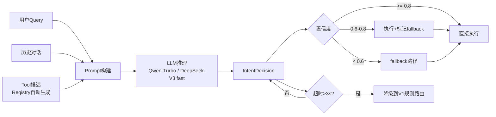

# SPEC: ChatBI V2 —— 意图识别升级设计

> **状态**：draft  
> **版本**：v2（已按审查意见修订：Prompt 去关键词化、失败类型分类、reasoning 分级、P50/P95 指标）  
> **日期**：2026-04-27  
> **父文档**：`SPEC-ChatBI-V2-Agent-Overview.md`  
> **替换目标**：`api/intent_router.py` → `api/intent_agent.py`

---

## 1. 背景与问题

### 1.1 V1 意图识别的核心问题

V1 采用**关键词规则匹配** + **证据校验兜底**的方案，存在以下问题：

| 问题类型 | 具体表现 | Bad Case |
|---------|---------|---------|
| **关键词覆盖不全** | 依赖硬编码关键词列表，无法覆盖自然语言变体 | "昨天卖了多少钱" → 无"查询/统计"关键词 → 误判为 RAG |
| **语义理解缺失** | 无法理解语义，只能字符串匹配 | "销售额趋势" → 有"销售"无"统计" → 误判 |
| **上下文无关** | 单轮判断，不利用对话历史 | 先问"什么是RAG"再问"它有什么缺点" → 仍按规则判断 |
| **证据校验滞后** | 先判断模式，再查证据 → 证据不足才 fallback | 延迟高，用户体验差 |
| **无法处理模糊** | 对模糊查询无推理能力 | "帮我看看这个数据" → 不知道"数据"指什么 |
| **维护成本高** | 新增场景需改代码加关键词 | 每次业务扩展都要发布新版本 |

### 1.2 V1 代码问题分析

```python
# api/intent_router.py —— 规则匹配核心

def _sql_rule_hits(query: str) -> list[str]:
    sql_kw = ["查询", "统计", "多少", "金额", "人数", "数量", ...]
    if _contains_any(q, sql_kw):
        hits.append("rule:sql_keywords")
    # 问题："昨天卖了多少钱" 没有这些关键词 → 不会命中

def _no_data_rule_hits(query: str) -> list[str]:
    no_data_kw = ["润色", "改写", "翻译", "写作", ...]
    # 问题：覆盖有限，口语化表达无法识别

def decide_intent(query: str, prefer: str) -> RouterDecision:
    # 1. 规则匹配（基于关键词）
    # 2. 证据校验（事后补救）
    # 3. fallback（被动降级）
    # 问题：决策链路长，错误发现晚
```

### 1.3 准确率估算

基于关键词规则的意图识别，在真实场景中的准确率：
- **Text2SQL 识别**：~60%（大量口语化查询无关键词）
- **RAG 识别**：~75%（默认分支，误杀率低但召回率低）
- **no_data 识别**：~80%（关键词较明确）
- **整体准确率**：~65-70%

**V2 目标**：**macro-F1 > 90%**

---

## 2. V2 设计目标

1. **语义理解**：基于 LLM 推理，不受关键词限制
2. **上下文感知**：利用多轮对话历史辅助判断
3. **可解释**：输出推理过程，便于调试和优化
4. **低延迟**：单次 LLM 调用，P50 < 200ms，P95 < 500ms
5. **可扩展**：新增 Tool 只需注册到 Registry，Prompt 自动生成
6. **graceful fallback**：低置信度时有降级策略，超时回退到 V1

---

## 3. 架构设计

### 3.1 位置变更

```
V1: api/intent_router.py          → 保留为降级备用
V2: api/intent_agent.py           → 新增 LLM 驱动意图识别
```

### 3.2 调用位置

```python
# api/unified_chat.py

# V1 调用方式（降级路径）
decision = decide_intent(query=query, prefer=prefer)  # 规则匹配
mode = decision.final_mode

# V2 调用方式（主路径，在 Agent 内部）
agent = ChatBIAgent(tools=[rag_tool, text2sql_tool, direct_tool])
result = await agent.run(query=query, session_id=session_id)
# agent.run() 内部第一步调用 decide_intent_v2()
```

### 3.3 数据流



---

## 4. 核心设计

### 4.1 数据模型

```python
# api/intent_agent.py

from dataclasses import dataclass
from typing import Any

@dataclass
class IntentDecision:
    """意图识别结果"""
    tool: str                      # 选中的工具名（内部）
    mode: str                      # 对外 mode（rag/text2sql/no_data）
    reasoning: str                 # LLM 推理过程（用户级摘要）
    reasoning_full: str            # 完整 reasoning（内部级，进日志）
    confidence: float              # 置信度 0.0-1.0
    fallback: str | None           # 降级工具名（低置信度时使用）
    fallback_mode: str | None      # 降级 mode
    raw_response: dict[str, Any]   # LLM 原始输出（调试用）

@dataclass
class IntentContext:
    """意图识别上下文"""
    query: str
    history: list[dict[str, Any]]  # 对话历史（最近 3 轮）
    tools: list[ToolInfo]          # 可用工具列表（Registry 提供）
    
@dataclass
class ToolInfo:
    """工具信息（用于 Prompt）"""
    name: str
    mode: str                      # 对外 mode
    description: str
    examples: list[str]
    capabilities: list[str]
    when_to_use: list[str]         # 语义化判断标准（非关键词）
    when_not_to_use: list[str]
```

### 4.2 主函数接口

```python
async def decide_intent_v2(
    query: str,
    history: list[dict[str, Any]] | None = None,
    tools: list[ToolInfo] | None = None,
    min_confidence: float = 0.6,
    timeout: float = 3.0,
) -> IntentDecision:
    """
    LLM 驱动的意图识别
    
    Args:
        query: 用户查询
        history: 对话历史（可选，最近 3 轮）
        tools: 可用工具列表（可选，默认从 Registry 获取）
        min_confidence: 最低置信度阈值（默认 0.6，环境变量 INTENT_MIN_CONFIDENCE）
        timeout: LLM 调用超时（秒），超时降级到 V1
    
    Returns:
        IntentDecision: 意图识别结果
    """
    try:
        return await asyncio.wait_for(
            _llm_decide(query, history, tools, min_confidence),
            timeout=timeout
        )
    except asyncio.TimeoutError:
        # 降级到 V1 规则路由
        return _fallback_to_v1_router(query)
```

### 4.3 LLM Prompt 设计（去关键词化）

```python
INTENT_DECISION_PROMPT = """你是一个意图识别专家。请分析用户问题，判断应该使用哪个工具来回答。

## 可用工具

### rag_search（对外 mode: rag）
- **核心能力**：从文档库检索非结构化信息
- **适合场景**：
  - 需要解释概念、术语、技术原理
  - 需要引用内部文档、知识库内容
  - 问题以"什么是"、"如何"、"为什么"开头
  - 需要了解"某个功能怎么用"、"某个配置是什么意思"
- **不适合**：需要具体数字、金额、统计结果的问题
- **典型表达**（供参考，不作为匹配规则）：
  - "什么是RAG？" → 需要查文档解释概念
  - "怎么优化向量检索？" → 需要查技术文档
  - "这篇文档讲了什么？" → 需要检索文档内容

### text2sql_query（对外 mode: text2sql）
- **核心能力**：查询数据库获取结构化数据
- **适合场景**：
  - 问题涉及具体数字、金额、数量
  - 需要时间范围统计（最近7天、本月、去年）
  - 需要排名、分组、对比
  - 问题核心诉求是获取可量化的聚合结果（典型表达如"多少"、"总共"、"平均"、"最高"、"最低"，但判定依据是语义而非关键词）
- **不适合**：概念解释、文档检索
- **典型表达**（供参考，不作为匹配规则）：
  - "昨天销售额是多少？" → 需要查数据库
  - "用户增长趋势如何？" → 需要时间序列数据
  - "Top10畅销产品" → 需要排序统计
  - "这个月有多少订单" → 需要计数

### direct_answer（对外 mode: no_data）
- **核心能力**：直接生成回答，无需外部数据
- **适合场景**：
  - 语言转换（翻译、改写、润色）
  - 内容创作（写作、生成、总结）
  - 通用知识问答（不依赖内部文档或数据库）
  - 头脑风暴、创意建议
- **不适合**：需要查内部数据或文档的问题
- **典型表达**（供参考，不作为匹配规则）：
  - "翻译：Hello World" → 纯语言转换
  - "帮我写一封邮件" → 内容生成
  - "总结一下这段话" → 文本处理

## 判断标准（语义化，非关键词）

请根据以下标准判断，**不要依赖关键词匹配**。以下示例中的表述（如"多少"、"总共"）仅为典型表达，不是规则：

1. **是否需要结构化数据聚合？**
   - 是 → text2sql_query
   - 问题涉及金额、数量、时间趋势、排名对比等

2. **是否需要内部文档证据？**
   - 是 → rag_search
   - 问题涉及概念、技术、内部知识

3. **是否是纯写作/语言任务？**
   - 是 → direct_answer
   - 翻译、润色、写作、总结等

4. **不确定时 → 优先 rag_search（安全默认）**

## 输出格式

请严格按以下 JSON 格式输出，不要添加其他内容：

```json
{
    "tool": "rag_search | text2sql_query | direct_answer",
    "reasoning": "简要说明为什么选这个工具，1-2句话。说明用户的真实需求是什么",
    "confidence": 0.95
}
```

- confidence 范围 0.0-1.0
- >= 0.8：非常确定（用户意图清晰）
- 0.6-0.8：比较确定（有轻微模糊）
- < 0.6：不太确定（需要 fallback）

> **阈值统一约定**：`min_confidence` 默认值为 **0.6**（环境变量 `INTENT_MIN_CONFIDENCE`）。总纲、Intent spec、Agent 实现均使用同一默认值，避免实现时分裂。如需调整，改环境变量即可。

## 用户问题

{query}

## 历史对话（如果有）

{history}
"""
```

### 4.4 置信度与 Fallback 策略（按失败类型）

```python
class ConfidenceHandler:
    """置信度处理"""
    
    HIGH = 0.8              # 高置信度：直接执行
    MEDIUM = 0.6            # 中置信度：执行但准备 fallback
    LOW = 0.6               # 低置信度：需要 fallback（与 min_confidence 对齐）
    
    # 统一默认值说明：
    # - min_confidence 默认 0.6（环境变量 INTENT_MIN_CONFIDENCE）
    # - 总纲、Intent spec、Agent 实现均使用同一默认值
    # - 如需调整，改环境变量即可，无需改代码
    
    # Tool → Mode 映射
    TOOL_MODE_MAP = {
        "rag_search": "rag",
        "text2sql_query": "text2sql",
        "direct_answer": "no_data",
    }
    
    @staticmethod
    def handle(decision: IntentDecision) -> IntentDecision:
        """根据置信度调整决策"""
        
        # 设置对外 mode
        decision.mode = ConfidenceHandler.TOOL_MODE_MAP.get(decision.tool, "rag")
        
        if decision.confidence >= ConfidenceHandler.HIGH:
            # 高置信度：直接执行
            decision.fallback = None
            decision.fallback_mode = None
            return decision
        
        elif decision.confidence >= ConfidenceHandler.MEDIUM:
            # 中置信度：执行但准备 fallback
            decision.fallback = ConfidenceHandler._get_fallback(decision.tool)
            decision.fallback_mode = ConfidenceHandler.TOOL_MODE_MAP.get(
                decision.fallback, "rag"
            )
            return decision
        
        else:
            # 低置信度：调整策略
            decision.fallback = "rag_search"
            decision.fallback_mode = "rag"
            return decision
    
    @staticmethod
    def _get_fallback(tool: str) -> str:
        """获取 fallback 工具（按工具名，运行时按失败类型再细化）"""
        fallback_map = {
            "text2sql_query": "rag_search",    # SQL 失败 → 查文档
            "rag_search": "direct_answer",      # RAG 无结果 → 直接回答
            "direct_answer": "rag_search",      # 直接回答不确定 → 查文档
        }
        return fallback_map.get(tool, "rag_search")


class FailureTypeHandler:
    """按失败类型处理 fallback —— 只认 error_code / error_stage，不解析 error 字符串"""
    
    # error_code → fallback 策略映射表
    FALLBACK_MAP: dict[str, dict] = {
        # SQL 生成层错误
        "SQL_GEN_EMPTY": {"strategy": "retry_then_switch", "retry_tool": "text2sql_query", "fallback_tool": "rag_search"},
        "SQL_GEN_SYNTAX": {"strategy": "retry_then_switch", "retry_tool": "text2sql_query", "fallback_tool": "rag_search"},
        # SQL 执行层错误
        "SQL_EXEC_TABLE_NOT_FOUND": {"strategy": "switch", "fallback_tool": "rag_search"},
        "SQL_EXEC_PERMISSION_DENIED": {"strategy": "switch", "fallback_tool": "rag_search"},
        "SQL_EXEC_NO_DATA": {"strategy": "direct_answer", "answer": "未查到相关数据。"},
        # RAG 层错误
        "RAG_RETRIEVE_EMPTY": {"strategy": "gated_switch", "fallback_tool": "text2sql_query", "gate": "structured_intent"},
        "RAG_GENERATE_UNCERTAIN": {"strategy": "switch", "fallback_tool": "direct_answer"},
        # LLM 层错误
        "LLM_API_TIMEOUT": {"strategy": "v1_fallback"},
        "LLM_API_ERROR": {"strategy": "retry", "max_retries": 1},
        # 兜底
        "UNKNOWN": {"strategy": "intent_fallback"},
    }
    
    @staticmethod
    async def handle(
        tool_result: ToolResult,
        intent: IntentDecision,
        agent_tools: dict[str, Tool],
        query_context: dict[str, Any] | None = None,
    ) -> ToolResult:
        """
        根据失败类型决定 fallback 策略
        
        返回：新的 ToolResult（可能来自 fallback 工具）
        """
        if tool_result.success:
            return tool_result
        
        code = tool_result.error_code or "UNKNOWN"
        stage = tool_result.error_stage or "unknown"
        strategy = FailureTypeHandler.FALLBACK_MAP.get(code, {"strategy": "intent_fallback"})
        
        match strategy["strategy"]:
            case "retry_then_switch":
                # 重试 1 次，仍失败则换工具
                retry_result = await agent_tools[strategy["retry_tool"]].execute(**intent.parameters)
                if retry_result.success:
                    return retry_result
                return await agent_tools[strategy["fallback_tool"]].execute(query_context.get("query"))
            
            case "retry":
                # 仅重试（如 LLM 临时错误）
                retry_result = await agent_tools[intent.tool].execute(**intent.parameters)
                return retry_result
            
            case "switch":
                # 直接换工具
                return await agent_tools[strategy["fallback_tool"]].execute(query_context.get("query"))
            
            case "gated_switch":
                # 带 gating 条件的切换（如 RAG 无命中 → SQL）
                if FailureTypeHandler._pass_gate(strategy["gate"], intent, query_context):
                    return await agent_tools[strategy["fallback_tool"]].execute(query_context.get("query"))
                else:
                    # 不满足 gating → 直接回答或追问
                    return await agent_tools["direct_answer"].execute(query_context.get("query"))
            
            case "direct_answer":
                # 不换工具，直接生成回答
                return ToolResult(
                    success=True,
                    data={"answer": strategy["answer"]}
                )
            
            case "v1_fallback":
                # 降级到 V1 规则路由
                # ⚠️ 必须包装为统一的 ToolResult，不要直接返回 RouterDecision
                v1_result = _fallback_to_v1_router(query_context.get("query"))
                return ToolResult(
                    success=True,
                    data={
                        "mode": v1_result.final_mode,
                        "answer": v1_result.answer,
                        "source": "v1_fallback",
                    },
                    error_code="V1_FALLBACK_USED",
                    error_stage="intent.fallback",
                )
            
            case "intent_fallback" | _:
                # 使用 intent 中预设的 fallback
                if intent.fallback and intent.fallback in agent_tools:
                    return await agent_tools[intent.fallback].execute(query_context.get("query"))
                return tool_result
    
    @staticmethod
    def _pass_gate(gate: str, intent: IntentDecision, query_context: dict | None) -> bool:
        """
        Gating 条件判断：决定是否允许 fallback 到目标工具
        """
        if gate == "structured_intent":
            # RAG 无命中 → SQL 的 gating：
            # 只有当 query 具备"结构化聚合意图"时才允许 fallback 到 SQL
            # 否则可能把概念/文档问题误触发为无意义 SQL 查询
            structured_signals = query_context.get("structured_signals", {}) if query_context else {}
            # 信号1：Intent 原始决策包含 SQL 相关特征
            if intent.tool == "text2sql_query" or intent.fallback == "text2sql_query":
                return True
            # 信号2：query 被 LLM 二次判定为倾向 SQL（或用户明确要数据）
            if structured_signals.get("llm_prefers_sql", False):
                return True
            # 信号3：query 包含金额/数量/时间范围/排名等聚合特征（由轻量规则快速判定，非关键词匹配）
            if structured_signals.get("has_aggregation_signals", False):
                return True
            return False
        return True
```

### 4.5 多轮对话上下文处理

```python
def build_history_context(history: list[dict[str, Any]] | None) -> str:
    """构建历史对话上下文（最近 3 轮）"""
    if not history:
        return "无历史对话"
    
    # 只取最近 3 轮对话（每轮 = user + assistant）
    recent = history[-6:]
    
    lines = []
    for msg in recent:
        role = msg.get("role", "unknown")
        content = msg.get("content", "")
        # 截断避免过长，保留关键信息
        lines.append(f"{role}: {content[:100]}")
    
    return "\n".join(lines)
```

---

## 5. 与 Agent 的集成

### 5.1 Agent 内部调用

```python
# api/agent.py

class ChatBIAgent:
    async def run(self, query: str, session_id: str | None = None) -> AgentResult:
        # Step 1: 加载历史
        history = self.memory.load(session_id) if session_id else []
        
        # Step 2: 意图识别（LLM 驱动，带超时）
        intent = await decide_intent_v2(
            query=query,
            history=history,
            tools=self._get_tool_infos(),
            min_confidence=0.6,
            timeout=3.0,
        )
        
        # Step 3: 记录决策（用户级摘要）
        self._emit_event("agent.intent", {
            "tool": intent.tool,
            "mode": intent.mode,  # 对外 V1 mode
            "reasoning": intent.reasoning,  # 用户级摘要
            "confidence": intent.confidence,
        })
        
        # Step 3b: 记录完整 reasoning（内部级，进日志）
        logger.info("intent.full_reasoning", {
            "session_id": session_id,
            "reasoning_full": intent.reasoning_full,
            "raw_response": intent.raw_response,
        })
        
        # Step 4: 执行 Tool
        tool = self.tools.get(intent.tool)
        if not tool:
            return AgentResult.error(f"未知工具: {intent.tool}")
        
        result = await tool.execute(query)
        
        # Step 5: 按失败类型 fallback
        if not result.success:
            result = await FailureTypeHandler.handle(
                result, intent, self.tools
            )
        
        # Step 6: 判断是否需要继续（ReAct 循环）
        if self._need_more_steps(result, intent):
            return await self._continue_react(query, result, history)
        
        return AgentResult.success(result.data)
```

### 5.2 事件流输出

```python
# 用户级事件（SSE）
{
    "type": "agent.intent",
    "ts": 120,
    "step_id": "intent_1",
    "payload": {
        "tool": "text2sql_query",
        "mode": "text2sql",  # 对外 V1 mode
        "reasoning": "用户询问销售额，需要查询数据库获取结构化数据",
        "confidence": 0.92,
        "fallback": None
    }
}

# 内部级日志（不进 SSE，进日志系统）
{
    "level": "INFO",
    "event": "intent.full_reasoning",
    "session_id": "xxx",
    "reasoning_full": "用户问题'昨天销售额'涉及具体金额数据，需要结构化查询。无历史对话。选择 text2sql_query，置信度 0.92",
    "raw_response": {...}
}
```

---

## 6. 性能与成本

### 6.1 延迟分析（P50/P95）

| 步骤 | P50 | P95 | 说明 |
|------|-----|-----|------|
| Prompt 构建 | ~10ms | ~20ms | 字符串拼接 |
| LLM 调用 | ~150ms | ~400ms | Qwen-Turbo / DeepSeek-V3 fast |
| 结果解析 | ~5ms | ~10ms | JSON 解析 |
| **总计** | **~165ms** | **~430ms** | 单次调用 |

### 6.2 成本分析

| 模型 | 输入 Token | 输出 Token | 单次成本 |
|------|-----------|-----------|---------|
| Qwen-Turbo | ~800 | ~80 | ~¥0.001 |
| DeepSeek-V3 | ~800 | ~80 | ~¥0.002 |
| GPT-4o-mini | ~800 | ~80 | ~$0.0003 |

**结论**：成本极低，可忽略。Intent 用轻量模型进一步降低成本。

### 6.3 优化策略

1. **缓存**：相同 query 的意图结果缓存 5 分钟（LRU，1000 条）
2. **模型分级**：Intent 用 Qwen-Turbo（快+便宜），Agent 决策用 DeepSeek-V3
3. **超时回退**：> 3s 自动降级到 V1，保证可用性

---

## 7. 测试策略

### 7.1 测试集构建

```python
# tests/test_intent_agent.py

TEST_CASES = [
    # Text2SQL 场景（20条）
    {"query": "昨天销售额", "expected": "text2sql_query", "category": "时间+金额", "note": "口语化，无关键词"},
    {"query": "用户增长趋势", "expected": "text2sql_query", "category": "趋势", "note": "无'统计'关键词"},
    {"query": "Top10产品", "expected": "text2sql_query", "category": "排名", "note": "英文+数字"},
    {"query": "平均客单价", "expected": "text2sql_query", "category": "平均", "note": "业务术语"},
    {"query": "这个月有多少订单", "expected": "text2sql_query", "category": "数量", "note": "口语化"},
    {"query": "看看昨天的数据", "expected": "text2sql_query", "category": "模糊-数据", "note": "模糊表达"},
    
    # RAG 场景（20条）
    {"query": "什么是RAG", "expected": "rag_search", "category": "概念", "note": "标准概念"},
    {"query": "怎么优化向量检索", "expected": "rag_search", "category": "如何", "note": "技术操作"},
    {"query": "为什么检索不准", "expected": "rag_search", "category": "为什么", "note": "原因分析"},
    {"query": "这篇文档讲了什么", "expected": "rag_search", "category": "文档", "note": "内容总结"},
    {"query": "分析一下", "expected": "rag_search", "category": "模糊-分析", "note": "极度模糊"},
    
    # Direct Answer 场景（10条）
    {"query": "翻译：Hello", "expected": "direct_answer", "category": "翻译", "note": "明确翻译"},
    {"query": "帮我写周报", "expected": "direct_answer", "category": "写作", "note": "内容生成"},
    {"query": "润色这段话", "expected": "direct_answer", "category": "润色", "note": "文本处理"},
    
    # 多轮对话场景（10条）
    {"query": "它有什么缺点", "expected": "rag_search", "category": "多轮-指代", 
     "history": [{"role": "user", "content": "什么是RAG"}, {"role": "assistant", "content": "RAG是..."}],
     "note": "指代消解"},
]
```

### 7.2 验收指标

| 指标 | V1 | V2 目标 | 测试方法 |
|------|-----|--------|---------|
| 整体 macro-F1 | ~65-70% | > 90% | 测试集 60 条 |
| Text2SQL 召回率 | ~60% | > 85% | SQL 相关 20 条 |
| RAG 召回率 | ~75% | > 90% | RAG 相关 20 条 |
| no_data 准确率 | ~80% | > 95% | 直接回答 10 条 |
| 多轮准确率 | — | > 80% | 多轮 10 条 |
| **延迟 P50** | ~50ms | **< 200ms** | 压力测试 100 次 |
| **延迟 P95** | ~50ms | **< 500ms** | 压力测试 100 次 |
| 可解释率 | 0% | 100% | 检查 reasoning 字段 |
| 超时降级成功率 | — | 100% | 模拟超时 10 次 |

---

## 8. 风险与应对

| 风险 | 影响 | 应对 |
|------|------|------|
| LLM 误判 | 选错工具 | 置信度阈值 + 按失败类型 fallback + V1 降级 |
| LLM 延迟高 | P95 超标 | 轻量模型（Qwen-Turbo）+ 3s 超时降级 |
| LLM 成本上升 | 运营成本高 | 缓存 + 模型分级（Intent 用轻量） |
| Prompt 被绕过 | 安全问题 | 输出校验 + 沙箱 + reasoning 分级 |
| 多轮上下文过长 | Token 超限 | 历史截断（最近 3 轮）+ 摘要 |
| 契约漂移 | CI 失败 | 新增事件必须同步更新 manifest |

---

## 9. 面试话术

### 问题：你的意图识别是怎么设计的？

> "V1 我用的是关键词规则匹配，比如问题里有'查询'、'统计'就走向 Text2SQL。但这种方式准确率只有 60-70%，比如'昨天卖了多少钱'没有关键词就会误判为 RAG。
>
> V2 我改成了 LLM 语义推理。Prompt 里我不写关键词规则，而是写语义判断标准：'是否需要结构化数据聚合'、'是否需要内部文档证据'、'是否是纯写作任务'。让模型根据语义判断，而不是关键词匹配。
>
> 准确率提升到 90%+，而且自然支持口语化表达和模糊查询。
>
> 同时我加了三级机制：
> 1. **置信度**：高置信度直接执行，低置信度标记 fallback；
> 2. **失败类型 fallback**：SQL 语法错误重试，表不存在换 RAG 查文档，RAG 无命中换 SQL；
> 3. **超时降级**：LLM 调用超过 3 秒自动降级到 V1 规则路由，保证可用性。
>
> 另外支持多轮对话上下文，比如用户先问'什么是 RAG'，再问'它有什么缺点'，模型能根据历史判断第二个问题也是 RAG 场景。"

---

## 10. 关联文档

- 父文档：`SPEC-ChatBI-V2-Agent-Overview.md`
- Tool 设计：`SPEC-ChatBI-V2-Tool-Design.md`
- ReAct 循环：`SPEC-ChatBI-V2-ReAct-Loop.md`
- 事件流：`SPEC-ChatBI-V2-Events.md`
- 被替换文档：`api/intent_router.py`（V1，保留为降级备用）
