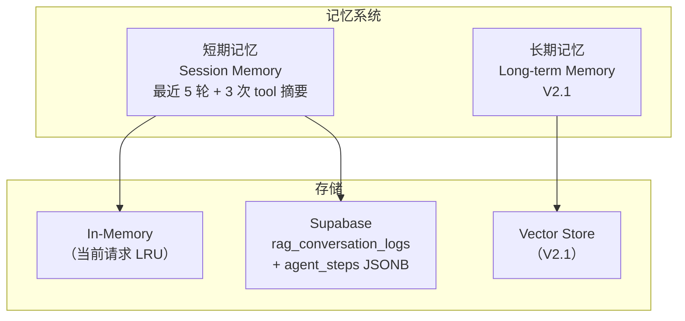

# SPEC: ChatBI V2 —— 记忆管理设计

> **状态**：draft  
> **版本**：v2（已按审查意见修订：补充 schema、上限、清理策略）  
> **日期**：2026-04-27  
> **父文档**：`SPEC-ChatBI-V2-Agent-Overview.md`

---

## 1. 设计目标

支持多轮对话的上下文保持，让 Agent 能基于历史对话进行推理。

**范围**：
- 短期记忆：当前会话的 ReAct 步骤历史（V2 核心）
- 长期记忆：跨会话的用户偏好（V2.1 扩展）

**最小可用记忆定义**：最近 5 轮对话 + 最近 3 次 tool 结果摘要。

---

## 2. 记忆类型



---

## 3. 短期记忆（Session Memory）

### 3.1 数据结构

```python
from dataclasses import dataclass
from typing import Any
from datetime import datetime

@dataclass
class SessionMemory:
    """会话记忆"""
    session_id: str
    created_at: datetime
    updated_at: datetime
    steps: list[StepRecord]       # ReAct 步骤历史（最多 20 条）
    user_queries: list[str]       # 用户问题历史（最多 20 条）
    
@dataclass
class StepRecord:
    """单步记录（同 ReAct Loop）"""
    step_number: int
    thought: str                  # 思考摘要（用户级）
    thought_full: str             # 完整思考（内部级）
    action: AgentAction
    observation: Any              # Tool 结果（截断摘要）
    timestamp: datetime
    latency_ms: int
```

### 3.2 存储 Schema

**复用现有表，新增 JSONB 字段**：

```sql
-- 现有表（V1）
CREATE TABLE rag_conversation_logs (
    id UUID PRIMARY KEY DEFAULT gen_random_uuid(),
    session_id TEXT,
    query TEXT,
    answer TEXT,
    mode TEXT,
    created_at TIMESTAMP DEFAULT now()
);

-- V2 扩展（新增字段，不破坏现有结构）
ALTER TABLE rag_conversation_logs 
ADD COLUMN IF NOT EXISTS agent_steps JSONB,
ADD COLUMN IF NOT EXISTS tool_results JSONB,
ADD COLUMN IF NOT EXISTS updated_at TIMESTAMP DEFAULT now();

-- 创建索引（按 session_id 查询）
CREATE INDEX IF NOT EXISTS idx_rag_logs_session 
ON rag_conversation_logs(session_id, created_at DESC);
```

**agent_steps JSONB 结构**：

```json
{
  "steps": [
    {
      "step_number": 1,
      "thought_summary": "用户问销售额，选 SQL",
      "tool": "text2sql_query",
      "mode": "text2sql",
      "success": true,
      "latency_ms": 1200,
      "timestamp": "2026-04-27T10:00:00Z"
    }
  ],
  "total_steps": 1,
  "tools_used": ["text2sql_query"],
  "fallback_used": false
}
```

**tool_results JSONB 结构**（截断存储）：

```json
{
  "results": [
    {
      "tool": "text2sql_query",
      "sql": "SELECT ...",
      "row_count": 10,
      "summary": "昨天销售额 10000 元",
      "truncated": true,
      "full_rows_stored": false
    }
  ]
}
```

### 3.3 上限与清理策略

| 限制项 | 上限 | 处理方式 |
|--------|------|---------|
| 单 session 轮数 | 20 轮 | 超限时保留最近 10 轮，早期压缩为摘要 |
| 单条 step 大小 | 10KB | 超出截断，标记 truncated |
| 单 session 总大小 | 200KB | 超出时归档早期数据 |
| 历史保留时间 | 30 天 | 自动归档到冷存储 |
| 并发冲突 | 乐观锁 | updated_at 校验，冲突时重试 |

**清理策略**：

```python
class MemoryCleanup:
    """记忆清理"""
    
    RETENTION_DAYS = 30      # 保留 30 天
    MAX_ROUNDS = 20          # 单 session 最多 20 轮
    KEEP_RECENT = 10         # 保留最近 10 轮
    
    @staticmethod
    def compress_old_steps(steps: list[StepRecord]) -> list[StepRecord]:
        """压缩早期步骤"""
        if len(steps) <= MemoryCleanup.MAX_ROUNDS:
            return steps
        
        # 保留最近 10 轮完整信息
        recent = steps[-MemoryCleanup.KEEP_RECENT:]
        
        # 早期步骤压缩为摘要
        older = steps[:-MemoryCleanup.KEEP_RECENT]
        summary = MemoryCleanup._summarize_steps(older)
        
        return [summary] + recent
    
    @staticmethod
    def _summarize_steps(steps: list[StepRecord]) -> StepRecord:
        """将多步压缩为单步摘要"""
        tools_used = list(set(s.action.tool_name for s in steps))
        return StepRecord(
            step_number=0,  # 0 表示摘要
            thought=f"早期 {len(steps)} 步的摘要",
            thought_full=f"使用了工具: {tools_used}",
            action=AgentAction(action_type="summary", tool_name="", parameters={}),
            observation={"summary": f"共 {len(steps)} 步"},
            timestamp=steps[0].timestamp,
            latency_ms=sum(s.latency_ms for s in steps),
        )
```

### 3.4 接口设计

```python
class MemoryStore:
    """记忆存储接口"""
    
    def __init__(self):
        self.sb = supabase_client()
        self.cache: dict[str, SessionMemory] = {}  # LRU 缓存
    
    async def load(self, session_id: str) -> list[StepRecord]:
        """
        加载会话历史
        
        1. 先查内存缓存
        2. 缓存未命中则查数据库
        3. 返回最近 5 轮（用于 Intent）或全部（用于 ReAct）
        """
        # 查缓存
        if session_id in self.cache:
            return self.cache[session_id].steps
        
        # 查数据库
        result = self.sb.table("rag_conversation_logs") \
            .select("agent_steps") \
            .eq("session_id", session_id) \
            .order("created_at", desc=False) \
            .limit(20) \
            .execute()
        
        steps = self._parse_records(result.data)
        
        # 写入缓存
        self.cache[session_id] = SessionMemory(
            session_id=session_id,
            created_at=datetime.now(),
            updated_at=datetime.now(),
            steps=steps,
            user_queries=[],
        )
        
        return steps
    
    async def save(self, session_id: str, steps: list[StepRecord]) -> None:
        """
        保存会话历史
        
        1. 压缩超限数据
        2. 乐观锁写入（updated_at 校验）
        3. 更新缓存
        """
        # 压缩
        compressed = MemoryCleanup.compress_old_steps(steps)
        
        # 序列化
        record = {
            "session_id": session_id,
            "agent_steps": self._serialize_steps(compressed),
            "updated_at": datetime.now().isoformat(),
        }
        
        # 乐观锁写入
        try:
            self.sb.table("rag_conversation_logs").upsert(record).execute()
        except Exception as e:
            # 冲突时重试
            if "conflict" in str(e).lower():
                await asyncio.sleep(0.1)
                self.sb.table("rag_conversation_logs").upsert(record).execute()
            else:
                raise
        
        # 更新缓存
        if session_id in self.cache:
            self.cache[session_id].steps = compressed
            self.cache[session_id].updated_at = datetime.now()
    
    async def summarize(self, session_id: str) -> str:
        """生成会话摘要（用于长历史压缩）"""
        steps = await self.load(session_id)
        if len(steps) <= 5:
            return self._format_history(steps)
        
        # 长历史用 LLM 压缩（可选，V2.1）
        return await self._llm_summarize(steps)
    
    def _format_history(self, steps: list[StepRecord]) -> str:
        """格式化历史为文本（用于 Prompt）"""
        lines = []
        for step in steps[-5:]:  # 只取最近 5 轮
            lines.append(f"Step {step.step_number}:")
            lines.append(f"  Thought: {step.thought}")
            lines.append(f"  Action: {step.action.tool_name}")
            lines.append(f"  Result: {str(step.observation)[:200]}")  # 截断
        return "\n".join(lines)
```

---

## 4. 上下文窗口管理

### 4.1 问题

LLM 有上下文长度限制，长历史需要压缩。

### 4.2 策略

```python
class ContextWindowManager:
    """上下文窗口管理"""
    
    def __init__(self, max_tokens: int = 4000):
        self.max_tokens = max_tokens
        self.token_estimator = TokenEstimator()
    
    def build_context(self, query: str, history: list[StepRecord]) -> str:
        """构建适合 LLM 的上下文"""
        # 1. 估算当前历史 token 数
        history_text = self._format_history(history)
        history_tokens = self.token_estimator.estimate(history_text)
        
        # 2. 如果超出限制，压缩
        if history_tokens > self.max_tokens * 0.7:
            history_text = self._compress_history(history)
        
        # 3. 组装上下文
        return f"""用户问题：{query}

历史对话：
{history_text}

请基于以上信息做出决策。"""
    
    def _compress_history(self, history: list[StepRecord]) -> str:
        """压缩历史：保留关键步骤，摘要次要步骤"""
        # 保留最近 3 步完整信息
        recent = history[-3:]
        # 更早的步骤只保留摘要
        older = history[:-3]
        older_summary = self._summarize_steps(older)
        
        return f"""早期步骤摘要：{older_summary}

最近步骤：
{self._format_history(recent)}"""
```

---

## 5. 与 V1 的兼容

### 5.1 表结构兼容

- **不删除**现有字段（query, answer, mode, created_at）
- **新增** agent_steps / tool_results JSONB 字段
- **不修改**现有索引（避免影响 V1 查询性能）

### 5.2 数据迁移

V1 数据无需迁移，V2 数据以 JSONB 扩展存储：
- V1 查询：不受影响
- V2 查询：查 agent_steps 字段

### 5.3 回退策略

如果 V2 记忆出现问题：
1. 禁用 agent_steps 读取（走 V1 逻辑）
2. 清空缓存，重新从数据库加载
3. 极端情况：降级到无状态模式（每轮独立）

---

## 6. 验收标准

- [ ] 多轮对话能保持上下文（最近 5 轮）
- [ ] 会话历史可持久化存储（Supabase）
- [ ] 长历史自动压缩（> 20 轮时保留最近 10 轮）
- [ ] 与 V1 表结构兼容（不破坏现有字段）
- [ ] 加载/保存延迟 < 100ms（P95）
- [ ] 并发冲突可恢复（乐观锁 + 重试）
- [ ] 30 天自动清理（不无限增长）

---

## 7. 关联文档

- 父文档：`SPEC-ChatBI-V2-Agent-Overview.md`
- ReAct 循环：`SPEC-ChatBI-V2-ReAct-Loop.md`
- 意图识别：`SPEC-ChatBI-V2-Intent.md`
