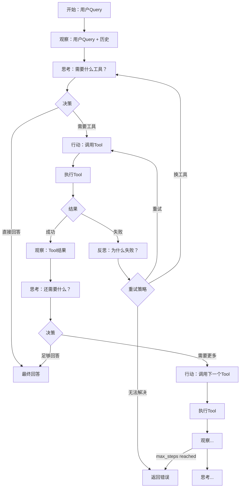

# SPEC: ChatBI V2 —— ReAct 循环详细设计

> **状态**：draft  
> **版本**：v1  
> **日期**：2026-04-27  
> **父文档**：`SPEC-ChatBI-V2-Agent-Overview.md`

---

## 1. ReAct 模式概述

ReAct = Reasoning（推理）+ Acting（行动）

```
观察（Observation）→ 思考（Thought）→ 行动（Action）→ 观察（Observation）→ ...
```

### 1.1 与 V1 的区别

| | V1 | V2 ReAct |
|---|-----|----------|
| 决策 | 一次规则匹配 | 每步重新推理 |
| 执行 | 固定流程 | 动态选择下一步 |
| 错误 | 直接报错 | 反思后重试/换方案 |
| 多工具 | ❌ | ✅ 串行/并行 |

---

## 2. ReAct 循环详细流程



---

## 3. 核心数据结构

### 3.1 StepRecord（每步记录）

```python
from dataclasses import dataclass
from typing import Any

@dataclass
class StepRecord:
    """ReAct 单步记录"""
    step_number: int
    thought: str           # LLM 思考内容
    action: AgentAction    # 执行的行动
    observation: Any       # 观察结果
    latency_ms: int

@dataclass
class AgentAction:
    """Agent 行动"""
    action_type: str       # "tool_call" | "final_answer" | "error"
    tool_name: str | None  # tool_call 时必填
    parameters: dict[str, Any] | None  # tool_call 时必填
    content: str | None    # final_answer 时必填
```

### 3.2 AgentResult（最终结果）

```python
@dataclass
class AgentResult:
    """Agent 执行结果"""
    success: bool
    answer: str
    steps: list[StepRecord]
    total_steps: int
    total_latency_ms: int
    fallback_used: bool    # 是否使用了 fallback
```

---

## 4. LLM Prompt 设计

### 4.1 决策 Prompt

```python
AGENT_DECISION_PROMPT = """你是一个数据分析助手 Agent。请根据用户问题和当前状态，决定下一步行动。

## 可用工具
{tools_description}

## 当前对话
用户问题：{query}

## 历史步骤
{history_summary}

## 当前观察
{observation}

## 输出格式
请严格按以下 JSON 格式输出：
```json
{
    "thought": "你的思考过程。分析用户需要什么，当前状态如何，下一步该做什么",
    "action_type": "tool_call 或 final_answer",
    "tool_name": "如果选 tool_call，填工具名（rag_search / text2sql_query / direct_answer）",
    "parameters": {"如果选 tool_call，填参数对象"},
    "content": "如果选 final_answer，填最终回答"
}
```

## 决策规则
1. 如果问题需要数据统计、金额、数量，选 text2sql_query
2. 如果问题需要概念解释、文档检索，选 rag_search
3. 如果问题是翻译、润色、通用问答，选 direct_answer
4. 如果上一步 Tool 失败了，分析原因决定重试或换工具
5. 如果已经获取了足够信息，直接回答
6. 如果无法解决，说明原因
"""
```

### 4.2 反思 Prompt（错误恢复）

```python
AGENT_REFLECT_PROMPT = """上一步执行失败了，请分析原因并决定下一步。

## 失败信息
Tool：{tool_name}
错误：{error}
参数：{parameters}

## 历史步骤
{history_summary}

## 输出格式
```json
{
    "reflection": "分析失败原因",
    "strategy": "retry / switch_tool / give_up",
    "next_action": {
        "action_type": "tool_call 或 final_answer 或 error",
        "tool_name": "...",
        "parameters": {...},
        "content": "..."
    }
}
```

## 策略规则
- retry：参数错误或临时问题，重试同一工具
- switch_tool：工具不适合，换另一个工具
- give_up：无法解决，返回错误说明
"""
```

---

## 5. 循环控制参数

```python
# 环境变量配置
AGENT_MAX_STEPS = 10          # 最大步数，防止无限循环
AGENT_MAX_LATENCY_MS = 30000  # 最大总延迟 30s
AGENT_RETRY_COUNT = 2         # 单工具重试次数
AGENT_RETRY_BACKOFF = 1.5     # 重试退避系数
```

---

## 6. 错误恢复策略

| 错误场景 | 策略 | 示例 |
|---------|------|------|
| SQL 语法错误 | retry | 重新生成 SQL |
| 表不存在 | switch_tool → rag_search | 查文档看表名是否正确 |
| RAG 无结果 | switch_tool → text2sql_query | 可能是数据问题不是文档问题 |
| LLM API 超时 | retry（指数退避） | 网络临时问题 |
| 连续 3 次失败 | give_up | 返回错误说明 |
| max_steps 达到 | give_up | "问题太复杂，建议拆分" |

---

## 7. 事件流输出

```python
def emit_agent_events(step: StepRecord, started_at: float):
    """输出 SSE 事件"""
    events = []
    
    # 步骤开始
    events.append({
        "type": "agent.step.start",
        "step_number": step.step_number,
        "ts": _now_ms(started_at)
    })
    
    # 思考内容
    events.append({
        "type": "agent.think",
        "step_number": step.step_number,
        "thought": step.thought,
        "ts": _now_ms(started_at)
    })
    
    # 工具调用（复用 V1 的 tool.call.start/end）
    if step.action.action_type == "tool_call":
        events.append({
            "type": "tool.call.start",
            "tool": step.action.tool_name,
            "input": step.action.parameters
        })
        events.append({
            "type": "tool.call.end",
            "tool": step.action.tool_name,
            "output": step.observation,
            "latency_ms": step.latency_ms
        })
    
    # 步骤结束
    events.append({
        "type": "agent.step.end",
        "step_number": step.step_number,
        "ts": _now_ms(started_at)
    })
    
    return events
```

---

## 8. 与 V1 事件流对比

| 事件 | V1 | V2 |
|------|-----|-----|
| `router.decision` | ✅ 规则决策 | ❌ 移除（Agent 替代） |
| `agent.step.start` | ❌ | ✅ 新增 |
| `agent.think` | ❌ | ✅ 新增 |
| `tool.call.start` | ✅ | ✅ 保留 |
| `tool.call.end` | ✅ | ✅ 保留 |
| `agent.step.end` | ❌ | ✅ 新增 |
| `sql.result` | ✅ | ✅ 保留（Text2SQL 时） |
| `rag.sources` | ✅ | ✅ 保留（RAG 时） |
| `assistant.message` | ✅ | ✅ 保留 |
| `latency` | ✅ | ✅ 保留 |

---

## 9. 验收标准

- [ ] ReAct 循环能正确执行多步推理
- [ ] 支持至少 2 个工具串行调用
- [ ] SQL 错误时能重试或换工具
- [ ] max_steps 达到时优雅退出
- [ ] 事件流包含 agent.step.start/think/end
- [ ] 总延迟 < 30s
