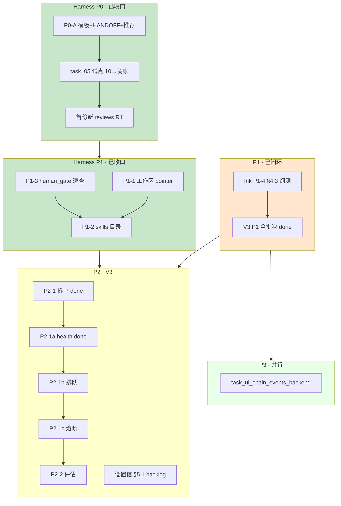
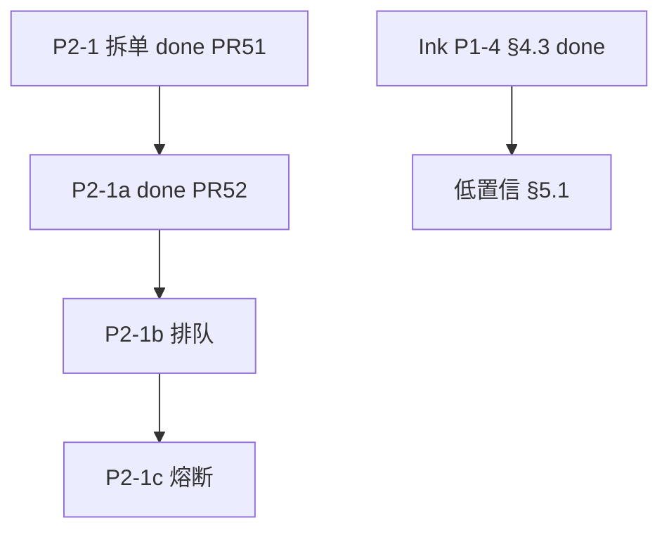

# 最近任务安排表（后端仓）

> **性质**：本仓 **近期排期与执行顺序** 的单一真值表；Agent / 人规划任务时 **优先读本文件**，再打开具体 `active/task_*.md`。  
> **维护**：状态变更、归档、新增 Harness 阶段时 **同步更新本节**；历史分析稿见 `docs/diary/tmp/`（不跟踪 Git）。  
> **分析基线**：2026-05-22（合并优先级终稿 + Harness 改进 §九 生效共识）  
> **范围**：`ai-ink-brain-api-python` · `docs/tasks/` · `docs/harness/` · `docs/spec/v3-agent/SPEC-ChatBI-V3-Overview.md` §2.1 · **治理线** [`docs/spec/governance/SPEC-Governance-Wiki-Harness-Roadmap-v1.md`](../spec/governance/SPEC-Governance-Wiki-Harness-Roadmap-v1.md)  
> **Harness 裁决**：`[docs/diary/2026-05-22-harness-evaluation-improvement-response.md](../diary/2026-05-22-harness-evaluation-improvement-response.md)` **§九**

---

## 0. Harness 改进（**已收口** · 运行常模）

> **改进工程状态**：P0 + P1 **done**（PR #45/#46/#49）；[`HARNESS_V2_PLAN.md`](../harness/HARNESS_V2_PLAN.md) 已 **`accepted`**。下文 §0.1～0.4 为**历史阶段记录**，不再表示「仍在试点/测试阶段」。  
> **Git**：本地 **勿在 `main` 上改/提交**；远程合入须 **PR**。  
> **近期当前（2026-05-30）**：  
> - **P0 OpenSpec×TDD Loop**：**done** · PR [#94](https://github.com/Cyning12/ai-ink-brain-api-python/pull/94) · REPORT [`REPORT_completion_20260530_v1.md`](../harness/invokes/by-task/p0-openspec-tdd/REPORT_completion_20260530_v1.md)  
> - **ChatBI P2 Loop**：**done** · 见 §5 P2-1 全完成  
> - 下一业务棒：见 §1.1 active（低置信 §5.1 / P3 chain events 等）

### 0.0 关账常模（改进后默认 · 非「测试阶段」）


| 任务类型                      | `test_strategy`        | 关账链（**`orchestration` 链式常模** · Lead spawn / Task 串行） | 50 `reinspect_results/` |
| ------------------------- | ---------------------- | ------------------------------------------------------- | ----------------------- |
| **改 `api/` / 契约 / CI 行为** | `required`             | explore → 22 → 30 → 40 → **50** → CLOSE → PR → `done/` | **必须**落盘                |
| **纯 docs / 拆单 / 索引**      | `not_applicable`（一行理由） | explore → 22 → 30 → 40 → CLOSE → PR → `done/`（50 **跳过** · task/PROMPT 明示） | —                       |
| **draft 探索**              | 按 task 写明              | 未冻结前 **不** 强制 50                | —                       |

> **历史对照**：`semi_auto: true` 同会话自动戴帽已 **deprecated**（见 [`HANDOFF_SEMI_AUTO.md`](../harness/prompts/handoff/HANDOFF_SEMI_AUTO.md)）；新 task **须**绑 [`PROMPT_*_chain_serial_*`](../harness/prompts/README.md)。


**硬规则**（与 [`ACCEPTANCE_LANDING.md`](../harness/ACCEPTANCE_LANDING.md) 一致）：凡 **`test_strategy: required`** 且合并前关账，**40 之后须有 50 书面复检**；禁止仅以对话「过了」归档。

### 0.5 理论对齐 Harness（**最高优先** · 2026-05-29）

> **来源**：培训讲义 Harness/Ralph 与 Ink 落地对照 · [`ai_coding_governance/lib/COMPARISON_Harness-Ralph理论_vs_Ink落地_v1_zh.md`](../../../../ai_coding_governance/lib/COMPARISON_Harness-Ralph理论_vs_Ink落地_v1_zh.md)  
> **说明**：§0.2～0.4 的 **2026-05-22 Harness 改进 P0/P1 已 done**；本节 **理论对齐 P0+P1 已于 2026-05-29 关账**（#90/#91/#92）。

| 阶段 | SPEC | 状态 | 关账 task |
| --- | --- | --- | --- |
| **P0** | [`SPEC-Governance-Harness-Theory-Align-P0-v1.md`](../spec/governance/SPEC-Governance-Harness-Theory-Align-P0-v1.md) | **done**（PR #90 · 2026-05-29） | `done/task_harness_theory_align_p0_v1.md` |
| **P1** | [`SPEC-Governance-Harness-Theory-Align-P1-v1.md`](../spec/governance/SPEC-Governance-Harness-Theory-Align-P1-v1.md) | **done**（PR #92 · 2026-05-29） | `done/task_harness_theory_align_p1_v1.md` |

**P0 要点（执行顺序）**：22 清单增补 → AGENTS ≤120 行 → active task Harness 字段回填 → 样例 22 审查。

### 0.6 P0 OpenSpec 写法 × TDD 纪律 Loop（**done** · 2026-05-30）

> **PR**：[#94](https://github.com/Cyning12/ai-ink-brain-api-python/pull/94) · merge `d55f15d`  
> **SPEC**：[`SPEC-Governance-Harness-OpenSpec-TDD-P0-v1.md`](../spec/governance/SPEC-Governance-Harness-OpenSpec-TDD-P0-v1.md)  
> **REPORT**：[`REPORT_completion_20260530_v1.md`](../harness/invokes/by-task/p0-openspec-tdd/REPORT_completion_20260530_v1.md)  
> **母单**：[`task_harness_p0_openspec_tdd_loop_v1.md`](done/task_harness_p0_openspec_tdd_loop_v1.md)

| round | task | 状态 |
| ----- | ---- | ---- |
| R1 | `task_harness_p0_task_validate_v1.md` | **done** · `harness_task_validate` + pytest |
| R2 | `task_harness_p0_audit_selfcheck_v1.md` | **done** · 22/40 帽补丁 |
| R3 | `task_harness_p0_status_cursor_v1.md` | **done** · `change_status --json` + Cursor commands |
| META | 母单 | **done** |

**卷三公众稿**：P0 工具已落地；实测句可对照 validate/status 命令核对（见 narrative vol3 **§0.4**）。

### 0.1 阶段 0 — Git / 分支


| #       | 任务                                                          | 状态       | 说明                                                                                            |
| ------- | ----------------------------------------------------------- | -------- | --------------------------------------------------------------------------------------------- |
| ~~0.1~~ | ~~PR：`task/chore-diary-tmp-ignore-and-main-branch-policy~~` | **done** | 已合并 [PR #45](https://github.com/Cyning12/ai-ink-brain-api-python/pull/45) → `main`（`f2e3437`） |
| ~~0.2~~ | ~~本地 `main` 超前 `origin` 的 harness/diary 提交~~                | **done** | 随 #45 一并合入                                                                                    |
| 0.3     | ~~建分支 `task/harness-improve-p0-20260522~~`                  | **取消**   | 沿用 `task/query-rewrite-obs` 承接 P0-B/C                                                         |


### 0.2 阶段 P0-A — 文档与模板（1 个 PR）


| #      | 任务                                   | 产出                                                     | 状态       |
| ------ | ------------------------------------ | ------------------------------------------------------ | -------- |
| ~~A1~~ | ~~扩展 `TASK_TEMPLATE` Harness 字段~~    | `docs/tasks/templates/TASK_TEMPLATE.md`                | **done** |
| ~~A2~~ | ~~`HANDOFF_SEMI_AUTO` 状态栏 **版本 B~~** | `docs/harness/prompts/handoff/HANDOFF_SEMI_AUTO.md`            | **done** |
| ~~A3~~ | ~~10 帽双 Prompt + `（推荐）` + 理由~~       | `10-requirements.md`、`TEMPLATE-requirements-invoke.md` | **done** |
| ~~A4~~ | ~~`harness/README` §4 rsync 仅维护者~~   | `docs/harness/README.md`                               | **done** |


> **合入**：[PR #46](https://github.com/Cyning12/ai-ink-brain-api-python/pull/46)（`1db7b4c`）

### 0.3 阶段 P0-B/C — 验收闭环（历史 · 曾用于首开验证）


| #         | 任务                    | 首开验证 task                                                          | 状态       |
| --------- | --------------------- | ------------------------------------------------------------------ | -------- |
| ~~B1~~    | ~~选定首开验证 task~~       | `task_05_query_rewrite_observability`                              | **done** |
| ~~B2~~    | ~~任务分支~~              | `task/query-rewrite-obs`                                           | **done** |
| ~~B3–B4~~ | ~~10 帽 + 人择 A/B~~     | A1/A3 新模板                                                          | **done** |
| ~~C1~~    | ~~**22 R1** 新落盘~~     | `reviews/by-task/05_query_rewrite_observability/task_05_query_rewrite_observability_audit_R1_20260522.md` | **done** |
| ~~C2–C5~~ | ~~30 → 40 → 50 → 关账~~ | invoke、`reinspect_results/`、pytest 绿、`done/`                       | **done** |


> **关账**：`docs/tasks/done/task_05_query_rewrite_observability.md`（2026-05-22）

### 0.4 阶段 P1 — 巩固（**已收口**）


| #    | 任务                                                   | 状态       | 说明                                                                                                        |
| ---- | ---------------------------------------------------- | -------- | --------------------------------------------------------------------------------------------------------- |
| P1-1 | 工作区 `Projects/docs/harness/reviews/` pointer 改索引/删悬空 | **done** | Projects `main` `c8f3d8c` · `docs/harness/tasks/done/task_harness_p1_reviews_pointers_v1.md` · 2026-05-23 |
| P1-2 | `docs/tasks/skills/` + README（6 类 SKILL，关账蒸馏+人审）     | **done** | `task_harness_p1_docs_consolidation_v1` · PR #49 · 2026-05-23                                             |
| P1-3 | `docs/tasks/README.md` `human_gate` 场景速查表            | **done** | 同上                                                                                                        |
| P1-4 | 前端 `ai-ink-brain` **Harness parity**（模板/rsync/规则同步）  | **远期**   | ≠ V3 **P1-4 §4.3 烟测**（已 done，见 §5）                                                                        |
| P1-5 | 历史 review 样例                                         | **已做**   | 10 份 + `task_05` 新 R1，`reviews/README`                                                                    |


**P1 巩固**：P1-1～P1-3 **全部 done**（2026-05-23）；工作区 pointer 与后端文档批分仓交付完成。

---

## 1. 现状快照（2026-05-30 更新）


| 维度                    | 结论                                                                                             |
| --------------------- | ---------------------------------------------------------------------------------------------- |
| **本表角色**              | **最近任务安排真值**                                                                                   |
| **排期 Wiki hub**       | [`concepts/task-schedule-ink-backend.md`](../coding_wiki/concepts/task-schedule-ink-backend.md) · **不**替代本表 |
| **active/**           | **11** 个 task + 1 附属 AGENT_PROMPT |
| **done/**             | **65+** 个 `.md`（含 P0 OpenSpec×TDD Loop 母+3 子） |
| **_views/done.md**    | 随关账同步（含 P0 Loop 四单 · 2026-05-30）                                                                                   |
| **Harness 改进**        | **done**（P0+P1 收口）               |
| **Harness 关账**        | **常模**：链式 `orchestration` · `required` → **50 必落盘**（见 §0.0）                                                 |
| **Wiki 治理**           | **阶段收口**（#83 · diary 验收 · #87 文稿 · W1 **done** Loop R1） |
| **近期当前**            | **编码规范 P3+P4 done**（§1.5）· P0 OpenSpec×TDD Loop **done** · 见 §1.1 业务 active |
| **V3 P2-1 韧性** | P2-1a/b/c **done** · Loop **done** |


### 1.1 active/ 任务清单


| #     | 任务文件 | 状态 | 主题 | 排期 |
| ----- | -------- | ---- | ---- | ---- |
| 1     | `task_ui_chain_events_backend.md`                                       | `pending`  | Chain Events 统一事件 | P3                                   |
| 2     | `task_rag_graphrag_pilot_explore_v1.md`                                 | （见 task 头） | GraphRAG 探索       | 按需                                   |
| 3     | `task_chatbi_v3_planning_after_resume_v1.md`                            | `planning` | V3 统筹索引           | P4                                   |
| 4     | `task_chatbi_v3_low_confidence_plan_preview_confirm_v1.md`              | `backlog`  | 低置信 §5.1          | P2                                   |
| 4b    | `task_chatbi_v3_lowconf_rag_preview_v1.md`                              | `draft`    | 低置信 §5-3 **RAG 全栈** | P2 · 先 Ink Harness |
| 5     | `task_chatbi_v3_debt_from_v2_multiturn_v1.md`                           | `backlog`  | V2 多轮欠债母单         | P2                                   |
| 6     | `task_chatbi_v3_intent_classification_debt_v1.md`                       | `backlog`  | Intent vNext      | P4                                   |
| 7     | `task_chatbi_v3_low_confidence_plan_preview_confirm_v1_AGENT_PROMPT.md` | 附属         | Agent Prompt      | —                                    |

### 1.5 编码规范 Epic（`standards-engineering` · 2026-06-09）

> **OUTLINE**：工作区 [`00_OUTLINE_工程编码规范改进_v1_zh.md`](../../../docs/standards/00_OUTLINE_工程编码规范改进_v1_zh.md) §5  
> **L2 后端**：[`docs/standards/CODING_BACKEND_L2_v1_zh.md`](../standards/CODING_BACKEND_L2_v1_zh.md) **active** v1.1 · PR [#143](https://github.com/Cyning12/ai-ink-brain-api-python/pull/143)

| 阶段 | task | 状态 | 说明 |
|------|------|------|------|
| **P2 · L2** | [`done/task_standards_backend_l2_draft_v1.md`](done/task_standards_backend_l2_draft_v1.md) | **done** | R1 签收 · L2 active |
| **P3+P4** | [`done/task_standards_backend_p3_p4_l3_ruff_v1.md`](done/task_standards_backend_p3_p4_l3_ruff_v1.md) | **done** | PR [#145](https://github.com/Cyning12/ai-ink-brain-api-python/pull/145) · `.mdc` + Ruff CI |
| **Tech-debt Epic** | [`done/task_standards_backend_api_modularization_manifest_v1.md`](done/task_standards_backend_api_modularization_manifest_v1.md) | **done** | **Epic CLOSE** · W1～W8 **done**（2026-06-09） |
| **W1** | [`done/task_api_env_rag_env_consolidation_w1.md`](done/task_api_env_rag_env_consolidation_w1.md) | **done** | `rag_env` env 收敛 · index 零 `os.getenv` |
| **W6** | [`done/task_api_agent_loop_split_w6.md`](done/task_api_agent_loop_split_w6.md) | **done** | PR [#153](https://github.com/Cyning12/ai-ink-brain-api-python/pull/153) · agent tool runner + persist |
| **W7** | [`done/task_api_tools_registry_split_w7.md`](done/task_api_tools_registry_split_w7.md) | **done** | PR [#155](https://github.com/Cyning12/ai-ink-brain-api-python/pull/155) · tools RAG/Text2SQL 子模块 |
| **W8** | [`done/task_api_intent_stack_split_w8.md`](done/task_api_intent_stack_split_w8.md) | **done** | PR [#157](https://github.com/Cyning12/ai-ink-brain-api-python/pull/157) · intent rules + LLM 子模块 |

**执行顺序**：P3+P4 **done** → W1～W8 **done** · **Epic CLOSE**。

### 1.6 图谱 YAML 图源迁移 Epic（`graph-yaml-migration` · **CLOSE** · 2026-06-16）

> **Epic MANIFEST**：[`done/task_engineering_graph_yaml_migration_epic_v1.md`](done/task_engineering_graph_yaml_migration_epic_v1.md) · **freeze**：`GRAPH-YAML-P0@786e32d`  
> **目标**：将 `docs/_tech_graph/*.ai.md` 双轨维护模式迁为 `.graph.yaml` 单一编辑源，统一由 `scripts/graph_yaml_compile.py` 生成 `.md`。

| 阶段 | Graph | PR | Task 文件 |
|------|-------|-----|-----------|
| **P0** | `00_main` | #163 / #164 | [`done/task_engineering_graph_yaml_p0_00_main_v1.md`](done/task_engineering_graph_yaml_p0_00_main_v1.md) |
| **P1** | `10_flow_rag` | #166 | [`done/task_engineering_graph_yaml_p1_10_flow_rag_v1.md`](done/task_engineering_graph_yaml_p1_10_flow_rag_v1.md) |
| **P2** | `11_flow_text2sql` | #167 | [`done/task_engineering_graph_yaml_p2_11_flow_text2sql_v1.md`](done/task_engineering_graph_yaml_p2_11_flow_text2sql_v1.md) |
| **P3a** | `12_flow_fts` | #168 | [`done/task_engineering_graph_yaml_p3a_12_flow_fts_v1.md`](done/task_engineering_graph_yaml_p3a_12_flow_fts_v1.md) |
| **P3b** | `13_flow_supabase_rpc` | #169 | [`done/task_engineering_graph_yaml_p3b_13_flow_supabase_rpc_v1.md`](done/task_engineering_graph_yaml_p3b_13_flow_supabase_rpc_v1.md) |
| **P4** | `14_runtime_observability` | #170 | [`done/task_engineering_graph_yaml_p4_14_runtime_observability_v1.md`](done/task_engineering_graph_yaml_p4_14_runtime_observability_v1.md) |
| **P5** | `15_e2e_boundary` | #171 | [`done/task_engineering_graph_yaml_p5_15_e2e_boundary_v1.md`](done/task_engineering_graph_yaml_p5_15_e2e_boundary_v1.md) |

**关账**：PR #172（Epic 落盘 + `done.md` / `done_by_domain.md` 视图更新）已合入 `main`。

**Post-Epic 修复**（2026-06-16 · **CLOSE**）：[`done/task_engineering_graph_yaml_post_epic_fix_v1.md`](done/task_engineering_graph_yaml_post_epic_fix_v1.md) · merge `f12e2a6` · 修复 `--all --check` · CI 增 YAML 校验 · 7 图 md 同步 · 规约文档更新。

#### 1.6 续 · Inform 闭环（串行 · **P0 merged / P1 merged · Inform YAML 单源闭环完成**）

> **执行顺序**：**P0 →（CI 绿 + merge）→ P1（CI 绿 + merge）** · 各 task 独立 PR · **禁止 P0 未 merge 开 P1**  
> **P0 PR 状态**：[#176](https://github.com/Cyning12/ai-ink-brain-api-python/pull/176) · CI 全绿 · **merged** `57f1035`  
> **P1 PR 状态**：[#178](https://github.com/Cyning12/ai-ink-brain-api-python/pull/178) · CI 全绿 · **merged** `5b8455b`

**P1 硬闸门**：✓ P0 done + HG-REINSPECT + **P0 PR CI 全绿 + merge 入 `main`**

| # | slug | task | 分支 | 状态 |
| --- | --- | --- | --- | --- |
| **1** | `graph-yaml-doc-hygiene-p0` | [`done/task_engineering_graph_yaml_doc_hygiene_p0_v1.md`](done/task_engineering_graph_yaml_doc_hygiene_p0_v1.md) | `task/graph-yaml-doc-hygiene-p0` | **done** · HG-TASK-DRAFT **approved** · HG-REINSPECT **signed** · PR #176 merged `57f1035` |
| **2** | `graph-yaml-export-yaml-p1` | [`done/task_engineering_graph_yaml_export_from_yaml_p1_v1.md`](done/task_engineering_graph_yaml_export_from_yaml_p1_v1.md) | `task/graph-yaml-export-yaml-p1` | **done** · HG-REINSPECT **signed** · PR #178 merged `5b8455b` |

**串行启动（复制即用）**：[`PROMPT_START_SERIAL_v1.md`](../harness/invokes/by-task/graph-yaml-inform-closure-chain/PROMPT_START_SERIAL_v1.md) · 链常模 [`PROMPT_cursor_task_chain_serial_v1_T1_graph-yaml-inform-closure_zh.md`](../harness/prompts/PROMPT_cursor_task_chain_serial_v1_T1_graph-yaml-inform-closure_zh.md)

**P0 摘要**：Sub-graph 去 `.ai.md` 链 · QNA 幽灵节点 · pytest 防回归（纯文档+compile 模板 · ~15 min）  
**P1 摘要**：`tech_graph_graph_export.py` 改读 YAML · manifest TIP · `99_spec` 去过渡表述（工具 · ~1–2 天）

**invoke**：[`PROMPT_START_SERIAL_v1.md`](../harness/invokes/by-task/graph-yaml-inform-closure-chain/PROMPT_START_SERIAL_v1.md)（串行）· 分步见各 slug 目录

**后续（本链外）**：见 **§1.7 G0 链**（本体扫描 → 留档 → 删 `.ai.md`）· `external_ref` 见 backlog task

#### 1.7 G0 链 · 本体扫描与 `.ai.md` 退场（**#1–#2 done · NIT active**）

> **执行顺序**：**G0 扫描 → 留档 → 删 `.ai.md` → Sub-graph NIT** · NIT 可与 #2 并行但 **#2 已 merge**

| # | slug | task | 仓 | 分支 | 状态 |
| --- | --- | --- | --- | --- | --- |
| **1** | `ontology-inventory-scan-g0` | [`docs/harness/tasks/done/harness/task_ontology_inventory_scan_g0_v1.md`](../../harness/tasks/done/harness/task_ontology_inventory_scan_g0_v1.md) | 工作区 + cyning-harness | `task/ontology-inventory-scan-g0` | **done** · 2026-06-17 |
| **2** | `graph-yaml-remove-ai-md` | [`done/task_engineering_graph_yaml_remove_ai_md_v1.md`](done/task_engineering_graph_yaml_remove_ai_md_v1.md) | Ink 后端 | `task/graph-yaml-remove-ai-md` | **done** · PR #179 merged |
| ∥ | `graph-yaml-subgraph-nit` | [`active/task_engineering_graph_yaml_subgraph_nit_v1.md`](active/task_engineering_graph_yaml_subgraph_nit_v1.md) | Ink 后端 | `task/graph-yaml-subgraph-nit` | **active** · 30 执行中 |
| — | `external_ref` backlog | [`active/task_engineering_graph_yaml_external_ref_backlog_v1.md`](active/task_engineering_graph_yaml_external_ref_backlog_v1.md) | Ink 后端 | — | **backlog** |

**Prompt · invoke**：[`PROMPT_ontology_inventory_scan_G0_v1_zh.md`](../../cyning-harness/docs/methodology/graph/PROMPT_ontology_inventory_scan_G0_v1_zh.md) **v1.3** · [`PROMPT_START_30_v1.md`](../../harness/invokes/by-task/ontology-inventory-scan-g0/PROMPT_START_30_v1.md)

**G1 HGM**：仍 blocked · 须 G0 大纲 §12 + 本链 #1 留档后再议 [`task_cyning_harness_g1_hgm_v2_v1.md`](../../harness/tasks/active/task_cyning_harness_g1_hgm_v2_v1.md)

### 1.3 semi_auto 退场双轨（**A+B done** · Epic CLOSE · 2026-06-08）

> **Epic MANIFEST**：[`task_harness_semi_auto_retirement_manifest_v1.md`](done/task_harness_semi_auto_retirement_manifest_v1.md) · **freeze**：`GOV-HARNESS-CHAIN-SEMI-AUTO-RETIRE@2026-06-08`  
> **P0 取向**：Task 链 = 改代码主力 · semi_auto 计划废弃（[`docs/diary/2026-06-06-gov-docs-noise-p0-task-chain-pilot_zh.md`](../diary/2026-06-06-gov-docs-noise-p0-task-chain-pilot_zh.md) §5）  
> **SPEC**：[`SPEC-Governance-Harness-Chain-Orchestration-v1.md`](../spec/governance/SPEC-Governance-Harness-Chain-Orchestration-v1.md) · **`全面生效`**

| 轨 | ID | task | 状态 | 执行器 | 证明 |
| --- | --- | --- | --- | --- | --- |
| **A · 治理** | G1 | [`done/task_harness_chain_orchestration_spec_v1.md`](../done/task_harness_chain_orchestration_spec_v1.md) | **done**（PR #135 · 2026-06-08） | CC | SPEC + TASK_TEMPLATE · `semi_auto` 过渡/废弃 |
| **B · api** | G2 | [`done/task_chatbi_intent_llm_retry_u1_5_v1.md`](../done/task_chatbi_intent_llm_retry_u1_5_v1.md) | **done**（PR #137/#138 · 2026-06-08） | CC | required + **50** · 链式关账 · 323 pytest |

**对外宣称「semi_auto 全面废弃」**：**已满足**（G1 + G2 均 done · 2026-06-08）。

### 1.4 semi_auto 物理退场 Phase 2（**G3 · done** · 2026-06-08）

> **task**：[`done/task_harness_semi_auto_retirement_phase2_v1.md`](done/task_harness_semi_auto_retirement_phase2_v1.md) · **freeze**：`GOV-HARNESS-SEMI-AUTO-RETIRE-P2@2026-06-08`  
> **分支**：`task/harness-semi-auto-retirement-phase2-v1` · **slug**：`harness-semi-auto-retirement-phase2`  
> **PROMPT**：[`PROMPT_claude_chain_serial_v1_T1_semi-auto-retirement-phase2_zh.md`](../harness/prompts/PROMPT_claude_chain_serial_v1_T1_semi-auto-retirement-phase2_zh.md)

| 项 | 内容 |
| --- | --- |
| **前置** | §1.3 A+B CLOSE |
| **交付** | SPEC **全面生效** · `HANDOFF_SEMI_AUTO` / `05-harness-semi-auto.mdc` **DEPRECATED** · RECENT §0.0 链式常模 · `TASK_TEMPLATE` semi_auto deprecated |
| **帽链** | explore → 22 → 30 → 40 → CLOSE（`not_applicable` · 跳过 50）· **T1 完成** |
| **证明** | invoke 6 件 · 22 R1 · explore 差分 · `harness_task_validate` OK · docs-only PR |

### 1.2 docs-noise 治理线（**CLOSE** · 2026-06-06）

> **状态**：docs-noise 治理线 **CLOSE**（2026-06-06）  
> **导图**：[`docs/spec/governance/docs-noise-inventory/README.md`](../spec/governance/docs-noise-inventory/README.md)  
> **MANIFEST**：[`done/task_governance_docs_noise_line_manifest_v1.md`](done/task_governance_docs_noise_line_manifest_v1.md)  
> **执行器**：P0 **Cursor** · P1–P3 **Claude Code** · 治理线 **CLOSE**

| 批次 | task | 状态 | Round |
| --- | --- | --- | --- |
| P0 | [`done/task_gov_docs_noise_p0_readme_v1.md`](done/task_gov_docs_noise_p0_readme_v1.md) | **done**（2026-06-06 · PR #121） | T1 |
| P1 | [`done/task_gov_docs_noise_p1_archived_v1.md`](done/task_gov_docs_noise_p1_archived_v1.md) | **done**（2026-06-06 · PR #123） | T2b |
| P2 | [`done/task_gov_docs_noise_p2_readorder_v1.md`](done/task_gov_docs_noise_p2_readorder_v1.md) | **done**（2026-06-06 · PR #126） | T2c |
| P3 | [`done/task_gov_docs_noise_p3_index_v1.md`](done/task_gov_docs_noise_p3_index_v1.md) | **done**（2026-06-06 · PR #129） | T2d |

---

## 2. 时间线行动建议（合并 Harness + 业务）


| 时段          | 行动                                                 | 优先级        | 说明                                              |
| ----------- | -------------------------------------------------- | ---------- | ----------------------------------------------- |
| **当前**    | §1.1 业务 active（Chain Events / ChatBI backlog 等） | 按表内排期 | 理论对齐 P0+P1 **done**（§0.5） |
| ~~**当前**~~    | ~~§0.5 理论对齐 P1~~ | ~~**P1**~~ | **done**（#92 · 2026-05-29） |
| ~~**当前**~~    | ~~§0.5 理论对齐 P0~~ | ~~**P0 最高**~~ | **done**（#90 · 2026-05-29） |
| ~~**当前**~~  | ~~§0 Harness P0-A + P0-C（`task_05`）~~              | ~~**P0**~~ | **done**（PR #45、#46）                            |
| ~~**立即**~~  | ~~归档 `task_harness_in_repo` + 补 `_views/done.md`~~ | ~~P0 治理~~  | **done**（2026-05-23）                            |
| ~~**当前**~~  | ~~§0.4 P1-1 工作区 `Projects/` reviews pointer~~      | ~~**P1**~~ | **done**（Projects `c8f3d8c` · 2026-05-23）       |
| ~~**当前**~~  | ~~§0.4 Harness P1-2 + P1-3~~                       | ~~**P1**~~ | **done**（PR #49 · 2026-05-23）                   |
| ~~**当前**~~  | ~~**P2-1** Resilience 拆单~~                         | ~~**P2**~~ | **done**（PR #51 · 2026-05-24）                   |
| ~~**当前**~~  | ~~**P2-1a** health/ready~~ | ~~**P2**~~ | **done**（PR #52 · `8f56d4a` · 2026-05-25） |
| ~~**当前**~~ | ~~T3 工作区 harness 推广~~ | ~~治理~~ | **done**（Projects 2026-05-26 · `task_harness_workspace_taxonomy_promote_v1` → 工作区 `done/`） |
| ~~**当前**~~ | ~~Coding Wiki pilot（T1b）~~ | ~~治理~~ | **done**（2026-05-26 · [`done/task_coding_wiki_pilot_v1.md`](done/task_coding_wiki_pilot_v1.md)） |
| ~~**当前**~~ | ~~Wiki-CTX-AB P2（T2）~~ | ~~治理~~ | **done**（2026-05-26 · [`done/task_wiki_ctx_ab_v1.md`](done/task_wiki_ctx_ab_v1.md) · 推荐默认 `coding_wiki/` 读序） |
| ~~**当前**~~ | ~~`ai-ink-brain` Harness parity~~ | ~~P1~~ | **done**（2026-05-27 · Ink PR #44 · 工作区 [`task_harness_frontend_p1_4_wiki_parity_v1`](../../../../docs/harness/tasks/done/task_harness_frontend_p1_4_wiki_parity_v1.md)） |
| **当前** | **P2 Loop**（R1+R2 **done** → **META** 关账） | **P2** | `task/chatbi-v3-p2-loop-v1` |
| ~~**当前 · 并行**~~ | ~~P2-1b ∥ W1~~ | — | **已整合**入 Loop（#86/#87 已合） |
| ~~**本周**~~  | ~~Ink **P1-4 §4.3** 前端烟测~~ | ~~P1 跨仓~~ | **done**（2026-05-23） |
| **本周**      | 对照现网后再定 `task_ui_chain_events_backend`             | P3         | 避免与 SSE 重复                                      |
| **V3 排期**   | 低置信 §5.1 预览确认拆分                                    | P2         | §5.0 已验收                                        |
| **按需**      | `legacy/` 6 个治理                                    | 治理         | 不阻塞                                             |
| **远期**      | Intent vNext、统筹单                                   | P4         | —                                               |


**工时粗估（非承诺）**：P2-1b/c 各 **3～5 天**；P2 全批 **2～4 周**。

---

## 3. 任务分层流程图（彩图）




---

## 4. 推荐下一棒（双执行路线）

### 4.1 全栈闭环线

```text
① ai-ink-brain Harness parity（P1-4 · 全仓 · 远期）  ← 近期
② **P2 Loop**：R1 关账 → R2 P2-1c（单 PR `task/chatbi-v3-p2-loop-v1`）
③ 低置信 §5.1 / P2-2 · P3 chain events（对照现网）
```

### 4.2 纯后端线

```text
① 全仓 Harness parity（Ink · P1-4 · 远期）
② **P2 Loop**：R1 关账 → R2 P2-1c（`task/chatbi-v3-p2-loop-v1`）
③ task_ui_chain_events_backend 现网对照后再动
④ 按需 legacy/ 治理
```

### 4.3 依赖关系（简图）




---

## 5. V3 批次对照（SPEC §2.1 摘要）


| 批次        | 项                | 后端任务状态（2026-05-25）                                                                                                                         |
| --------- | ---------------- | ------------------------------------------------------------------------------------------------------------------------------------------ |
| **P0**    | Text2SQL 可观测     | `done`                                                                                                                                     |
| **P1-1**  | SQL AST          | `done`（2026-05-14）                                                                                                                         |
| **P1-2**  | Prompt 注入 PoC    | `done`（2026-05-20）                                                                                                                         |
| **P1-3**  | 分级闸门 RBAC        | `done`（2026-05-13）                                                                                                                         |
| **P1-4**  | 低置信澄清 §4.3       | 后端 `done`；前端 **done**（2026-05-23 · Ink 烟测；`ai-ink-brain/content/tasks/done/task_chatbi_v3_multiturn_clarify_semantics_4_3_frontend_v1.md`） |
| **P2-1**  | 拆单母单             | **done**（`docs/tasks/done/task_chatbi_v3_p2_resilience_v1.md` · PR #51）                                                                    |
| **P2-1a** | health / ready   | **done**（`docs/tasks/done/task_chatbi_v3_p2_resilience_health_ready_v1.md` · PR #52）                                                       |
| **P2-1b** | 限流 | **done**（PR **#86** · `docs/tasks/done/task_chatbi_v3_p2_resilience_rate_limit_v1.md`） |
| **P2-1c** | 熔断 | **done**（Loop R2 · `docs/tasks/done/task_chatbi_v3_p2_resilience_circuit_breaker_v1.md`） |
| **P2 Loop** | 编排母单 | **done**（`docs/tasks/done/task_chatbi_v3_p2_resilience_loop_v1.md` · REPORT `REPORT_completion_chatbi_v3_p2_loop_v1.md`） |
| **P2-2**  | 评估烟测集            | **待拆**                                                                                                                                     |
| **P2-3**  | multiturn §2 工程债 | `backlog` 母单                                                                                                                               |
| **P2 延伸** | 低置信预览确认 §5.1     | `backlog`（§5.0 已验收 2026-05-13）                                                                                                             |


---

## 6. 治理与数据卫生

### 6.1 `_views/done.md`

**2026-05-23**：`done/` **53** 文件 ↔ `_views/done.md` **53** 条索引，**无遗漏**。

### 6.2 `legacy/`（6 个）


| 文件                                                         | 建议              |
| ---------------------------------------------------------- | --------------- |
| `Task 04.md`                                               | 统一命名或迁入 `done/` |
| `task_03_hybrid_search_implementation.md`                  | 补 `状态`          |
| `task_rag_b1_metadata_structured_recall_v1.md`             | 同上              |
| `task_rag_b2_fts_alias_backfill_v1.md`                     | 同上              |
| `task_rag_b2_v2_fts_alias_symbols_versions_identifiers.md` | 同上              |
| `task_rag_keyword_websearch_date_normalize_v1.md`          | 同上              |


### 6.3 目录与状态不一致


| 文件路径                     | 问题                           |
| ------------------------ | ---------------------------- |
| `docs/tasks/done/` 内部分文件 | 文首 `状态` 日期仍标「待补」— 按需核对，不阻塞排期 |


### 6.4 本仓 Harness 查漏补缺（P2-1a 后 · 前端 parity 前）


| #   | 项                                 | 状态       | 说明                                                                     |
| --- | --------------------------------- | -------- | ---------------------------------------------------------------------- |
| 1   | `RECENT_TASK_SCHEDULE` 与 P2-1a    | **done** | 本节已同步 PR #52                                                           |
| 2   | `HARNESS_V2_PLAN`                 | **done** | 用户已改 `accepted`                                                        |
| 3   | Harness taxonomy（prompts + invokes + reviews） | **done** | `git mv` 2026-05-25；见 [`../harness/README.md`](../harness/README.md) §2.1 |
| 4   | `content/tasks` 无 — 本仓 N/A | — | 前端 parity 时对齐 `content/harness` |
| 5   | CI Required vs `verify-fast` | **已明确** | 见 §6.5 |
| 6   | 母单 §子单状态 P2-1a | **done** | `task_chatbi_v3_p2_resilience_v1.md` + PR #52 |


### 6.5 CI：`pytest` Required vs `verify-fast` 非 Required


| workflow                      | 本仓 job 名           | 与合并的关系                                                                |
| ----------------------------- | ------------------ | --------------------------------------------------------------------- |
| `**pytest.yml`**              | `pytest`           | **合并前必绿**（与根 `AGENTS.md` §8、本地命令一致）                                   |
| `**tech-graph.yml`**          | `manifest_check` 等 | **必绿**（图谱/manifest）                                                   |
| `**tech-graph-contract.yml`** | `contract_check`   | **必绿**（契约）                                                            |
| `**verify-fast.yml`**         | `verify`           | **并行再跑一遍同 marker 的 pytest**（`-q --tb=short`）；**默认不设 GitHub Required** |


**含义**：PR 可以 **verify-fast 红但 pytest 绿仍合并**（反之亦然则仍须修）；`verify-fast` 用于**更快/独立信号**与日后可选升为 Required，**不是**当前关账硬门禁。真值见工作区 `Projects/docs/harness/VERIFICATION_CI_PATTERN.md` §5.1（若路径存在）。

### 6.6 Wiki-CTX-AB · Coding Wiki · 全仓 Harness 推广（2026-05-25）

> **SPEC 真值**：[`docs/spec/governance/SPEC-Governance-Wiki-Harness-Roadmap-v1.md`](../spec/governance/SPEC-Governance-Wiki-Harness-Roadmap-v1.md)（T0～T4）  
> **P1 题集**：[`docs/harness/experiments/wiki_ctx_ab_v1/questions.md`](../harness/experiments/wiki_ctx_ab_v1/questions.md)

| 阶段 | 任务 / 工件 | 状态 | 说明 |
| --- | --- | --- | --- |
| T0 | Harness taxonomy 本仓 | **done** | §6.4 #3 · 2026-05-25 |
| **T1a** | **`task_wiki_ctx_ab_v1`** · P1 | **done** | `conclusion_p1_zh.md` · 2026-05-25 |
| **T3** | **`task_harness_workspace_taxonomy_promote_v1`** | **done** | 工作区 [`docs/harness/tasks/done/`](../../../../docs/harness/tasks/done/task_harness_workspace_taxonomy_promote_v1.md) · 2026-05-26 关账 |
| **T1b** | **`task_coding_wiki_pilot_v1`** | **done** | 2026-05-26 关账 · [`done/task_coding_wiki_pilot_v1.md`](done/task_coding_wiki_pilot_v1.md) |
| T2 | **`task_wiki_ctx_ab_v1`** · P2（精简包 vs 仅 Wiki） | **done** | 2026-05-26 关账 · [`done/task_wiki_ctx_ab_v1.md`](done/task_wiki_ctx_ab_v1.md) · **推荐默认** `coding_wiki/index` + syntheses（降幅 78.8%、4/4 pass） |
| **T1c** | **`task_coding_wiki_t1c_test_archive_v1`** | **done** | 2026-05-26 关账 · [`done/task_coding_wiki_t1c_test_archive_v1.md`](done/task_coding_wiki_t1c_test_archive_v1.md) · `reinspect_coding_wiki_t1c_20260526_v1.md` |
| **Multi slug AB** | **`task_wiki_ctx_ab_multi_slug_v1`** | **done** | 2026-05-26 关账 · [`done/task_wiki_ctx_ab_multi_slug_v1.md`](done/task_wiki_ctx_ab_multi_slug_v1.md) · 2 slug 部分外推 · `reinspect_wiki_ctx_ab_multi_20260526_v1.md` |
| **Wiki Loop A1–A4** | **`task_harness_wiki_loop_a1_a4_v1`** + 四子 task | **done** | 2026-05-26 · [`done/task_harness_wiki_loop_a1_a4_v1.md`](done/task_harness_wiki_loop_a1_a4_v1.md) · test_strategy ingest + SPEC/排期同步 · 单 PR `task/wiki-loop-a1-a4-v1` |
| **Wiki Loop B-Q3 Recheck** | **`task_harness_wiki_loop_bq3_recheck_v1`** + 三子 task | **done** | 2026-05-26 · [`done/task_harness_wiki_loop_bq3_recheck_v1.md`](done/task_harness_wiki_loop_bq3_recheck_v1.md)（关账后）· B-Q3 Recheck · 单 PR `task/wiki-loop-bq3-recheck-v1` · 第二 Loop 试点 |
| **Wiki Loop C2 Verify** | **`task_harness_wiki_loop_c2_verify_v1`** + 两子 task | **done** | 2026-05-26 · [`done/task_harness_wiki_loop_c2_verify_v1.md`](done/task_harness_wiki_loop_c2_verify_v1.md)（META 关账后）· invoke C2 全绿 · 单 PR `task/wiki-loop-c2-verify-v1` · 第三 Loop |
| **P1-4** | **前端 Harness parity** | **done** | 2026-05-27 · [`SPEC-Governance-Wiki-Frontend-Parity-v1.md`](../spec/governance/SPEC-Governance-Wiki-Frontend-Parity-v1.md) · 工作区 [`task_harness_frontend_p1_4_wiki_parity_v1.md`](../../../../docs/harness/tasks/done/task_harness_frontend_p1_4_wiki_parity_v1.md) · Ink PR #44 |
| **P2 Loop** | **Wiki Loop P2 后续** | **done** | [`task_harness_wiki_loop_p2_followup_v1.md`](done/task_harness_wiki_loop_p2_followup_v1.md) · R1–R3 关账 · `WIKI-LOOP-P2-FOLLOWUP@2026-05-27` · `REPORT_completion_wiki_loop_p2_followup_v1.md` |
| T4 | 图谱桥接 / `graph_nodes` | **done** · lint | Bridge SPEC · syntheses **25/25** · [`task_governance_wiki_t4_ops_v1.md`](done/task_governance_wiki_t4_ops_v1.md) **done** · `GOV-WIKI-T4-OPS@2026-05-29` |
| **T4+L2** | **Wiki Loop T4+L2** | **done** | `task_harness_wiki_loop_t4_l2_v1` · R1→R2→R3 全关账 · freeze `WIKI-LOOP-T4-L2@2026-05-27` |
| **T4 expand** | **`task_governance_wiki_t4_expand_v2`** | **done** | Post-Pilot · 3 篇 synthesis `graph_nodes` · 单 task · 分支 `task/gov-t4-l2-followup-v1` · `GOV-T4-EXPAND@2026-05-27` |
| **L2 Phase B** | **`task_governance_l2_manifest_ci_v1`** | **done** | manifest ≥12 + `tech_graph_test_manifest_check` + CI · 单 task · 分支 `task/gov-l2-manifest-ci-v1` · `GOV-L2-MANIFEST-CI@2026-05-27` |
| **Agent 读序** | **`task_governance_wiki_agent_readorder_v1`** | **done** | 2026-05-27 · [`done/task_governance_wiki_agent_readorder_v1.md`](done/task_governance_wiki_agent_readorder_v1.md) · `GOV-WIKI-AGENT-READORDER@2026-05-27` · AGENTS 必读第 5 条 + `11-coding-wiki-readorder.mdc` |
| **Ingest 批量** | **`task_governance_wiki_ingest_batch_v1`** | **done** | 2026-05-27 · [`done/task_governance_wiki_ingest_batch_v1.md`](done/task_governance_wiki_ingest_batch_v1.md) · syntheses **15** · `GOV-WIKI-INGEST-BATCH@2026-05-27` |
| **AB 代表性扩面** | **`task_governance_wiki_ctx_ab_representative_v1`** | **done** | 2026-05-27 关账 · 6 slug · T7/T8 pass · [`done/task_governance_wiki_ctx_ab_representative_v1.md`](done/task_governance_wiki_ctx_ab_representative_v1.md) · `reinspect_wiki-ctx-ab-representative_20260527_v1.md` · P1-4 已关账 |
| **Wiki Loop Unit A** | **`task_harness_wiki_loop_unit_a_v1`** + R1–R3 | **done** | 2026-05-28 · **PR-A [#79](https://github.com/Cyning12/ai-ink-brain-api-python/pull/79)** · cc · `WIKI-LOOP-UNIT-A@2026-05-28` · [`done/task_harness_wiki_loop_unit_a_v1.md`](done/task_harness_wiki_loop_unit_a_v1.md) |
| **L2 Phase C impl** | **`task_governance_l2_phase_c_impl_v1`** | **done** | 2026-05-28 · 单元 **B** · **PR-B [#80](https://github.com/Cyning12/ai-ink-brain-api-python/pull/80)** · `GOV-L2-PHASE-C-IMPL@2026-05-28` · [`done/task_governance_l2_phase_c_impl_v1.md`](done/task_governance_l2_phase_c_impl_v1.md) · `reinspect_gov-l2-phase-c-impl_20260528_v1.md` |
| **L2 Phase C CI** | **tech-graph.yml `check-failure-paths`** | **done** | 2026-05-28 · **PR [#81](https://github.com/Cyning12/ai-ink-brain-api-python/pull/81)** · Required 步与 `99_spec` VERIFY 一致 |
| **Wiki Unit AB closeout** | **`task_governance_wiki_unit_ab_closeout_v1`** | **done** | 2026-05-28 · **PR [#82](https://github.com/Cyning12/ai-ink-brain-api-python/pull/82)** · docs-only · `GOV-WIKI-UNIT-AB-CLOSEOUT@2026-05-28` |
| **T4 ops** | **`task_governance_wiki_t4_ops_v1`** | **done** | lint + 99_spec · PR [#83](https://github.com/Cyning12/ai-ink-brain-api-python/pull/83) · `GOV-WIKI-T4-OPS@2026-05-29` |
| **Task schedule hub** | **`task_governance_task_schedule_wiki_bridge_v1`** | **done** | `concepts/task-schedule-ink-backend` · 防 RECENT/active 孤岛 · `GOV-TASK-SCHEDULE-WIKI@2026-05-29` |

---

## 7. 关联引用


| 用途               | 路径                                                                                                                                 |
| ---------------- | ---------------------------------------------------------------------------------------------------------------------------------- |
| 任务落盘规则           | `[README.md](README.md)`                                                                                                           |
| Harness 入口       | `[../harness/README.md](../harness/README.md)`                                                                                     |
| Harness §九 裁决    | `[../diary/2026-05-22-harness-evaluation-improvement-response.md](../diary/2026-05-22-harness-evaluation-improvement-response.md)` |
| V3 总规            | `docs/spec/v3-agent/SPEC-ChatBI-V3-Overview.md` §2.1                                                                               |
| 治理 / Wiki 路线     | `docs/spec/governance/SPEC-Governance-Wiki-Harness-Roadmap-v1.md`                                                                  |
| Wiki-CTX-AB 实验   | `docs/harness/experiments/wiki_ctx_ab_v1/`                                                                                         |
| spec 根索引         | `docs/spec/README.md`                                                                                                              |
| Ink P1-4 前端关账    | `ai-ink-brain/content/tasks/done/task_chatbi_v3_multiturn_clarify_semantics_4_3_frontend_v1.md`                                    |
| Projects P1-1 关账 | `Projects/docs/harness/tasks/done/task_harness_p1_reviews_pointers_v1.md`（`main` `c8f3d8c`）                                        |
| 项目配置             | `docs/meta/PROJECT_CONFIG_AI_INK_BRAIN_API_PYTHON.md`                                                                              |


---

## 8. 修订记录


| 日期         | 说明                                                                                                |
| ---------- | ------------------------------------------------------------------------------------------------- |
| 2026-05-22 | 自 `docs/diary/tmp/2026-05-22-backend-tasks-priority-final.md` 迁入 `docs/tasks/`；合并 Harness 改进排期 §0 |
| 2026-05-22 | §0.1/0.2 **done**：PR #45 已合并 `main`                                                               |
| 2026-05-22 | **P0-A1～A4 done**；**P0-B/C** 以 `task_05` 试点                                                       |
| 2026-05-22 | **PR #46 合并**：P0 全收口 + 首份新 R1                                                                     |
| 2026-05-23 | **P0 治理 done**：`task_harness_in_repo` 归档；`_views/done.md` 53/53                                   |
| 2026-05-23 | **Harness P1-2/P1-3 done**：`task_harness_p1_docs_consolidation_v1` 关账（PR #49）                     |
| 2026-05-23 | **Harness P1-1 done**：Projects reviews pointer（`c8f3d8c`）；**P1-1～P1-3 全收口**；下一棒 **P2-1**          |
| 2026-05-24 | **P2-1 拆单 done**（PR #51）；**当前棒 P2-1a**；子单母单路径指向 `done/`；分支 `task/chatbi-v3-p2-1a-health`          |
| 2026-05-25 | P2-1a done（PR #52）；taxonomy §2.1；近期当前=治理+Wiki；P2-1b/c **V3 排队**（非 Harness 当前棒） |
| 2026-05-25 | §6.6 + `docs/spec/governance/` + `wiki_ctx_ab_v1` P1 题集/模板；`task_wiki_ctx_ab_v1` 草案 |
| 2026-05-26 | **T3 done**：工作区 taxonomy 关账；§1/§2/§6.6 与 SPEC 对齐；当前棒 **T1b** Coding Wiki |
| 2026-05-26 | **T2 done**：Wiki-CTX-AB v1 关账 · `WIKI-CTX-AB@2026-05-25` · 推荐默认 `coding_wiki/` 读序；当前棒 **P1-4** 前端 parity |
| 2026-05-26 | **P0 收口**：`_views/done` 已含 wiki 双 task；实践文 [`docs/diary/2026-05-26-llm-wiki-harness-pilot-practice.md`](../diary/2026-05-26-llm-wiki-harness-pilot-practice.md)；下一棒 **T1c**（需新建 active task） |
| 2026-05-26 | **T1c done**：`task_coding_wiki_t1c_test_archive_v1` 关账 · `CODING-WIKI-T1C@2026-05-26` · §6.6 更新 |
| 2026-05-26 | **Multi slug AB done**：`task_wiki_ctx_ab_multi_slug_v1` 关账 · 部分外推 · §6.6 更新 |
| 2026-05-26 | **Wiki Loop A1–A4 done**：四子 task + 母单关账 · §1/§6.6 同步 · `WIKI-LOOP-A1-A4@2026-05-26` |
| 2026-05-26 | **Wiki Loop B-Q3 Recheck done**：R1–R3 子 task + 母单关账 · §6.6 同步 · `WIKI-LOOP-BQ3-RECHECK@2026-05-26` · 第二 harness-loop-batch Loop |
| 2026-05-26 | **Wiki Loop C2 Verify in_progress**：R1 RECENT §6.6 draft 行 · `WIKI-C2-R1-SCHEDULE@2026-05-26` · 第三 Loop invoke C2 试点 |
| 2026-05-26 | **Wiki Loop C2 Verify done**：R2 RECENT §6.6 done + invoke README · `WIKI-C2-R2-INDEX@2026-05-26` · R1/R2 invoke C2 全绿 |
| 2026-05-27 | **Wiki Loop T4+L2 done**：R1→R3 子 task + 母单关账 · §6.6 T4+L2 行 · `WIKI-LOOP-T4-L2@2026-05-27` · 第四 harness-loop-batch 真实业务 Loop |
| 2026-05-27 | **T4 扩面 + L2 Phase B 拆单**：`task_governance_wiki_t4_expand_v2` · `task_governance_l2_manifest_ci_v1` · 两单 task 并行（非 Loop） |
| 2026-05-27 | **gov-wiki-t4-expand done**：T4 扩面 3 synthesis graph_nodes · reinspect pass · Harness 帽链追溯补全 |
| 2026-05-27 | **gov-l2-manifest-ci 30 编码**：manifest 12 entries + `tech_graph_test_manifest_check.py` + pytest + workflow + 99_spec VERIFY |
| 2026-05-27 | **gov-l2-manifest-ci done**：PR #70 merge · L2 Phase B CI · Harness hygiene Part A（task done 正文 · invoke §3 · H5 引用） |
| 2026-05-27 | **gov-wiki-agent-readorder done**：P2 读序常模化 · AGENTS 必读第 5 条 · rules `11-coding-wiki-readorder.mdc` · `reinspect_gov-wiki-agent-readorder_20260527_v1.md` |
| 2026-05-27 | **gov-wiki-ingest-batch done**：10 slug batch ingest · syntheses 5→15 · `reinspect_gov-wiki-ingest-batch_20260527_v1.md` |
| 2026-05-27 | **AB 代表性扩面 done**：6 slug · `WIKI-CTX-AB-REP@2026-05-27` · accepted 部分外推 · 前端 P1-4 证据轨 |
| 2026-05-27 | **推广 runway 冻结**：P1-4 SPEC + 工作区 task/Prompt · P2 Loop SPEC + 三子 task 草案 · Roadmap §5.2 |
| 2026-05-27 | **P2 Loop R1–R3 + META done**：T4 active · L2 Phase C design · Batch-2 ingest · `WIKI-LOOP-P2-FOLLOWUP@2026-05-27` · PR #76 |
| 2026-05-27 | **P1-4 前端 Harness parity done**：工作区关账 · Ink PR #44 · SPEC/Roadmap/§6.6 索引同步 |
| 2026-05-28 | **Wiki Loop Unit A R1 hygiene**：对比表 #36/#37 同步 · P2 SPEC 母单链 `done/` · RECENT §6.6 Unit A in_progress · `GOV-WIKI-DOCS-HYGIENE@2026-05-28` |
| 2026-05-28 | **PR-A #79 合 main** · 单元 **B** `in_progress` · `PROMPT_TASK_22_to_CLOSE` · C2 抽样表 · `git merge origin/main` |
| 2026-05-28 | **Unit AB closeout done**：PR #82 · #79–#81 叙事对齐 · SKILL B 臂 case |
| 2026-05-29 | **T4 ops 立项**：`task_governance_wiki_t4_ops_v1` · lint + 99_spec pointer · §6.6 in_progress |
| 2026-05-29 | **T4 ops done**：PR #83 · diary 验收草案 |
| 2026-05-29 | **Task schedule Wiki hub done**：`concepts/task-schedule-ink-backend` · V3 P2-1b 当前棒 |
| 2026-05-29 | **Task schedule read smoke accepted**：Claude Code · Kimi-code · 4/4 · `harness/experiments/task_schedule_read_smoke_v1/` |
| 2026-05-29 | **双轨并行启动**：P2-1b 限流 + Wiki 验收文档扩充 · §1.2 worktree |
| 2026-05-29 | **任务整合**：P2 Loop 母单 + R1/R2 · #86/#87 归 R1 关账 · 单 PR `task/chatbi-v3-p2-loop-v1` |
| 2026-05-29 | **P2 Loop META done**：R1 关账 + R2 熔断 + 母单归档 · REPORT `REPORT_completion_chatbi_v3_p2_loop_v1.md` · §5 P2-1 全 **done** |
| 2026-06-08 | **§1.4 Phase 2 G3 CLOSE**：semi_auto 物理退场 · SPEC 全面生效 · DEPRECATED 横幅 · task → `done/` |
| 2026-06-09 | **§1.5 编码规范 Epic**：P2 done #143 · P3+P4 task + api 模块化 MANIFEST |
| 2026-06-16 | **§1.6 续 Inform 闭环 P0 merged**：PR #176 merge `57f1035` · P1 `graph-yaml-export-yaml-p1` unblocked |
| 2026-06-16 | **§1.6 续 Inform 闭环 P0 done**：`task_engineering_graph_yaml_doc_hygiene_p0_v1.md` 关账 · PR #176 merged |
| 2026-06-17 | **§1.6 续 Inform 闭环 P1 done**：`task_engineering_graph_yaml_export_from_yaml_p1_v1.md` 关账 · PR #178 merged |
| 2026-06-17 | **§1.7 G0 #1 done**：`ontology-inventory-scan-g0` 关账 · HG-INVENTORY-ARCHIVED signed |
| 2026-06-17 | **§1.7 G0 #2 done**：`graph-yaml-remove-ai-md` 关账 · PR #179 merge · 0× `.ai.md` |
| 2026-06-17 | **§1.7 G0 NIT**：`graph-yaml-subgraph-nit` 30 执行中 |
| 2026-06-16 | **§1.6 Post-Epic 修复 CLOSE**：`--all` bug · CI YAML check · 7 图 md 漂移 · `99_spec` 机器轨 · merge `f12e2a6` |
| 2026-06-16 | **§1.6 图谱 YAML 图源迁移 Epic CLOSE**：P0～P5 共 7 graph · `.graph.yaml` 唯一编辑源 · PR #163～#172 |


---

## 给 Cursor

`RECENT_TASK_SCHEDULE`、`最近任务安排`、`Harness P1`、`P2-1`、`active`、`_views/done`