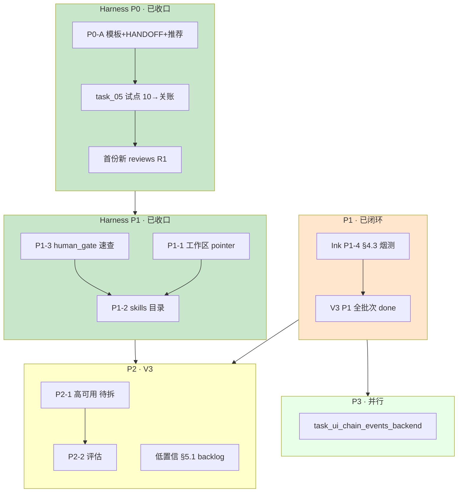
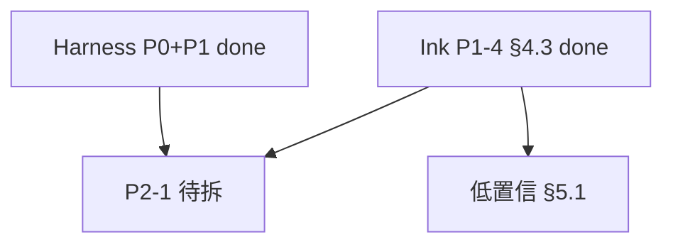

# 最近任务安排表（后端仓）

> **性质**：本仓 **近期排期与执行顺序** 的单一真值表；Agent / 人规划任务时 **优先读本文件**，再打开具体 `active/task_*.md`。  
> **维护**：状态变更、归档、新增 Harness 阶段时 **同步更新本节**；历史分析稿见 `docs/diary/tmp/`（不跟踪 Git）。  
> **分析基线**：2026-05-22（合并优先级终稿 + Harness 改进 §九 生效共识）  
> **范围**：`ai-ink-brain-api-python` · `docs/tasks/` · `docs/harness/` · `docs/spec/v3-agent/SPEC-ChatBI-V3-Overview.md` §2.1  
> **Harness 裁决**：[`docs/diary/2026-05-22-harness-evaluation-improvement-response.md`](../diary/2026-05-22-harness-evaluation-improvement-response.md) **§九**

---

## 0. Harness 改进（当前主线 · **P1 巩固已收口** → **P2 / P1-4 远期**）

> **里程碑（已达成）**：子仓跑通 **第一份新写的** `docs/harness/reviews/task_05_*_audit_R1_*.md`（PR #46 · `task_05` 试点）。  
> **Git**：本地 **勿在 `main` 上改/提交**；远程合入须 **PR**。  
> **下一棒**：**P2-1** Resilience 拆单 / 低置信 §5.1 backlog；**远期** Ink Harness parity（§0.4 P1-4）。

### 0.1 阶段 0 — Git / 分支

| # | 任务 | 状态 | 说明 |
|---|------|------|------|
| ~~0.1~~ | ~~PR：`task/chore-diary-tmp-ignore-and-main-branch-policy`~~ | **done** | 已合并 [PR #45](https://github.com/Cyning12/ai-ink-brain-api-python/pull/45) → `main`（`f2e3437`） |
| ~~0.2~~ | ~~本地 `main` 超前 `origin` 的 harness/diary 提交~~ | **done** | 随 #45 一并合入 |
| 0.3 | ~~建分支 `task/harness-improve-p0-20260522`~~ | **取消** | 沿用 `task/query-rewrite-obs` 承接 P0-B/C |

### 0.2 阶段 P0-A — 文档与模板（1 个 PR）

| # | 任务 | 产出 | 状态 |
|---|------|------|------|
| ~~A1~~ | ~~扩展 `TASK_TEMPLATE` Harness 字段~~ | `docs/tasks/templates/TASK_TEMPLATE.md` | **done** |
| ~~A2~~ | ~~`HANDOFF_SEMI_AUTO` 状态栏 **版本 B**~~ | `docs/harness/prompts/HANDOFF_SEMI_AUTO.md` | **done** |
| ~~A3~~ | ~~10 帽双 Prompt + `（推荐）` + 理由~~ | `10-requirements.md`、`TEMPLATE-requirements-invoke.md` | **done** |
| ~~A4~~ | ~~`harness/README` §4 rsync 仅维护者~~ | `docs/harness/README.md` | **done** |

> **合入**：[PR #46](https://github.com/Cyning12/ai-ink-brain-api-python/pull/46)（`1db7b4c`）

### 0.3 阶段 P0-B/C — 试点闭环（硬验收）

| # | 任务 | 试点 | 状态 |
|---|------|------|------|
| ~~B1~~ | ~~选定试点 task~~ | `task_05_query_rewrite_observability` | **done** |
| ~~B2~~ | ~~任务分支~~ | `task/query-rewrite-obs` | **done** |
| ~~B3–B4~~ | ~~10 帽 + 人择 A/B~~ | A1/A3 新模板 | **done** |
| ~~C1~~ | ~~**22 R1** 新落盘~~ | `reviews/task_05_query_rewrite_observability_audit_R1_20260522.md` | **done** |
| ~~C2–C5~~ | ~~30 → 40 → 50 → 关账~~ | invoke、`reinspect_results/`、pytest 绿、`done/` | **done** |

> **关账**：`docs/tasks/done/task_05_query_rewrite_observability.md`（2026-05-22）

### 0.4 阶段 P1 — 巩固（**已收口**）

| # | 任务 | 状态 | 说明 |
|---|------|------|------|
| P1-1 | 工作区 `Projects/docs/harness/reviews/` pointer 改索引/删悬空 | **done** | Projects `main` `c8f3d8c` · `docs/harness/tasks/done/task_harness_p1_reviews_pointers_v1.md` · 2026-05-23 |
| P1-2 | `docs/tasks/skills/` + README（6 类 SKILL，关账蒸馏+人审） | **done** | `task_harness_p1_docs_consolidation_v1` · PR #49 · 2026-05-23 |
| P1-3 | `docs/tasks/README.md` `human_gate` 场景速查表 | **done** | 同上 |
| P1-4 | 前端 `ai-ink-brain` **Harness parity**（模板/rsync/规则同步） | **远期** | ≠ V3 **P1-4 §4.3 烟测**（已 done，见 §5） |
| P1-5 | 历史 review 样例 | **已做** | 10 份 + `task_05` 新 R1，`reviews/README` |

**P1 巩固**：P1-1～P1-3 **全部 done**（2026-05-23）；工作区 pointer 与后端文档批分仓交付完成。

---

## 1. 现状快照（2026-05-23 更新）

| 维度 | 结论 |
|------|------|
| **本表角色** | **最近任务安排真值** |
| **active/** | **7** 个任务相关文件（见 §1.1） |
| **done/** | **53** 个 `.md` |
| **_views/done.md** | **53 / 53** 已索引（§6.1 **已补齐**） |
| **Harness P0** | **done**（A1–A4 + `task_05` 试点 + 首份新 R1） |
| **V3 P1** | **全批次闭环**（含 Ink **P1-4 §4.3** 前端烟测，2026-05-23） |
| **Harness P1** | **P1-1～P1-3 done**（2026-05-23）；Harness 前端 parity（P1-4）**远期** |

### 1.1 active/ 任务清单

| # | 任务文件 | 状态 | 主题 | 排期 |
|---|---------|------|------|------|
| 1 | `task_ui_chain_events_backend.md` | `pending` | Chain Events 统一事件 | P3 |
| 2 | `task_rag_graphrag_pilot_explore_v1.md` | （见 task 头） | GraphRAG 探索 | 按需 |
| 3 | `task_chatbi_v3_planning_after_resume_v1.md` | `planning` | V3 统筹索引 | P4 |
| 4 | `task_chatbi_v3_low_confidence_plan_preview_confirm_v1.md` | `backlog` | 低置信 §5.1 | P2 |
| 5 | `task_chatbi_v3_debt_from_v2_multiturn_v1.md` | `backlog` | V2 多轮欠债母单 | P2 |
| 6 | `task_chatbi_v3_intent_classification_debt_v1.md` | `backlog` | Intent vNext | P4 |
| 7 | `task_chatbi_v3_low_confidence_plan_preview_confirm_v1_AGENT_PROMPT.md` | 附属 | Agent Prompt | — |

---

## 2. 时间线行动建议（合并 Harness + 业务）

| 时段 | 行动 | 优先级 | 说明 |
|------|------|--------|------|
| ~~**当前**~~ | ~~§0 Harness P0-A + P0-C（`task_05`）~~ | ~~**P0**~~ | **done**（PR #45、#46） |
| ~~**立即**~~ | ~~归档 `task_harness_in_repo` + 补 `_views/done.md`~~ | ~~P0 治理~~ | **done**（2026-05-23） |
| ~~**当前**~~ | ~~§0.4 P1-1 工作区 `Projects/` reviews pointer~~ | ~~**P1**~~ | **done**（Projects `c8f3d8c` · 2026-05-23） |
| ~~**当前**~~ | ~~§0.4 Harness P1-2 + P1-3~~ | ~~**P1**~~ | **done**（PR #49 · 2026-05-23） |
| **当前** | **P2-1** Resilience 拆单（待建 task） | **P2** | Harness P1 已收口 |
| ~~**本周**~~ | ~~Ink **P1-4 §4.3** 前端烟测~~ | ~~P1 跨仓~~ | **done**（2026-05-23） |
| **本周** | 对照现网后再定 `task_ui_chain_events_backend` | P3 | 避免与 SSE 重复 |
| **V3 排期** | 低置信 §5.1 预览确认拆分 | P2 | §5.0 已验收 |
| **按需** | `legacy/` 6 个治理 | 治理 | 不阻塞 |
| **远期** | Intent vNext、统筹单；Ink Harness parity（P1-4） | P4 | |

**工时粗估（非承诺）**：Harness P1 文档批 **1～2 天**；P2-1 拆单 **0.5 天**；P2 实现 **2～4 周**。

---

## 3. 任务分层流程图（彩图）



---

## 4. 推荐下一棒（双执行路线）

### 4.1 全栈闭环线

```text
① P2-1 Resilience 拆单 + 低置信 §5.1 backlog 择项  ← 当前
    ↓
② 对照现网后再定 task_ui_chain_events_backend（P3）
    ↓
③ 远期：Ink Harness parity（§0.4 P1-4）
```

### 4.2 纯后端线

```text
① P2-1 Resilience 新建 task（Harness P1 已收口）
② task_ui_chain_events_backend 现网对照后再动
③ 按需 legacy/ 治理
```

### 4.3 依赖关系（简图）



---

## 5. V3 批次对照（SPEC §2.1 摘要）

| 批次 | 项 | 后端任务状态（2026-05-23） |
|------|-----|---------------------------|
| **P0** | Text2SQL 可观测 | `done` |
| **P1-1** | SQL AST | `done`（2026-05-14） |
| **P1-2** | Prompt 注入 PoC | `done`（2026-05-20） |
| **P1-3** | 分级闸门 RBAC | `done`（2026-05-13） |
| **P1-4** | 低置信澄清 §4.3 | 后端 `done`；前端 **done**（2026-05-23 · Ink 烟测；`ai-ink-brain/content/tasks/done/task_chatbi_v3_multiturn_clarify_semantics_4_3_frontend_v1.md`） |
| **P2-1** | 限流熔断 + health | **待拆 implementation 单** |
| **P2-2** | 评估烟测集 | **待拆** |
| **P2-3** | multiturn §2 工程债 | `backlog` 母单 |
| **P2 延伸** | 低置信预览确认 §5.1 | `backlog`（§5.0 已验收 2026-05-13） |

---

## 6. 治理与数据卫生

### 6.1 `_views/done.md`

**2026-05-23**：`done/` **53** 文件 ↔ `_views/done.md` **53** 条索引，**无遗漏**。

### 6.2 `legacy/`（6 个）

| 文件 | 建议 |
|------|------|
| `Task 04.md` | 统一命名或迁入 `done/` |
| `task_03_hybrid_search_implementation.md` | 补 `状态` |
| `task_rag_b1_metadata_structured_recall_v1.md` | 同上 |
| `task_rag_b2_fts_alias_backfill_v1.md` | 同上 |
| `task_rag_b2_v2_fts_alias_symbols_versions_identifiers.md` | 同上 |
| `task_rag_keyword_websearch_date_normalize_v1.md` | 同上 |

### 6.3 目录与状态不一致

| 文件路径 | 问题 |
|---------|------|
| `docs/tasks/done/` 内部分文件 | 文首 `状态` 日期仍标「待补」— 按需核对，不阻塞排期 |

---

## 7. 关联引用

| 用途 | 路径 |
|------|------|
| 任务落盘规则 | [`README.md`](README.md) |
| Harness 入口 | [`../harness/README.md`](../harness/README.md) |
| Harness §九 裁决 | [`../diary/2026-05-22-harness-evaluation-improvement-response.md`](../diary/2026-05-22-harness-evaluation-improvement-response.md) |
| V3 总规 | `docs/spec/v3-agent/SPEC-ChatBI-V3-Overview.md` §2.1 |
| Ink P1-4 前端关账 | `ai-ink-brain/content/tasks/done/task_chatbi_v3_multiturn_clarify_semantics_4_3_frontend_v1.md` |
| Projects P1-1 关账 | `Projects/docs/harness/tasks/done/task_harness_p1_reviews_pointers_v1.md`（`main` `c8f3d8c`） |
| 项目配置 | `docs/meta/PROJECT_CONFIG_AI_INK_BRAIN_API_PYTHON.md` |

---

## 8. 修订记录

| 日期 | 说明 |
|------|------|
| 2026-05-22 | 自 `docs/diary/tmp/2026-05-22-backend-tasks-priority-final.md` 迁入 `docs/tasks/`；合并 Harness 改进排期 §0 |
| 2026-05-22 | §0.1/0.2 **done**：PR #45 已合并 `main` |
| 2026-05-22 | **P0-A1～A4 done**；**P0-B/C** 以 `task_05` 试点 |
| 2026-05-22 | **PR #46 合并**：P0 全收口 + 首份新 R1 |
| 2026-05-23 | **P0 治理 done**：`task_harness_in_repo` 归档；`_views/done.md` 53/53 |
| 2026-05-23 | **Harness P1-2/P1-3 done**：`task_harness_p1_docs_consolidation_v1` 关账（PR #49） |
| 2026-05-23 | **Harness P1-1 done**：Projects reviews pointer（`c8f3d8c`）；**P1-1～P1-3 全收口**；下一棒 **P2-1** |

---

## 给 Cursor

`RECENT_TASK_SCHEDULE`、`最近任务安排`、`Harness P1`、`P2-1`、`active`、`_views/done`
