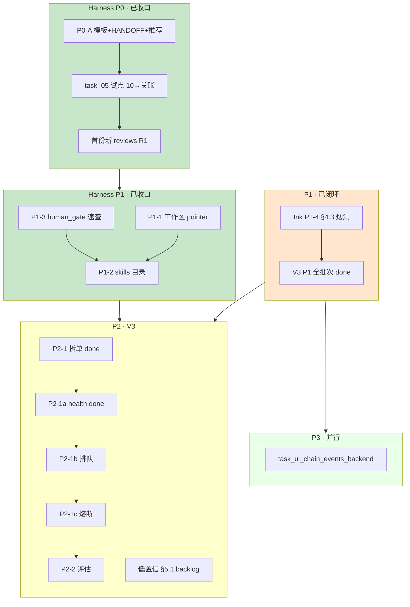
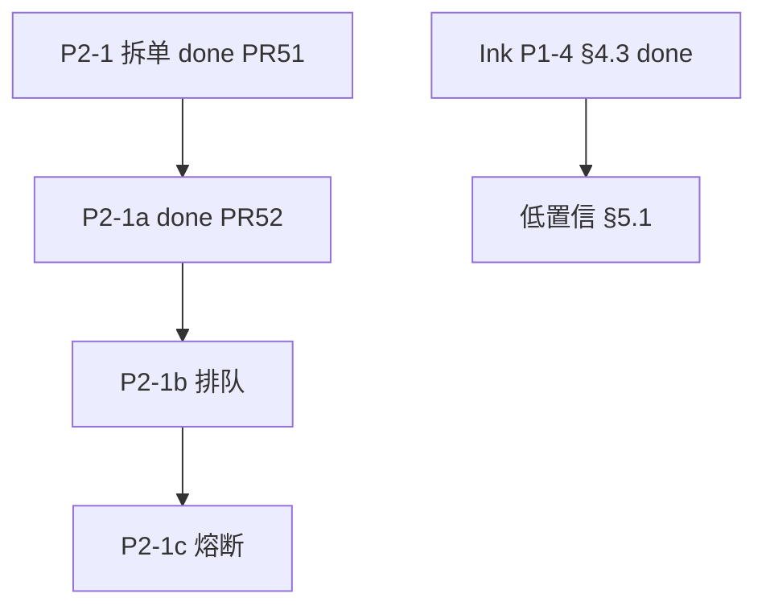

# 最近任务安排表（后端仓）

> **性质**：本仓 **近期排期与执行顺序** 的单一真值表；Agent / 人规划任务时 **优先读本文件**，再打开具体 `active/task_*.md`。  
> **维护**：状态变更、归档、新增 Harness 阶段时 **同步更新本节**；历史分析稿见 `docs/diary/tmp/`（不跟踪 Git）。  
> **分析基线**：2026-05-22（合并优先级终稿 + Harness 改进 §九 生效共识）  
> **范围**：`ai-ink-brain-api-python` · `docs/tasks/` · `docs/harness/` · `docs/spec/v3-agent/SPEC-ChatBI-V3-Overview.md` §2.1 · **治理线** [`docs/spec/governance/SPEC-Governance-Wiki-Harness-Roadmap-v1.md`](../spec/governance/SPEC-Governance-Wiki-Harness-Roadmap-v1.md)  
> **Harness 裁决**：`[docs/diary/2026-05-22-harness-evaluation-improvement-response.md](../diary/2026-05-22-harness-evaluation-improvement-response.md)` **§九**

---

## 0. Harness 改进（**已收口** · 运行常模）

> **改进工程状态**：P0 + P1 **done**（PR #45/#46/#49）；[`HARNESS_V2_PLAN.md`](../harness/HARNESS_V2_PLAN.md) 已 **`accepted`**。下文 §0.1～0.4 为**历史阶段记录**，不再表示「仍在试点/测试阶段」。  
> **Git**：本地 **勿在 `main` 上改/提交**；远程合入须 **PR**。  
> **近期当前（治理/工程）**：**P1-4 前端 Harness parity**（全仓 · 远期）；工作区 **T3** taxonomy **done**（2026-05-26 · Projects）；本仓 taxonomy **done**（§6.4）；**Wiki-CTX-AB T2 done**（2026-05-26 · 推荐默认 `coding_wiki/` 读序）。  
> **V3 韧性**：P2-1a **done**（PR #52）；P2-1b/c **排队** — 属 ChatBI 实现子单，**与 Harness 改进无关**，**非**本表默认「当前棒」。

### 0.0 关账常模（改进后默认 · 非「测试阶段」）


| 任务类型                      | `test_strategy`        | 关账链（`semi_auto: true` 时）        | 50 `reinspect_results/` |
| ------------------------- | ---------------------- | ------------------------------- | ----------------------- |
| **改 `api/` / 契约 / CI 行为** | `required`             | 30 → 40 → **50** → PR → `done/` | **必须**落盘                |
| **纯 docs / 拆单 / 索引**      | `not_applicable`（一行理由） | 30 → 40；50 **可选**（母单拆单曾做 50）    | 有行为变更时建议仍做              |
| **draft 探索**              | 按 task 写明              | 未冻结前 **不** 强制 50                | —                       |


**硬规则**（与 [`ACCEPTANCE_LANDING.md`](../harness/ACCEPTANCE_LANDING.md) 一致）：凡 **`test_strategy: required`** 且合并前关账，**40 之后须有 50 书面复检**；禁止仅以对话「过了」归档。

### 0.1 阶段 0 — Git / 分支


| #       | 任务                                                          | 状态       | 说明                                                                                            |
| ------- | ----------------------------------------------------------- | -------- | --------------------------------------------------------------------------------------------- |
| ~~0.1~~ | ~~PR：`task/chore-diary-tmp-ignore-and-main-branch-policy~~` | **done** | 已合并 [PR #45](https://github.com/Cyning12/ai-ink-brain-api-python/pull/45) → `main`（`f2e3437`） |
| ~~0.2~~ | ~~本地 `main` 超前 `origin` 的 harness/diary 提交~~                | **done** | 随 #45 一并合入                                                                                    |
| 0.3     | ~~建分支 `task/harness-improve-p0-20260522~~`                  | **取消**   | 沿用 `task/query-rewrite-obs` 承接 P0-B/C                                                         |


### 0.2 阶段 P0-A — 文档与模板（1 个 PR）


| #      | 任务                                   | 产出                                                     | 状态       |
| ------ | ------------------------------------ | ------------------------------------------------------ | -------- |
| ~~A1~~ | ~~扩展 `TASK_TEMPLATE` Harness 字段~~    | `docs/tasks/templates/TASK_TEMPLATE.md`                | **done** |
| ~~A2~~ | ~~`HANDOFF_SEMI_AUTO` 状态栏 **版本 B~~** | `docs/harness/prompts/handoff/HANDOFF_SEMI_AUTO.md`            | **done** |
| ~~A3~~ | ~~10 帽双 Prompt + `（推荐）` + 理由~~       | `10-requirements.md`、`TEMPLATE-requirements-invoke.md` | **done** |
| ~~A4~~ | ~~`harness/README` §4 rsync 仅维护者~~   | `docs/harness/README.md`                               | **done** |


> **合入**：[PR #46](https://github.com/Cyning12/ai-ink-brain-api-python/pull/46)（`1db7b4c`）

### 0.3 阶段 P0-B/C — 验收闭环（历史 · 曾用于首开验证）


| #         | 任务                    | 首开验证 task                                                          | 状态       |
| --------- | --------------------- | ------------------------------------------------------------------ | -------- |
| ~~B1~~    | ~~选定首开验证 task~~       | `task_05_query_rewrite_observability`                              | **done** |
| ~~B2~~    | ~~任务分支~~              | `task/query-rewrite-obs`                                           | **done** |
| ~~B3–B4~~ | ~~10 帽 + 人择 A/B~~     | A1/A3 新模板                                                          | **done** |
| ~~C1~~    | ~~**22 R1** 新落盘~~     | `reviews/by-task/05_query_rewrite_observability/task_05_query_rewrite_observability_audit_R1_20260522.md` | **done** |
| ~~C2–C5~~ | ~~30 → 40 → 50 → 关账~~ | invoke、`reinspect_results/`、pytest 绿、`done/`                       | **done** |


> **关账**：`docs/tasks/done/task_05_query_rewrite_observability.md`（2026-05-22）

### 0.4 阶段 P1 — 巩固（**已收口**）


| #    | 任务                                                   | 状态       | 说明                                                                                                        |
| ---- | ---------------------------------------------------- | -------- | --------------------------------------------------------------------------------------------------------- |
| P1-1 | 工作区 `Projects/docs/harness/reviews/` pointer 改索引/删悬空 | **done** | Projects `main` `c8f3d8c` · `docs/harness/tasks/done/task_harness_p1_reviews_pointers_v1.md` · 2026-05-23 |
| P1-2 | `docs/tasks/skills/` + README（6 类 SKILL，关账蒸馏+人审）     | **done** | `task_harness_p1_docs_consolidation_v1` · PR #49 · 2026-05-23                                             |
| P1-3 | `docs/tasks/README.md` `human_gate` 场景速查表            | **done** | 同上                                                                                                        |
| P1-4 | 前端 `ai-ink-brain` **Harness parity**（模板/rsync/规则同步）  | **远期**   | ≠ V3 **P1-4 §4.3 烟测**（已 done，见 §5）                                                                        |
| P1-5 | 历史 review 样例                                         | **已做**   | 10 份 + `task_05` 新 R1，`reviews/README`                                                                    |


**P1 巩固**：P1-1～P1-3 **全部 done**（2026-05-23）；工作区 pointer 与后端文档批分仓交付完成。

---

## 1. 现状快照（2026-05-26 更新）


| 维度                    | 结论                                                                                             |
| --------------------- | ---------------------------------------------------------------------------------------------- |
| **本表角色**              | **最近任务安排真值**                                                                                   |
| **active/**           | **9** 个任务相关文件（见 §1.1；Wiki-CTX-AB 已归档）                                                               |
| **done/**             | **55+** 个 `.md`（含 P2-1a，[PR #52](https://github.com/Cyning12/ai-ink-brain-api-python/pull/52)） |
| **_views/done.md**    | 已含 P2-1a 索引行                                                                                   |
| **Harness 改进**        | **done**（P0+P1 收口；`[HARNESS_V2_PLAN](../harness/HARNESS_V2_PLAN.md)` `accepted`）               |
| **Harness 关账**        | **常模**：`required` 实现 task → **50 必落盘**（见 §0.0）                                                 |
| **V3 P1**             | **全批次闭环**（含 Ink **P1-4 §4.3** 前端烟测，2026-05-23）                                                 |
| **Harness 前端 parity** | **下一棒（全仓）** · §0.4 P1-4 |
| **近期当前** | **P1-4 前端 Harness parity**（全仓 · 远期）← **T2 done**（[`done/task_wiki_ctx_ab_v1.md`](done/task_wiki_ctx_ab_v1.md) · 2026-05-26 · 推荐默认 `coding_wiki/` 读序） |
| **V3 P2-1 韧性** | P2-1a **done**（PR #52）；P2-1b/c **排队**（非 Harness、非默认当前棒） |
| **维护债** | Overview §3 文件若缺失则以母单 §子单状态为准 |


### 1.1 active/ 任务清单


| #     | 任务文件 | 状态 | 主题 | 排期 |
| ----- | -------- | ---- | ---- | ---- |
| 0b    | `task_chatbi_v3_p2_resilience_rate_limit_v1.md` | `todo` | P2-1b 限流 | **V3 排队** · 非 Harness 近期 |
| 0c    | `task_chatbi_v3_p2_resilience_circuit_breaker_v1.md` | `todo` | P2-1c 熔断 | V3 排队 · 1b 后 |
| 1     | `task_ui_chain_events_backend.md`                                       | `pending`  | Chain Events 统一事件 | P3                                   |
| 2     | `task_rag_graphrag_pilot_explore_v1.md`                                 | （见 task 头） | GraphRAG 探索       | 按需                                   |
| 3     | `task_chatbi_v3_planning_after_resume_v1.md`                            | `planning` | V3 统筹索引           | P4                                   |
| 4     | `task_chatbi_v3_low_confidence_plan_preview_confirm_v1.md`              | `backlog`  | 低置信 §5.1          | P2                                   |
| 5     | `task_chatbi_v3_debt_from_v2_multiturn_v1.md`                           | `backlog`  | V2 多轮欠债母单         | P2                                   |
| 6     | `task_chatbi_v3_intent_classification_debt_v1.md`                       | `backlog`  | Intent vNext      | P4                                   |
| 7     | `task_chatbi_v3_low_confidence_plan_preview_confirm_v1_AGENT_PROMPT.md` | 附属         | Agent Prompt      | —                                    |


---

## 2. 时间线行动建议（合并 Harness + 业务）


| 时段          | 行动                                                 | 优先级        | 说明                                              |
| ----------- | -------------------------------------------------- | ---------- | ----------------------------------------------- |
| ~~**当前**~~  | ~~§0 Harness P0-A + P0-C（`task_05`）~~              | ~~**P0**~~ | **done**（PR #45、#46）                            |
| ~~**立即**~~  | ~~归档 `task_harness_in_repo` + 补 `_views/done.md`~~ | ~~P0 治理~~  | **done**（2026-05-23）                            |
| ~~**当前**~~  | ~~§0.4 P1-1 工作区 `Projects/` reviews pointer~~      | ~~**P1**~~ | **done**（Projects `c8f3d8c` · 2026-05-23）       |
| ~~**当前**~~  | ~~§0.4 Harness P1-2 + P1-3~~                       | ~~**P1**~~ | **done**（PR #49 · 2026-05-23）                   |
| ~~**当前**~~  | ~~**P2-1** Resilience 拆单~~                         | ~~**P2**~~ | **done**（PR #51 · 2026-05-24）                   |
| ~~**当前**~~  | ~~**P2-1a** health/ready~~ | ~~**P2**~~ | **done**（PR #52 · `8f56d4a` · 2026-05-25） |
| ~~**当前**~~ | ~~T3 工作区 harness 推广~~ | ~~治理~~ | **done**（Projects 2026-05-26 · `task_harness_workspace_taxonomy_promote_v1` → 工作区 `done/`） |
| ~~**当前**~~ | ~~Coding Wiki pilot（T1b）~~ | ~~治理~~ | **done**（2026-05-26 · [`done/task_coding_wiki_pilot_v1.md`](done/task_coding_wiki_pilot_v1.md)） |
| ~~**当前**~~ | ~~Wiki-CTX-AB P2（T2）~~ | ~~治理~~ | **done**（2026-05-26 · [`done/task_wiki_ctx_ab_v1.md`](done/task_wiki_ctx_ab_v1.md) · 推荐默认 `coding_wiki/` 读序） |
| **当前** | `ai-ink-brain` Harness parity | P1 | §0.4 P1-4 · 全仓 · 远期 |
| **V3 排队** | P2-1b 限流 → P2-1c 熔断 | P2 | 按需立项；**非** Harness 改进近期项 |
| ~~**本周**~~  | ~~Ink **P1-4 §4.3** 前端烟测~~ | ~~P1 跨仓~~ | **done**（2026-05-23） |
| **本周**      | 对照现网后再定 `task_ui_chain_events_backend`             | P3         | 避免与 SSE 重复                                      |
| **V3 排期**   | 低置信 §5.1 预览确认拆分                                    | P2         | §5.0 已验收                                        |
| **按需**      | `legacy/` 6 个治理                                    | 治理         | 不阻塞                                             |
| **远期**      | Intent vNext、统筹单                                   | P4         | —                                               |


**工时粗估（非承诺）**：P2-1b/c 各 **3～5 天**；P2 全批 **2～4 周**。

---

## 3. 任务分层流程图（彩图）




---

## 4. 推荐下一棒（双执行路线）

### 4.1 全栈闭环线

```text
① ai-ink-brain Harness parity（P1-4 · 全仓 · 远期）  ← 近期
② V3 排队：P2-1b → P2-1c（P2-1a 已 PR #52）
③ 低置信 §5.1 / P2-2 · P3 chain events（对照现网）
```

### 4.2 纯后端线

```text
① 全仓 Harness parity（Ink · P1-4 · 远期）
② V3 韧性排队：P2-1b → P2-1c（母单 done/；P2-1a 见 done/）
③ task_ui_chain_events_backend 现网对照后再动
④ 按需 legacy/ 治理
```

### 4.3 依赖关系（简图）




---

## 5. V3 批次对照（SPEC §2.1 摘要）


| 批次        | 项                | 后端任务状态（2026-05-25）                                                                                                                         |
| --------- | ---------------- | ------------------------------------------------------------------------------------------------------------------------------------------ |
| **P0**    | Text2SQL 可观测     | `done`                                                                                                                                     |
| **P1-1**  | SQL AST          | `done`（2026-05-14）                                                                                                                         |
| **P1-2**  | Prompt 注入 PoC    | `done`（2026-05-20）                                                                                                                         |
| **P1-3**  | 分级闸门 RBAC        | `done`（2026-05-13）                                                                                                                         |
| **P1-4**  | 低置信澄清 §4.3       | 后端 `done`；前端 **done**（2026-05-23 · Ink 烟测；`ai-ink-brain/content/tasks/done/task_chatbi_v3_multiturn_clarify_semantics_4_3_frontend_v1.md`） |
| **P2-1**  | 拆单母单             | **done**（`docs/tasks/done/task_chatbi_v3_p2_resilience_v1.md` · PR #51）                                                                    |
| **P2-1a** | health / ready   | **done**（`docs/tasks/done/task_chatbi_v3_p2_resilience_health_ready_v1.md` · PR #52）                                                       |
| **P2-1b** | 限流 | **todo** · V3 排队 · `task_chatbi_v3_p2_resilience_rate_limit_v1.md` |
| **P2-1c** | 熔断               | `**todo`** · `task_chatbi_v3_p2_resilience_circuit_breaker_v1.md`                                                                          |
| **P2-2**  | 评估烟测集            | **待拆**                                                                                                                                     |
| **P2-3**  | multiturn §2 工程债 | `backlog` 母单                                                                                                                               |
| **P2 延伸** | 低置信预览确认 §5.1     | `backlog`（§5.0 已验收 2026-05-13）                                                                                                             |


---

## 6. 治理与数据卫生

### 6.1 `_views/done.md`

**2026-05-23**：`done/` **53** 文件 ↔ `_views/done.md` **53** 条索引，**无遗漏**。

### 6.2 `legacy/`（6 个）


| 文件                                                         | 建议              |
| ---------------------------------------------------------- | --------------- |
| `Task 04.md`                                               | 统一命名或迁入 `done/` |
| `task_03_hybrid_search_implementation.md`                  | 补 `状态`          |
| `task_rag_b1_metadata_structured_recall_v1.md`             | 同上              |
| `task_rag_b2_fts_alias_backfill_v1.md`                     | 同上              |
| `task_rag_b2_v2_fts_alias_symbols_versions_identifiers.md` | 同上              |
| `task_rag_keyword_websearch_date_normalize_v1.md`          | 同上              |


### 6.3 目录与状态不一致


| 文件路径                     | 问题                           |
| ------------------------ | ---------------------------- |
| `docs/tasks/done/` 内部分文件 | 文首 `状态` 日期仍标「待补」— 按需核对，不阻塞排期 |


### 6.4 本仓 Harness 查漏补缺（P2-1a 后 · 前端 parity 前）


| #   | 项                                 | 状态       | 说明                                                                     |
| --- | --------------------------------- | -------- | ---------------------------------------------------------------------- |
| 1   | `RECENT_TASK_SCHEDULE` 与 P2-1a    | **done** | 本节已同步 PR #52                                                           |
| 2   | `HARNESS_V2_PLAN`                 | **done** | 用户已改 `accepted`                                                        |
| 3   | Harness taxonomy（prompts + invokes + reviews） | **done** | `git mv` 2026-05-25；见 [`../harness/README.md`](../harness/README.md) §2.1 |
| 4   | `content/tasks` 无 — 本仓 N/A | — | 前端 parity 时对齐 `content/harness` |
| 5   | CI Required vs `verify-fast` | **已明确** | 见 §6.5 |
| 6   | 母单 §子单状态 P2-1a | **done** | `task_chatbi_v3_p2_resilience_v1.md` + PR #52 |


### 6.5 CI：`pytest` Required vs `verify-fast` 非 Required


| workflow                      | 本仓 job 名           | 与合并的关系                                                                |
| ----------------------------- | ------------------ | --------------------------------------------------------------------- |
| `**pytest.yml`**              | `pytest`           | **合并前必绿**（与根 `AGENTS.md` §8、本地命令一致）                                   |
| `**tech-graph.yml`**          | `manifest_check` 等 | **必绿**（图谱/manifest）                                                   |
| `**tech-graph-contract.yml`** | `contract_check`   | **必绿**（契约）                                                            |
| `**verify-fast.yml`**         | `verify`           | **并行再跑一遍同 marker 的 pytest**（`-q --tb=short`）；**默认不设 GitHub Required** |


**含义**：PR 可以 **verify-fast 红但 pytest 绿仍合并**（反之亦然则仍须修）；`verify-fast` 用于**更快/独立信号**与日后可选升为 Required，**不是**当前关账硬门禁。真值见工作区 `Projects/docs/harness/VERIFICATION_CI_PATTERN.md` §5.1（若路径存在）。

### 6.6 Wiki-CTX-AB · Coding Wiki · 全仓 Harness 推广（2026-05-25）

> **SPEC 真值**：[`docs/spec/governance/SPEC-Governance-Wiki-Harness-Roadmap-v1.md`](../spec/governance/SPEC-Governance-Wiki-Harness-Roadmap-v1.md)（T0～T4）  
> **P1 题集**：[`docs/harness/experiments/wiki_ctx_ab_v1/questions.md`](../harness/experiments/wiki_ctx_ab_v1/questions.md)

| 阶段 | 任务 / 工件 | 状态 | 说明 |
| --- | --- | --- | --- |
| T0 | Harness taxonomy 本仓 | **done** | §6.4 #3 · 2026-05-25 |
| **T1a** | **`task_wiki_ctx_ab_v1`** · P1 | **done** | `conclusion_p1_zh.md` · 2026-05-25 |
| **T3** | **`task_harness_workspace_taxonomy_promote_v1`** | **done** | 工作区 [`docs/harness/tasks/done/`](../../../../docs/harness/tasks/done/task_harness_workspace_taxonomy_promote_v1.md) · 2026-05-26 关账 |
| **T1b** | **`task_coding_wiki_pilot_v1`** | **done** | 2026-05-26 关账 · [`done/task_coding_wiki_pilot_v1.md`](done/task_coding_wiki_pilot_v1.md) |
| T2 | **`task_wiki_ctx_ab_v1`** · P2（精简包 vs 仅 Wiki） | **done** | 2026-05-26 关账 · [`done/task_wiki_ctx_ab_v1.md`](done/task_wiki_ctx_ab_v1.md) · **推荐默认** `coding_wiki/index` + syntheses（降幅 78.8%、4/4 pass） |
| **T1c** | **`task_coding_wiki_t1c_test_archive_v1`** | **done** | 2026-05-26 关账 · [`done/task_coding_wiki_t1c_test_archive_v1.md`](done/task_coding_wiki_t1c_test_archive_v1.md) · `reinspect_coding_wiki_t1c_20260526_v1.md` |
| **Multi slug AB** | **`task_wiki_ctx_ab_multi_slug_v1`** | **active** | 当前棒 · 分支 `task/wiki-ctx-ab-multi-slug-v1` · [`active/task_wiki_ctx_ab_multi_slug_v1.md`](active/task_wiki_ctx_ab_multi_slug_v1.md) · 帽链 `wiki-ctx-ab-multi/PROMPT_22` 起 |
| P1-4 | 前端 Harness parity | **远期** | `ai-ink-brain` · 与 T3 工作区交付 **解耦** |
| T4 | 图谱 `::documents` 等 | **planned** | SPEC §T4 |

---

## 7. 关联引用


| 用途               | 路径                                                                                                                                 |
| ---------------- | ---------------------------------------------------------------------------------------------------------------------------------- |
| 任务落盘规则           | `[README.md](README.md)`                                                                                                           |
| Harness 入口       | `[../harness/README.md](../harness/README.md)`                                                                                     |
| Harness §九 裁决    | `[../diary/2026-05-22-harness-evaluation-improvement-response.md](../diary/2026-05-22-harness-evaluation-improvement-response.md)` |
| V3 总规            | `docs/spec/v3-agent/SPEC-ChatBI-V3-Overview.md` §2.1                                                                               |
| 治理 / Wiki 路线     | `docs/spec/governance/SPEC-Governance-Wiki-Harness-Roadmap-v1.md`                                                                  |
| Wiki-CTX-AB 实验   | `docs/harness/experiments/wiki_ctx_ab_v1/`                                                                                         |
| spec 根索引         | `docs/spec/README.md`                                                                                                              |
| Ink P1-4 前端关账    | `ai-ink-brain/content/tasks/done/task_chatbi_v3_multiturn_clarify_semantics_4_3_frontend_v1.md`                                    |
| Projects P1-1 关账 | `Projects/docs/harness/tasks/done/task_harness_p1_reviews_pointers_v1.md`（`main` `c8f3d8c`）                                        |
| 项目配置             | `docs/meta/PROJECT_CONFIG_AI_INK_BRAIN_API_PYTHON.md`                                                                              |


---

## 8. 修订记录


| 日期         | 说明                                                                                                |
| ---------- | ------------------------------------------------------------------------------------------------- |
| 2026-05-22 | 自 `docs/diary/tmp/2026-05-22-backend-tasks-priority-final.md` 迁入 `docs/tasks/`；合并 Harness 改进排期 §0 |
| 2026-05-22 | §0.1/0.2 **done**：PR #45 已合并 `main`                                                               |
| 2026-05-22 | **P0-A1～A4 done**；**P0-B/C** 以 `task_05` 试点                                                       |
| 2026-05-22 | **PR #46 合并**：P0 全收口 + 首份新 R1                                                                     |
| 2026-05-23 | **P0 治理 done**：`task_harness_in_repo` 归档；`_views/done.md` 53/53                                   |
| 2026-05-23 | **Harness P1-2/P1-3 done**：`task_harness_p1_docs_consolidation_v1` 关账（PR #49）                     |
| 2026-05-23 | **Harness P1-1 done**：Projects reviews pointer（`c8f3d8c`）；**P1-1～P1-3 全收口**；下一棒 **P2-1**          |
| 2026-05-24 | **P2-1 拆单 done**（PR #51）；**当前棒 P2-1a**；子单母单路径指向 `done/`；分支 `task/chatbi-v3-p2-1a-health`          |
| 2026-05-25 | P2-1a done（PR #52）；taxonomy §2.1；近期当前=治理+Wiki；P2-1b/c **V3 排队**（非 Harness 当前棒） |
| 2026-05-25 | §6.6 + `docs/spec/governance/` + `wiki_ctx_ab_v1` P1 题集/模板；`task_wiki_ctx_ab_v1` 草案 |
| 2026-05-26 | **T3 done**：工作区 taxonomy 关账；§1/§2/§6.6 与 SPEC 对齐；当前棒 **T1b** Coding Wiki |
| 2026-05-26 | **T2 done**：Wiki-CTX-AB v1 关账 · `WIKI-CTX-AB@2026-05-25` · 推荐默认 `coding_wiki/` 读序；当前棒 **P1-4** 前端 parity |
| 2026-05-26 | **P0 收口**：`_views/done` 已含 wiki 双 task；实践文 [`docs/diary/2026-05-26-llm-wiki-harness-pilot-practice.md`](../diary/2026-05-26-llm-wiki-harness-pilot-practice.md)；下一棒 **T1c**（需新建 active task） |
| 2026-05-26 | **T1c done**：`task_coding_wiki_t1c_test_archive_v1` 关账 · `CODING-WIKI-T1C@2026-05-26` · §6.6 更新 |
| 2026-05-26 | **Multi slug AB active**：`task_wiki_ctx_ab_multi_slug_v1` · `WIKI-CTX-AB-MULTI@2026-05-26` · 10 帽起草 + 22→关账 Prompt |


---

## 给 Cursor

`RECENT_TASK_SCHEDULE`、`最近任务安排`、`Harness P1`、`P2-1`、`active`、`_views/done`