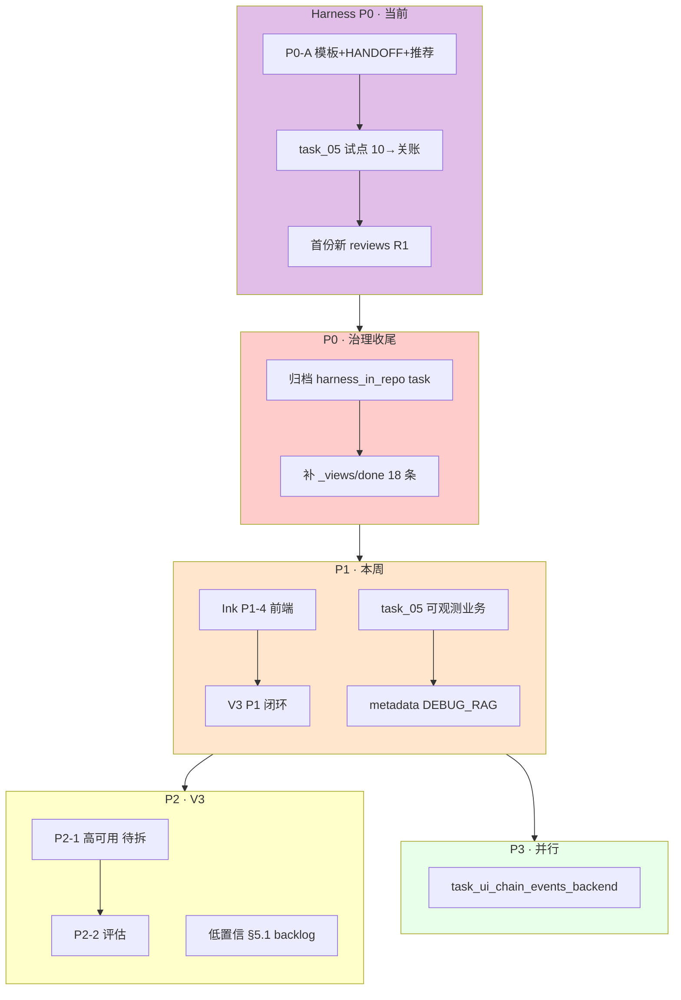
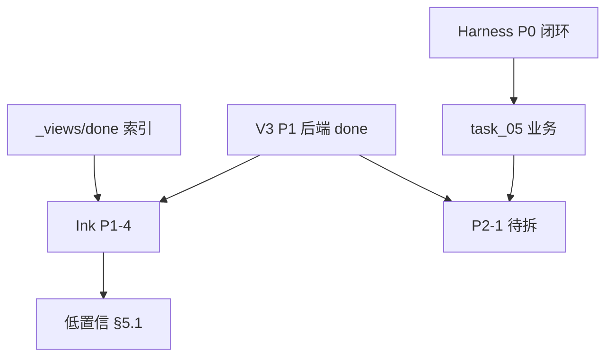

# 最近任务安排表（后端仓）

> **性质**：本仓 **近期排期与执行顺序** 的单一真值表；Agent / 人规划任务时 **优先读本文件**，再打开具体 `active/task_*.md`。  
> **维护**：状态变更、归档、新增 Harness 阶段时 **同步更新本节**；历史分析稿见 `docs/diary/tmp/`（不跟踪 Git）。  
> **分析基线**：2026-05-22（合并优先级终稿 + Harness 改进 §九 生效共识）  
> **范围**：`ai-ink-brain-api-python` · `docs/tasks/` · `docs/harness/` · `docs/spec/v3-agent/SPEC-ChatBI-V3-Overview.md` §2.1  
> **Harness 裁决**：[`docs/diary/2026-05-22-harness-evaluation-improvement-response.md`](../diary/2026-05-22-harness-evaluation-improvement-response.md) **§九**

---

## 0. Harness 改进（当前主线 · P0 优先）

> **里程碑**：子仓跑通 **第一份新写的** `docs/harness/reviews/task_*_audit_R1_*.md`（≠ 已召回的 10 份历史样例）— **已达成**（`task_05` · PR #46）。  
> **Git**：本地 **勿在 `main` 上改/提交**；远程合入须 **PR**。  
> **工作分支（当前）**：`task/query-rewrite-obs`（**P0-B/C 试点**）；Harness 文档批在 `task/chore-diary-tmp-ignore-and-main-branch-policy`（**ahead**，待 PR 或 cherry-pick）。

### 0.1 阶段 0 — Git / 分支

| # | 任务 | 状态 | 说明 |
|---|------|------|------|
| ~~0.1~~ | ~~PR：`task/chore-diary-tmp-ignore-and-main-branch-policy`~~ | **done** | 已合并 [PR #45](https://github.com/Cyning12/ai-ink-brain-api-python/pull/45) → `main`（`f2e3437`）；含 tmp ignore、`07-git-workflow`、Harness 内嵌/裁决/样例、`RECENT_TASK_SCHEDULE` |
| ~~0.2~~ | ~~本地 `main` 超前 `origin` 的 harness/diary 提交~~ | **done** | 随 #45 一并合入（`d48845d`～`0460ce1`） |
| 0.3 | ~~建分支 `task/harness-improve-p0-20260522`~~ | **取消** | 沿用当前分支 |

### 0.2 阶段 P0-A — 文档与模板（1 个 PR）

| # | 任务 | 产出 | 状态 |
|---|------|------|------|
| ~~A1~~ | ~~扩展 `TASK_TEMPLATE` Harness 字段~~ | `docs/tasks/templates/TASK_TEMPLATE.md` | **done** |
| ~~A2~~ | ~~`HANDOFF_SEMI_AUTO` 状态栏 **版本 B**~~ | `docs/harness/prompts/HANDOFF_SEMI_AUTO.md` | **done** |
| ~~A3~~ | ~~10 帽双 Prompt + `（推荐）` + 理由~~ | `10-requirements.md`、`TEMPLATE-requirements-invoke.md` | **done** |
| ~~A4~~ | ~~`harness/README` §4 rsync 仅维护者~~ | `docs/harness/README.md` | **done** |

### 0.3 阶段 P0-B/C — 试点闭环（硬验收）

| # | 任务 | 试点 | 状态 |
|---|------|------|------|
| ~~B1~~ | ~~选定试点 task~~ | [`done/task_05_query_rewrite_observability.md`](done/task_05_query_rewrite_observability.md) | **done** |
| ~~B2~~ | ~~任务分支~~ | `task/query-rewrite-obs` | **done** |
| ~~B3–B4~~ | ~~10 帽 + task 模板~~ | `task_05` 已按 TASK_TEMPLATE 补齐 | **done** |
| ~~C1~~ | **22 R1** 新落盘 | [`reviews/task_05_query_rewrite_observability_audit_R1_20260522.md`](../harness/reviews/task_05_query_rewrite_observability_audit_R1_20260522.md) | **done** |
| C2–C4 | 30 → 40 → 50 | 单测绿、自检/复检已落盘 | **done**（`HG-*` 已 approved） |
| ~~C5~~ | ~~关账 `done/` + 合并 PR #46~~ | [`done/task_05_query_rewrite_observability.md`](done/task_05_query_rewrite_observability.md) | **done**（已合并 PR #46 → `main` `1db7b4c`） |

**建议 task 单（Harness 自身）**：

| 文件 | 范围 |
|------|------|
| `active/task_harness_p0_template_and_handoff_v1.md`（待建） | P0-A |
| 试点闭环可并入 `task_05` 或 `task_harness_p0_pilot_closeout_v1.md`（待建） | P0-B/C |

### 0.4 阶段 P1 — 巩固（P0 通过后）

| # | 任务 | 状态 |
|---|------|------|
| P1-1 | 工作区 `Projects/docs/harness/reviews/` pointer 改索引/删悬空 | 待做 |
| P1-2 | `docs/tasks/skills/` + README（6 类 SKILL，关账蒸馏+人审） | 待做 |
| P1-3 | `docs/tasks/README.md` `human_gate` 场景速查表 | 待做 |
| P1-4 | 前端 `ai-ink-brain` Harness parity（独立 PR） | 远期 |
| P1-5 | 历史 review 样例 | **已做**（10 份，`reviews/README`） |

---

## 1. 现状快照（2026-05-23 更新）

| 维度 | 结论 |
|------|------|
| **本表角色** | **最近任务安排真值**（替代 `docs/diary/tmp/2026-05-22-backend-tasks-priority-final.md`） |
| **active/** | **7** 个任务相关文件（见 §1.1） |
| **done/** | 53 个 `.md`；含 `task_harness_in_repo_prompts_and_rules_v1` 已归档 |
| **_views/done.md** | 已索引 **53** 条，遗漏 **0** 条（§6.1 已补齐） |
| **V3 P1 后端** | P1-1～P1-3、P1-4 后端侧 **done** |
| **V3 P1 缺口** | **P1-4 前端**（Ink-Brain）仍 `pending`，跨仓阻塞 P1 收口 |
| **Harness 内嵌** | `task_harness_in_repo_prompts_and_rules_v1` 已完成 `git mv` 归档至 `done/` |

### 1.1 active/ 任务清单

| # | 任务文件 | 状态 | 主题 | 排期 |
|---|---------|------|------|------|
| 1 | `task_ui_chain_events_backend.md` | `pending` | Chain Events 统一事件 | P3 |
| 2 | `task_rag_graphrag_pilot_explore_v1.md` | （见 task 头） | GraphRAG 探索 | 按需 |
| 3 | `task_chatbi_v3_planning_after_resume_v1.md` | `planning` | V3 统筹索引 | P4 |
| 4 | `task_chatbi_v3_low_confidence_plan_preview_confirm_v1.md` | `backlog` | 低置信 §5.1 | P2 |
| 5 | `task_chatbi_v3_debt_from_v2_multiturn_v1.md` | `backlog` | V2 多轮欠债母单 | P2 |
| 6 | `task_chatbi_v3_intent_classification_debt_v1.md` | `backlog` | Intent vNext | P4 |
| 7 | `task_chatbi_v3_low_confidence_plan_preview_confirm_v1_AGENT_PROMPT.md` | 附属 | Agent Prompt | — |

---

## 2. 时间线行动建议（合并 Harness + 业务）

| 时段 | 行动 | 优先级 | 说明 |
|------|------|--------|------|
| **当前** | **§0 Harness P0-A**（模板 + HANDOFF 状态栏 + A/B 推荐） | **P0** | 与裁决 §九 一致 |
| **当前** | **§0 Harness P0-C** 以 `task_05` 跑通 10→关账 → **首份新 R1** | **P0** | 硬验收 |
| ~~立即~~ | ~~归档 `task_harness_in_repo_prompts_and_rules_v1` → `done/` + `_views/done.md`~~ | **done** | 2026-05-23 已完成 `git mv` + 索引追加 |
| ~~立即~~ | ~~补 `_views/done.md` 遗漏 **18** 条（§6.1）~~ | **done** | 2026-05-23 校验 done 视图已补齐（遗漏 0） |
| **本周** | `task_05` 业务验收（可观测日志/metadata） | P1 | 与 Harness 试点可同一分支 |
| **本周** | 推动 Ink **P1-4 前端**烟测 | P1 跨仓 | |
| **本周** | 对照现网后再定 `task_ui_chain_events_backend` | P3 | 避免与 SSE 重复 |
| **下周** | 从 SPEC 拆 **P2-1** `task_chatbi_v3_p2_resilience_v1`（待建） | P2 | |
| **V3 排期** | 低置信 §5.1 预览确认拆分 | P2 | §5.0 已验收 |
| **按需** | `legacy/` 6 个治理 | 治理 | 不阻塞 |
| **远期** | Intent vNext、统筹单 | P4 | |

**工时粗估（非承诺）**：Harness P0 **2～4 天**；P0 治理索引 **0.5～1 天**；P1 跨仓+task_05 业务 **1～2 周**；P2 **2～4 周**。

---

## 3. 任务分层流程图（彩图）



---

## 4. 推荐下一棒（双执行路线）

### 4.1 全栈闭环线

```text
① §0 Harness P0（模板 + 试点 task_05 闭环 + 新 R1）
    ↓
② 归档 harness_in_repo + 补 _views/done.md（18 条）
    ↓
③ Ink P1-4 前端烟测（跨仓）
    ↓
④ task_05 业务深化 / P2-1 Resilience 拆单
```

### 4.2 纯后端线

```text
① §0 Harness P0-A + P0-C（task_05）
② P0 治理索引 + harness_in_repo 归档
③ P2-1 Resilience 新建 task
```

### 4.3 依赖关系（简图）



---

## 5. V3 批次对照（SPEC §2.1 摘要）

| 批次 | 项 | 后端任务状态（2026-05-22） |
|------|-----|---------------------------|
| **P0** | Text2SQL 可观测 | `done` |
| **P1-1** | SQL AST | `done`（2026-05-14） |
| **P1-2** | Prompt 注入 PoC | `done`（2026-05-20） |
| **P1-3** | 分级闸门 RBAC | `done`（2026-05-13） |
| **P1-4** | 低置信澄清 §4.3 | 后端 `done`；**前端 `pending`（Ink）** |
| **P2-1** | 限流熔断 + health | **待拆 implementation 单** |
| **P2-2** | 评估烟测集 | **待拆** |
| **P2-3** | multiturn §2 工程债 | `backlog` 母单 |
| **P2 延伸** | 低置信预览确认 §5.1 | `backlog`（§5.0 已验收 2026-05-13） |

---

## 6. 治理与数据卫生

### 6.1 `_views/done.md` 索引一致性（已收敛）

`done/` 当前 53 个文件，`_views/done.md` 已索引 53 条，**遗漏 0**。  
本轮已完成：`task_harness_in_repo_prompts_and_rules_v1` 归档后同步追加索引。

### 6.2 `legacy/`（6 个）

| 文件 | 建议 |
|------|------|
| `Task 04.md` | 统一命名或迁入 `done/` |
| `task_03_hybrid_search_implementation.md` | 补 `状态` |
| `task_rag_b1_metadata_structured_recall_v1.md` | 同上 |
| `task_rag_b2_fts_alias_backfill_v1.md` | 同上 |
| `task_rag_b2_v2_fts_alias_symbols_versions_identifiers.md` | 同上 |
| `task_rag_keyword_websearch_date_normalize_v1.md` | 同上 |

### 6.3 目录与状态不一致

| 文件路径 | 问题 |
|---------|------|
| （已修复）`done/task_harness_in_repo_prompts_and_rules_v1.md` | 2026-05-23 已自 `active/` 归档，状态与目录一致 |
| `docs/tasks/done/task_unified_chat_router_evidence_observability_v1.md` 等 | 核对文首 `状态` 与目录 |

---

## 7. 关联引用

| 用途 | 路径 |
|------|------|
| 任务落盘规则 | [`README.md`](README.md) |
| Harness 入口 | [`../harness/README.md`](../harness/README.md) |
| Harness §九 裁决 | [`../diary/2026-05-22-harness-evaluation-improvement-response.md`](../diary/2026-05-22-harness-evaluation-improvement-response.md) |
| V3 总规 | `docs/spec/v3-agent/SPEC-ChatBI-V3-Overview.md` §2.1 |
| 项目配置 | `docs/meta/PROJECT_CONFIG_AI_INK_BRAIN_API_PYTHON.md` |

---

## 8. 修订记录

| 日期 | 说明 |
|------|------|
| 2026-05-22 | 自 `docs/diary/tmp/2026-05-22-backend-tasks-priority-final.md` 迁入 `docs/tasks/`；合并 Harness 改进排期 §0 |
| 2026-05-22 | 更新快照：reorg/V2 Runner 已 `done/`；Harness 内嵌 task 待归档；**本表为最近安排真值** |
| 2026-05-22 | §0.1/0.2 **done**：PR #45 已合并 `main`；下一棒 **P0-A1**（仍用 `task/chore-diary-tmp-ignore-and-main-branch-policy`） |
| 2026-05-22 | **P0-A1 done**：`TASK_TEMPLATE` 扩展 Harness 字段；下一棒 **P0-A2**（HANDOFF 状态栏版本 B） |
| 2026-05-22 | **P0-A2 done**：`HANDOFF_SEMI_AUTO` §3.4 版本 B/C；下一棒 **P0-A3**（10 帽 A/B 推荐） |
| 2026-05-22 | **P0-A3 done**：10/TEMPLATE A/B `（推荐）` + 规则表；下一棒 **P0-A4**（harness README rsync） |
| 2026-05-22 | **P0-A 收口**：A1–A4 均 done；下一棒 **P0-B/C**（`task_05` 试点闭环）或先 **PR 合入 P0-A 文档批** |
| 2026-05-22 | **P0-B/C 试点**：分支 `task/query-rewrite-obs`；首份新 R1 `task_05_*_audit_R1_20260522`；单测+50 已落盘；**待人** `HG-*` approved 后关账 |
| 2026-05-22 | **P0-B/C 关账**：`task_05` → `done/`；pytest 208 passed；PR #46 待/已合并 |
| 2026-05-23 | **P0 治理归档**：`task_harness_in_repo_prompts_and_rules_v1` 已 `git mv` 至 `done/`；`_views/done.md` 完整索引（53/53）；§1 与 §2 已同步 |

---

## 给 Cursor

`RECENT_TASK_SCHEDULE`、`最近任务安排`、`Harness P0`、`task_05`、`active`、`_views/done`
